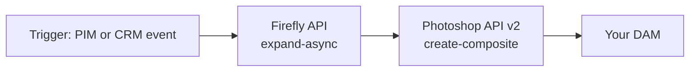

# Part 1 of 8: Firefly Services is an API suite, not an app

*Series: Firefly Services for developers. Checked against Adobe's developer documentation on September 23, 2026. Endpoints and limits change, so confirm against the linked source before you ship.*

## TL;DR

- Firefly Services is a set of REST APIs you call from your own code. There is no canvas, no login screen and no Export button.
- It is not one API. Adobe's docs currently list ten families.
- Firefly makes pixels. Photoshop API and InDesign API own structure and layout. Design your pipeline around that split.

## The family

| API family | What I can confirm from Adobe's docs |
|---|---|
| Firefly API | Generate, expand, fill and similar-image jobs, object composites, video generation, custom models, an upload endpoint |
| Photoshop API | PSD edits, manifests, masks, renditions, actions. v1 is past end of life; use v2 (see Part 7) |
| InDesign API | Document composition. Storage providers documented as AWS S3, Dropbox and Azure |
| Lightroom API | Photo edits such as auto tone and auto straighten (per the SDK endpoint map) |
| Audio/Video API | Media APIs with their own storage page |
| Substance 3D API | Scene and model rendering |
| Illustrator, Creative Production, Express, Content Tagging | Listed in the Firefly Services docs navigation. I did not verify their details, so check the docs before you plan around them |

## Where each job belongs

- **Make a new background or adapt an image's size:** Firefly API.
- **Put a product into a layered template:** Photoshop API.
- **Change headline text in a PSD:** Photoshop API v2 through `execute-actions`.
- **Assemble multi-page layouts:** InDesign API.

If your architecture diagram has one box labeled "Firefly," there are probably three APIs hiding in it.

## Why "infrastructure" is the right mental model

Once creative work runs headless, it inherits ordinary service concerns: latency, concurrency, retries, payload size, and job polling. Firefly image jobs are async only, so you will be managing job state whether you planned to or not (Part 3). Files travel by URL, not in request bodies (Part 2).

## A pipeline you can actually build

1. An upstream system fires an event when a regional SKU or campaign is ready.
2. Your orchestrator calls `POST /v3/images/expand-async` to adapt the hero image to a new size.
3. It polls the job, then hands the result to Photoshop API v2 (`/v2/create-composite`) to drop the image into a template.
4. Finished files go to your storage or DAM.

The endpoints above are the ones I verified. Everything around them (the trigger, the orchestrator, the DAM) is your architecture.

## Common mistakes

- Treating Firefly as the thing that handles layers, live text and page layout. It doesn't.
- Assuming every API accepts the same storage domains (Part 2 has the differences).
- Copying a 2024 tutorial and calling an endpoint Adobe has since removed (Part 3).

## Sources

- Firefly API docs: https://developer.adobe.com/firefly-services/docs/firefly-api/
- Photoshop API reference (lists the Firefly Services API families): https://developer.adobe.com/firefly-services/docs/photoshop/api/
- Async guide (expand-async endpoint): https://developer.adobe.com/firefly-services/docs/firefly-api/guides/how-tos/using-async-apis
- Photoshop SDK endpoint map: https://github.com/adobe/adobe-photoshop-api-sdk
