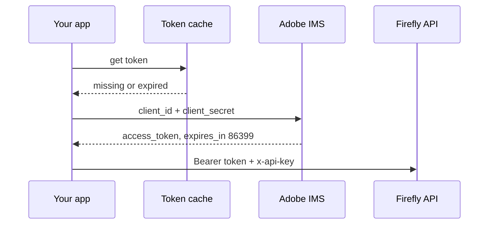
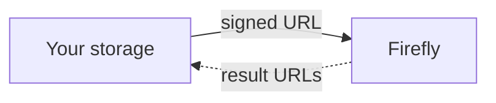

# Part 2 of 8: Three things that break Firefly calls before a pixel renders

*Series: Firefly Services for developers. Checked against Adobe's documentation on September 23, 2026.*

## TL;DR

- Access tokens last 24 hours. Cache and refresh them; don't mint one per call.
- Files travel as signed URLs or upload IDs, never inside the generation request.
- Different failures need different responses. Don't blanket-retry.

## 1. Tokens

Firefly Services uses OAuth Server-to-Server credentials created in the Adobe Developer Console. Your backend exchanges a Client ID and Client Secret with Adobe's Identity Management System (IMS) for an access token.

```bash
curl -X POST 'https://ims-na1.adobelogin.com/ims/token/v3' \
  -H 'Content-Type: application/x-www-form-urlencoded' \
  -d 'grant_type=client_credentials&client_id={CLIENT_ID}&client_secret={CLIENT_SECRET}&scope=openid,AdobeID,session,additional_info,read_organizations,firefly_api,ff_apis'
```

The response looks like this:

```json
{"access_token":"...","token_type":"bearer","expires_in":86399}
```

Adobe's docs say each token is valid for 24 hours and recommend storing it and refreshing before it expires. Scopes differ between APIs, so copy the scope string from the getting-started page of the API you're calling.

Every call then carries two headers:

```http
Authorization: Bearer <access_token>
x-api-key: <client_id>
```



**A minimal token manager (illustrative code, not from Adobe's docs):**

```python
import time, requests

class TokenManager:
    def __init__(self, client_id, client_secret, scope, early=3600):
        self.cid, self.secret, self.scope, self.early = client_id, client_secret, scope, early
        self.token, self.expires_at = None, 0

    def get(self):
        if not self.token or time.time() >= self.expires_at - self.early:
            r = requests.post(
                "https://ims-na1.adobelogin.com/ims/token/v3",
                data={"grant_type": "client_credentials", "client_id": self.cid,
                      "client_secret": self.secret, "scope": self.scope},
                timeout=30)
            r.raise_for_status()
            j = r.json()
            self.token = j["access_token"]
            self.expires_at = time.time() + j["expires_in"]
        return self.token
```

Renewing an hour early is my habit. It is not an Adobe requirement. If you run several workers, share the token through a cache or secrets store rather than fetching one per worker.

## 2. Files travel by URL

Firefly reads inputs from pre-signed URLs, or from an ID returned by its upload endpoint.

**Pre-signed URL domains.** For Firefly image workflows, Adobe's docs list three:

| Provider | Domain |
|---|---|
| Amazon S3 | `*.amazonaws.com` |
| Microsoft Azure | `*.windows.net` |
| Dropbox | `*.dropboxusercontent.com` |

Other Firefly Services APIs list different domains, so check each API's storage page:

- The **Audio/Video API** also lists frame.io, cloudfront.net, drive.google.com and adobe.io.
- The **Photoshop** and **Lightroom** docs describe Google Drive signed URLs as well.
- For the **InDesign API**, an Adobe Community reply says only AWS S3, Dropbox and Azure are supported and that domain allow-listing is enforced. That is a community answer, not official documentation.



**The upload endpoint.** If you'd rather not host the file, upload it once:

```bash
curl --location 'https://firefly-api.adobe.io/v2/storage/image' \
  --header 'x-api-key: <CLIENT_ID>' \
  --header 'Authorization: Bearer <TOKEN>' \
  --header 'Content-Type: image/png' \
  --data-binary '@/path/to/source.png'
# -> {"images":[{"id":"e42cf05b-..."}]}
```

- The returned ID is valid for 7 days.
- The maximum upload size is 15 MB.
- Send raw binary, not base64, not multipart form data.
- Image inputs are JPEG, PNG and WebP. The upload API's reference also mentions TIFF and JXL.

**Results come back as URLs.** In one older Adobe sample the result URLs were S3 links with a one-hour expiry. Don't depend on that number; copy finished assets into your own storage promptly.

## 3. Handle failures differently

| Situation | What I'd do | Basis |
|---|---|---|
| Token expired | Refresh once, retry once | Design guidance |
| Rate limited (429) | Back off with jitter | 429 is listed in Adobe's API reference |
| Not entitled (403) | Stop and fix product profile or project setup | 403 is listed in Adobe's API reference |

The API reference also lists 408, 415, 422 and 500 responses. Log each class separately.

## Checklist

- [ ] Client secret lives in a secrets manager
- [ ] One shared token cache, refresh before expiry
- [ ] Inputs use approved domains or upload IDs
- [ ] Finished assets copied into your storage
- [ ] Retry logic distinguishes auth, rate limit and entitlement errors

## Sources

- Authentication: https://developer.adobe.com/firefly-services/docs/firefly-api/getting-started/
- Image upload: https://developer.adobe.com/firefly-services/docs/firefly-api/guides/concepts/image-upload/
- Presigned URLs (Adobe Experience League): https://experienceleague.adobe.com/en/docs/platform-learn/tutorial-one-adobe/production/crpr1/ex2
- Audio/Video storage: https://developer.adobe.com/audio-video-firefly-services/getting-started/storage-solutions
- Lightroom storage: https://developer.adobe.com/firefly-services/docs/lightroom/getting-started/storage-solutions/
- InDesign domains (community): https://community.adobe.com/t5/indesign-discussions/firefly-services-indesign-api-input-output-assets-domains-question/m-p/15515417
- API reference (response codes, upload limits): https://developer.adobe.com/firefly-services/docs/firefly-api/api/
