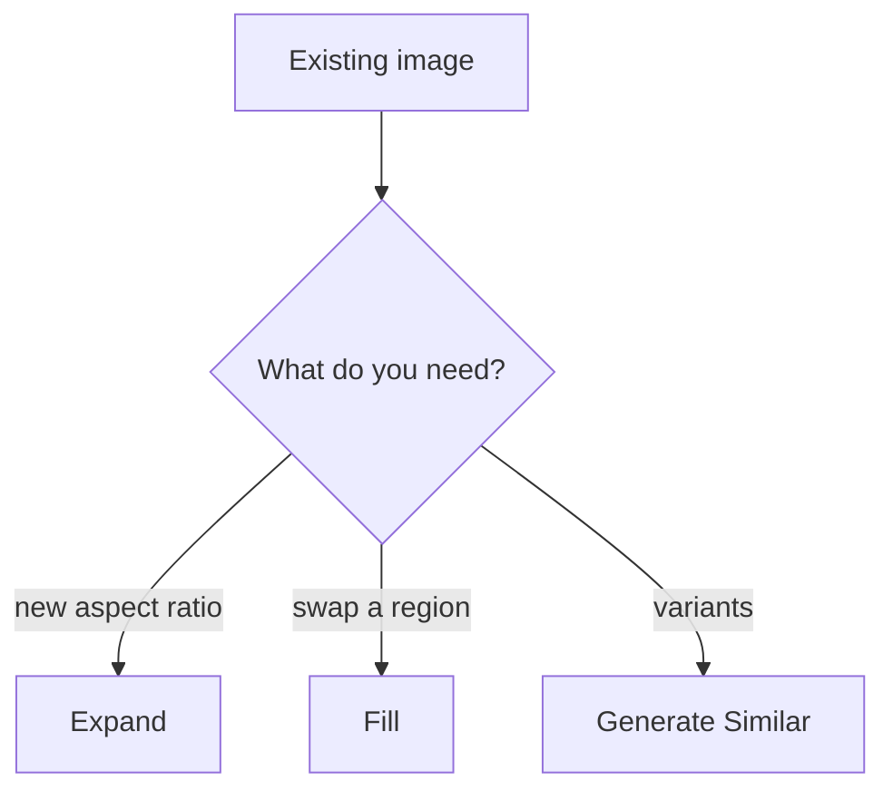
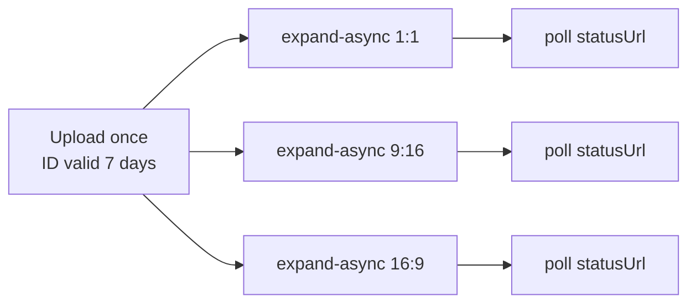

# Part 5 of 8: Three Firefly endpoints for adapting images at scale

*Series: Firefly Services for developers. Checked against Adobe's documentation on September 23, 2026.*

## TL;DR

- **Expand** changes the canvas: source image plus a target size.
- **Fill** regenerates a masked region. White in the mask can change; black is protected.
- **Similar** generates variations of an approved image.
- Upload a source once, reuse its ID for seven days, and run jobs in parallel.

A hero image approved on Monday needs to be square, vertical and ultra-wide by Friday. That's an Expand job.



All three run as async jobs (Part 3).

## Expand

Send the source and the size of the full canvas you want. From Adobe's async guide:

```json
POST /v3/images/expand-async
{
  "image": {"source": {"uploadId": "<upload id>"}},
  "size": {"width": 3000, "height": 3000}
}
```

Per Adobe's SDK reference:

- The source can be an `uploadId` or a signed URL from an allow-listed domain.
- Control where the original sits with `placement` (alignment and inset), **or** supply a mask that defines the area to expand into. Placement can't be used together with a mask.
- `prompt` is optional. `seeds` and `numVariations` work as in Part 4.

## Fill

You provide a source, a mask and a size. The body shape below follows Adobe's Fill guide; the prompt is optional:

```json
{
  "numVariations": 1,
  "size": {"width": 2048, "height": 2048},
  "prompt": "a modern office interior, soft daylight",
  "image": {
    "source": {"uploadId": "<source id>"},
    "mask": {"uploadId": "<mask id>"}
  }
}
```

Mask semantics, from Adobe's masking guide: a mask is a grayscale overlay. White areas are exposed to edits (think flashlight beams); black areas are protected. An inverted mask swaps them.

Notes from the Fill guide:

- Size can be any width and height between 1 and 2688 pixels.
- Adobe's tutorial replaces the backgrounds of employee photos with a consistent style, using the Photoshop API's Create Mask to automate masks.
- An older note in the guide said masks produced by Create Mask needed inverting for Fill, described as temporary. I can't tell whether that's still true, so **check polarity on one image before you batch**.

## Generate Similar

Start from an image you already like and ask Firefly for variations, rather than re-prompting from scratch. Use the async Generate Similar Images endpoint listed in Adobe's API reference.

## Upload once, run in parallel

Adobe's async guide expands one uploaded source to several sizes by starting all jobs at once, then polling each status URL:



**Illustrative Python (not from Adobe's docs):**

```python
from concurrent.futures import ThreadPoolExecutor
import requests

def expand(upload_id, w, h, headers):
    r = requests.post("https://firefly-api.adobe.io/v3/images/expand-async",
        headers=headers,
        json={"image": {"source": {"uploadId": upload_id}}, "size": {"width": w, "height": h}},
        timeout=30)
    r.raise_for_status()
    return poll(r.json()["statusUrl"], headers)   # poll() from Part 3

sizes = [(2048, 2048), (1152, 2048), (2688, 1512)]
with ThreadPoolExecutor(max_workers=3) as ex:
    results = list(ex.map(lambda s: expand(UPLOAD_ID, *s, HEADERS), sizes))
```

Check current size limits in the API reference before choosing target dimensions.

## Test one mask first

1. Run one image end to end.
2. Check which area actually changed.
3. Check edges and lighting.
4. Then queue the batch.

## Sources

- Async guide (expand pattern): https://developer.adobe.com/firefly-services/docs/firefly-api/guides/how-tos/using-async-apis
- Fill guide: https://developer.adobe.com/firefly-services/docs/firefly-api/guides/how-tos/using-fill-image
- Fill tutorial: https://developer.adobe.com/firefly-services/docs/firefly-api/guides/how-tos/firefly-fill-image-api-tutorial
- Expand tutorial: https://developer.adobe.com/firefly-services/docs/firefly-api/guides/how-tos/firefly-expand-image-api-tutorial/
- Masking: https://developer.adobe.com/firefly-services/docs/firefly-api/guides/concepts/masking
- SDK reference (placement, mask, seeds): https://github.com/Firefly-Services/firefly-services-sdk-js/blob/main/docs/firefly/index.md
