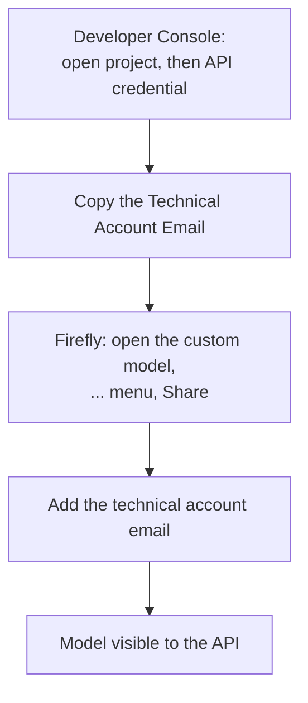

# Part 6 of 8: Your custom model trained. Your API can't see it yet.

*Series: Firefly Services for developers. Checked against Adobe's documentation on September 23, 2026.*

## TL;DR

- Train subject models for a specific product or character, and style models for a look and feel.
- Both take 10 to 30 images in Firefly's training flow.
- To call a model from the API, **share it with your technical account** first.
- Then send an `x-model-version` header for custom models and pass `customModelId` in the body.

## Subject or style?

- **Subject model:** a specific character, person, product or object. Adobe's guidance: same make and model across images, subject in clear focus near the center, occupying at least 25% of the frame, varied views and lighting, and no large distracting objects. White or transparent backgrounds work, but a mix with more complex surroundings is best.
- **Style model:** visual characteristics such as color palette, patterns, brush technique, illustration treatment, texture, lighting or overall aesthetic.

For subject models, Firefly asks for a Name and a Concept ID, a unique name you use in captions and prompts to refer to the subject.

Custom models are private by default and designed for commercial use. Access requires a Creative Cloud or Enterprise plan with Custom Models.

## Training flow

Upload 10 to 30 images, let Firefly analyze them (it generates captions, model tags and recommendations for improving the set), correct the captions, resolve flagged issues, and train.

On data handling, Adobe states that its foundational Firefly models are not trained on your proprietary data.

## The step people skip: sharing

Adobe's guide says a trained model must be shared with your technical account so that it's accessible to the List Custom Models API and the image generation API. Models shared at the organization level are also shared with individual projects.



## Calling the model

Adobe's tutorial uses the async endpoint with a custom-model header value and the model's ID:

```bash
curl --request POST 'https://firefly-api.adobe.io/v3/images/generate-async' \
  --header 'Content-Type: application/json' \
  --header 'x-model-version: image3_custom' \
  --header "x-api-key: $CLIENT_ID" \
  --header "Authorization: Bearer $ACCESS_TOKEN" \
  --data '{
    "prompt": "An almond seed in a warm setting",
    "customModelId": "<your custom model id>",
    "numVariations": 2,
    "seeds": [66080, 82683],
    "size": {"width": 2048, "height": 2048},
    "contentClass": "photo"
  }'
```

The v3 spec's `x-model-version` values include both `image3_custom` and `image4_custom`. Adobe's tutorial demonstrates `image3_custom`, so confirm which your model supports.

## Can't see your model? List them

```bash
curl -X GET https://firefly-api.adobe.io/v3/custom-models \
  -H "Authorization: Bearer $ACCESS_TOKEN" -H "x-api-key: $CLIENT_ID"
```

Models shared with your credential appear in the list. If yours is missing, go back to the share step.

## Checklist

- [ ] Subject and style trained as separate models
- [ ] 10 to 30 images, same product and color for subjects, in clear focus
- [ ] Technical Account Email copied from the right Developer Console project
- [ ] Model shared with that email
- [ ] Header and `customModelId` set on the request

## Sources

- Grant apps access: https://developer.adobe.com/firefly-services/docs/firefly-api/guides/how-tos/cm-share-model/
- Custom models concepts: https://developer.adobe.com/firefly-services/docs/firefly-api/guides/concepts/custom-models/
- Generate image tutorial: https://developer.adobe.com/firefly-services/docs/firefly-api/guides/how-tos/cm-generate-image/
- Custom models overview (help): https://helpx.adobe.com/firefly/web/work-with-enterprise-features/train-custom-models/custom-models-overview.html
- Create and train (help): https://helpx.adobe.com/firefly/web/firefly-custom-models-in-creative-cloud/train-firefly-custom-models.html
- Subject model guidance (Experience League): https://experienceleague.adobe.com/en/docs/platform-learn/tutorial-one-adobe/production/crpr1/ex4
- Adobe's "create with confidence" brief (data handling): https://business.adobe.com/content/dam/dx/us/en/resources/sdk/create-with-confidence/create-with-confidence.pdf
