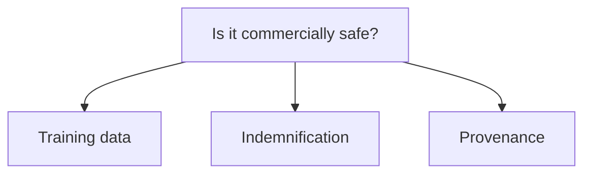

# Part 8 of 8: Three questions to ask before Firefly output goes into an ad

*Series: Firefly Services for developers. Checked against Adobe's public materials on September 23, 2026. This is a summary of what Adobe says publicly, not legal advice. Your contract and your counsel decide what applies to you.*

## TL;DR

- "Is it commercially safe?" is really three questions: training data, indemnification, provenance.
- Indemnification is a contract entitlement, not a default setting.
- Content Credentials are Adobe's provenance mechanism. Test whether yours survive your own pipeline.

## 1. What was it trained on?

Adobe says its Firefly models are trained only on content it has permission to use, including Adobe Stock, public domain material and licensed content. Adobe also states that its foundational Firefly models are not trained on your enterprise's proprietary data.

Adobe's apps also offer third-party ("partner") models alongside Firefly's own. Ask your Adobe representative whether the same training-data and indemnification commitments apply to any partner model you plan to use.

## 2. Who stands behind the output?

Adobe's business site says enterprise customers may purchase an entitlement that comes with contractual IP indemnification for select Firefly outputs, available through the Adobe Express and Firefly site license or certain Creative Cloud for enterprise plans. Customers on qualifying plans are eligible, and terms apply.

Adobe publishes an enterprise legal FAQ whose sections cover:

- what indemnification is and whether Adobe will indemnify for Firefly outputs
- what types of claims are covered
- which Firefly-powered features are covered
- what liability cap applies
- who owns generated content

For developers: don't promise coverage on legal's behalf. Route these questions to your contract owner, and confirm which features your pipeline calls are covered.

## 3. Can you show where it came from?

Adobe says Firefly applies Content Credentials to assets that are fully generated by Firefly, giving customers traceability. Two practical points:

- In the Image5 API, `output.cai` is listed among the removed request fields, so CAI directives are not configurable there. If your downstream logic relied on CAI settings, adjust it at the service layer.
- Credentials can be lost in your own pipeline. Resizing, re-encoding, format conversion and some CDN or DAM transformations may strip metadata. I haven't verified which of Adobe's endpoints preserve credentials on edited outputs, so test rather than assume.

## Dev homework

1. Generate one asset.
2. Resize it.
3. Re-encode it (for example to another format).
4. Check whether the credentials survive at each step, using the C2PA tooling of your choice (for instance an open-source tool such as `c2patool`).
5. Tell your legal team what you found.

## Questions to bring to your Adobe rep

- Which of the Firefly Services APIs I call are covered by the indemnification entitlement?
- Do partner models carry the same commitments?
- Which of our pipeline steps preserve Content Credentials, and which don't?
- Where is the liability cap documented for our contract?

## Sources

- Adobe's approach to Firefly: https://business.adobe.com/products/firefly-business/firefly-ai-approach.html
- Firefly legal FAQs for enterprise customers: https://www.adobe.com/cc-shared/assets/pdf/enterprise/firefly-legal-faqs-enterprise-customers-2024-06-11.pdf
- Create with confidence (Adobe): https://business.adobe.com/content/dam/dx/us/en/resources/sdk/create-with-confidence/create-with-confidence.pdf
- Image5 migration (removed `output.cai`): https://developer.adobe.com/firefly-services/docs/firefly-api/guides/how-tos/cm-generate-image/breaking-changes
- Image Model 4 guide (training data statement): https://www.adobe.com/cc-shared/assets/pdf/business/teams/sdk/firefly-image-model-4-guide.pdf
