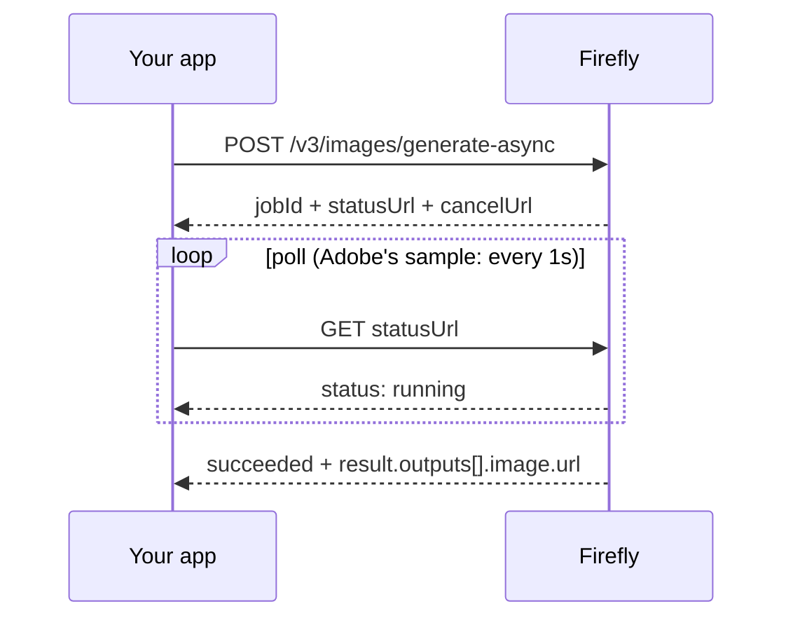

# Part 3 of 8: Old Firefly samples may call endpoints that are gone

*Series: Firefly Services for developers. Checked against Adobe's documentation on September 23, 2026.*

## TL;DR

- Adobe removed the non-async v3 image endpoints on October 3, 2025. Async is the only path now.
- Model 4 is selected with the `x-model-version` header, not a JSON field.
- Image5 uses a new, non-backward-compatible schema. Porting means rewriting the request.
- Don't assume Image Model 4 Ultra's variation behavior in the API. Test it.

## What changed, from Adobe's changelog

| Date | Change |
|---|---|
| Nov 18, 2024 | Async Generate, Expand, Fill, Object Composite and Similar APIs generally available |
| Mar 11, 2025 | Custom models supported in Generate Images |
| Apr 29, 2025 | Image Model 4 available for Generate Images and Generate Similar |
| Sep 10, 2025 | Generate Images v2, Expand Image v1 and Fill Image v1 removed |
| **Oct 3, 2025** | **Non-async Generate, Similar, Object Composite, Expand and Fill (v3) removed** |

Some tutorial code still points at the removed synchronous endpoints.

## The async loop



The submit response:

```json
{
  "jobId": "urn:ff:jobs:...",
  "statusUrl": "https://firefly-api.adobe.io/v3/status/urn:ff:jobs:...",
  "cancelUrl": "https://firefly-api.adobe.io/v3/cancel/urn:ff:jobs:..."
}
```

A finished job (trimmed):

```json
{
  "status": "succeeded",
  "jobId": "urn:ff:jobs:...",
  "result": {
    "size": {"width": 2048, "height": 2048},
    "outputs": [{"seed": 2142812600, "image": {"url": "https://...amazonaws.com/..."}}],
    "contentClass": "art"
  }
}
```

Adobe's polling sample loops until the status is `succeeded` or `failed`. While running it returns `running`. I did not find a `pending` state in Adobe's material.

**A minimal poller (illustrative, not from Adobe's docs):**

```python
import time, requests

def poll(status_url, headers, interval=1.0, timeout=120):
    deadline = time.time() + timeout
    while time.time() < deadline:
        j = requests.get(status_url, headers=headers, timeout=30).json()
        if j.get("status") == "succeeded":
            return j
        if j.get("status") == "failed":
            raise RuntimeError(j)
        time.sleep(interval)
    raise TimeoutError(status_url)
```

For volume, hand this to your job orchestrator (Step Functions, Temporal, a queue with workers) instead of holding a thread per job.

## Model selection: a header

In Adobe's v3 OpenAPI spec, `x-model-version` is an optional header, defaulting to `image3`:

| Value | Meaning |
|---|---|
| `image3` | Default |
| `image3_custom` | Custom model on Image Model 3 |
| `image4_standard` | Image Model 4 |
| `image4_ultra` | Image Model 4 Ultra |
| `image4_custom` | Custom model on Image Model 4 |

```http
POST /v3/images/generate-async HTTP/1.1
Host: firefly-api.adobe.io
Authorization: Bearer <token>
x-api-key: <client id>
x-model-version: image4_standard
Content-Type: application/json
```

Custom models also need `customModelId` in the body (Part 6).

## Image5

Adobe describes Image5 as Firefly's latest model, with native 4 MP output. Its Generate Image API is a major version change:

- Old and new schemas are not compatible, and non-conforming payloads are rejected.
- Removed: `aspectRatio` (only `size` is supported), `modelVersion`, `output.cai`, `output.storeInputs`.
- New or newly relevant: `negativePrompt`, `promptBiasingLocaleCode`, `contentClass`, `upsamplerType`, `visualIntensity`.
- `N` became `numVariations`; `modelId` became `customModelId` with new semantics.

Adobe's Image5 pages don't agree with each other on every detail (one feature guide shows `modelSpecificPayload` in a sample while the migration guide lists it as removed). Treat the current API reference as the source of truth and keep a compatibility layer in your code so you can adjust quickly.

## Image Model 4 Ultra and `numVariations`

What I can confirm: in the Firefly web app, users report getting a single image when Image 4 Ultra is selected (an Adobe Community reply).

What I could not confirm: how the API treats `numVariations` for `image4_ultra`. Test it with your credentials before your UI assumes four options.

## Checklist

- [ ] No calls to removed synchronous endpoints
- [ ] Jobs handled by an orchestrator or worker pool
- [ ] Model chosen via header; custom models also send `customModelId`
- [ ] Image5 migration planned as a payload rewrite
- [ ] Ultra variation count tested, not assumed

## LinkedIn kit

**Post**

Adobe removed the synchronous Firefly endpoints on October 3, 2025. Some tutorial code still points at them.

Generate, Similar, Object Composite, Expand and Fill all run as async jobs now. You submit, get back a job ID with a status URL and a cancel URL, and poll until it says succeeded or failed. Adobe's own sample checks once a second.

Model 4 is still selected by a header, x-model-version, with values like image4_standard and image4_ultra. Not a field in the JSON body.

Then there's Image5, Firefly's newest model, with native 4 MP output. Its API uses a different schema, and Adobe says payloads written for the old one are rejected. So porting means rewriting the request, not swapping a string.

One thing I'd test instead of assuming: Ultra returns a single image in the Firefly web app. Check what numVariations does against the API before your UI promises four options.

Polling loop, or an orchestrator?

**Alternate hooks**
- If your Firefly code calls /v3/images/generate, check the changelog before you check your prompt.
- Image5 isn't a new value for the same request. It's a new request.

**First comment:** Changelog: https://developer.adobe.com/firefly-services/docs/firefly-api/guides/changelog Image5 migration guide: https://developer.adobe.com/firefly-services/docs/firefly-api/guides/how-tos/cm-generate-image/breaking-changes

## Sources

- Changelog: https://developer.adobe.com/firefly-services/docs/firefly-api/guides/changelog
- Async guide: https://developer.adobe.com/firefly-services/docs/firefly-api/guides/how-tos/using-async-apis
- Image5 migration: https://developer.adobe.com/firefly-services/docs/firefly-api/guides/how-tos/cm-generate-image/breaking-changes
- Image5 feature guide: https://developer.adobe.com/firefly-services/docs/firefly-api/guides/how-tos/cm-generate-image/feature-guide
- v3 OpenAPI spec (a mirror, for header values): https://huggingface.co/spaces/Mxdua89/Test/blob/main/image_generation_async_v3.json
- Community reply on model IDs: https://community.adobe.com/bug-reports-403/adobe-firefly-api-v3-generating-image-models-access-1483583
- Community reply on Ultra in the web app: https://community.adobe.com/questions-404/adobe-firefly-s-amount-of-images-generated-1476400
