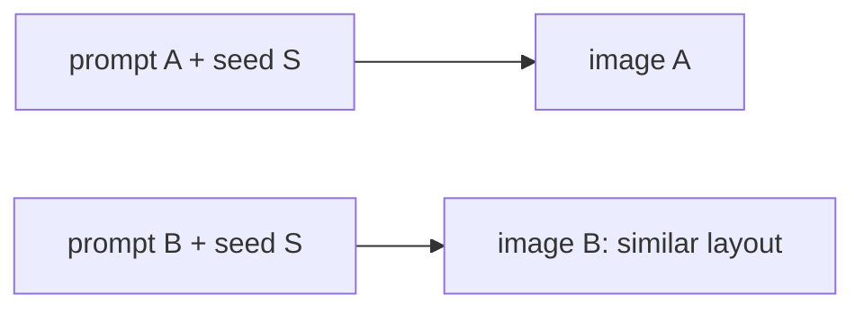

# Part 4 of 8: Four knobs that make Firefly output repeatable

*Series: Firefly Services for developers. Checked against Adobe's documentation on September 23, 2026.*

## TL;DR

- The parameter is `seeds`, and it's an array. Every output returns its seed. Store it.
- `negativePrompt` is the field for exclusions.
- Structure and style references each take a `strength`. Structure strength runs 1 to 100, default 50.
- `visualIntensity` is a separate control.

## Why this matters

Say marketing approves a look for an autumn campaign, and you change "wool sweater" to "cashmere sweater." Without a fixed seed, the whole scene can change with it: camera, light, background. Determinism controls let you change one thing at a time.

## 1. Seeds

A seed is a starting point for generation. Adobe's docs say using a seed lets you generate consistent images across calls. Its SDK reference gives the example of reusing a seed to get a similar image in a different style.

Details worth knowing:

- The request field is `seeds`, an **array** of integers.
- `numVariations` defaults to the number of seeds, or to 1 if you send none.
- If you send both, the number of seeds must equal `numVariations`.
- The seed for each output is returned in the finished job:

```json
"outputs": [{"seed": 2142812600, "image": {"url": "https://..."}}]
```

A request that pins two variations (shape adapted from Adobe's custom-models tutorial):

```json
{
  "prompt": "A wool sweater on a mannequin, autumn light",
  "numVariations": 2,
  "seeds": [66080, 82683],
  "size": {"width": 2048, "height": 2048},
  "contentClass": "photo"
}
```



**What to store next to each asset in your DAM:** the seed, the full prompt and negative prompt, the model header value, any `customModelId`, and the request timestamp. Without the seed you can't rebuild a composition later.

## 2. negativePrompt

`negativePrompt` tells Firefly what to leave out. Writing "no snow" in the main prompt tends to pull toward snow, because the words in a prompt describe what you want to see. Put exclusions in the field built for them:

```json
{
  "prompt": "A serene mountain valley with a clean river",
  "negativePrompt": "snow, winter, power lines"
}
```

Adobe's docs define the parameter and list it among the Image5 control fields. The explanation of *why* exclusions in the main prompt backfire is general behavior of text-to-image models, not something I found in Adobe's documentation.

## 3. Structure and style references

Both take an `imageReference` whose `source` is either an `uploadId` or a signed URL from an approved domain.

```json
{
  "prompt": "a photo of a volcano",
  "structure": {
    "imageReference": {"source": {"uploadId": "<id>"}},
    "strength": 50
  },
  "style": {
    "imageReference": {"source": {"uploadId": "<id>"}},
    "presets": ["painting"],
    "strength": 50
  }
}
```

- **Structure reference:** applies structural characteristics such as outline and depth. `strength` is 1 to 100; when omitted, the default is 50. Adobe's guide says it controls how closely the result resembles the reference.
- **Style reference:** steers the look. It sits alongside style `presets`, and the `strength` value influences how much they apply.

Lower values let the prompt lead; higher values let the reference lead.

## 4. visualIntensity

`visualIntensity` is its own parameter. It appears in Adobe's request schema and tutorials (samples use values like 2 and 6). Keep it separate in your mental model from reference `strength`. I did not verify its allowed range.

## Which knob for what

| Goal | Use |
|---|---|
| Rebuild a shot | `seeds` |
| Leave things out | `negativePrompt` |
| Keep the layout | `structure.strength` |
| Match a look | `style.imageReference` |
| Tune the overall look | `visualIntensity` |

## Could not verify

- The allowed range and default of `visualIntensity`.
- The default `strength` for style references (I confirmed 50 for structure).
- Adobe's internal mechanism behind `negativePrompt`.

## LinkedIn kit

**Post**

In Firefly's API it's seeds, plural. And it's an array.

Small detail, big difference if you want repeatable images.

Say marketing approves a look for an autumn campaign. You change "wool sweater" to "cashmere sweater" and, without a fixed seed, the whole scene can change with it. Camera, light, background.

Four things help.

Seeds. Every output comes back with its seed. Store it next to the asset. If you send seeds and numVariations together, the counts need to match.

negativePrompt. Tells Firefly what to leave out. Writing "no snow" in the main prompt tends to pull toward snow.

Reference strength. Structure references take a strength from 1 to 100, default 50. Higher means the reference leads.

visualIntensity. A separate control. Don't mix it up with strength.

Do you keep seeds in your DAM metadata?

**Alternate hooks**
- You changed one word in the prompt and the whole scene moved. Here's how to stop that.
- Every Firefly output hands you a seed. Most pipelines throw it away.

**First comment:** Seeds: https://developer.adobe.com/firefly-services/docs/firefly-api/guides/concepts/seeds/ Structure references: https://developer.adobe.com/firefly-services/docs/firefly-api/guides/concepts/structure-image-reference/

## Sources

- Seeds: https://developer.adobe.com/firefly-services/docs/firefly-api/guides/concepts/seeds/
- Structure references: https://developer.adobe.com/firefly-services/docs/firefly-api/guides/concepts/structure-image-reference/
- Style presets: https://developer.adobe.com/firefly-services/docs/firefly-api/guides/concepts/style-presets/
- Terminology: https://developer.adobe.com/firefly-services/docs/firefly-api/guides/concepts/terminology
- Custom models tutorial (request shape): https://developer.adobe.com/firefly-services/docs/firefly-api/guides/how-tos/cm-generate-image/
- Firefly SDK reference (seeds and numVariations): https://github.com/Firefly-Services/firefly-services-sdk-js/blob/main/docs/firefly/index.md
