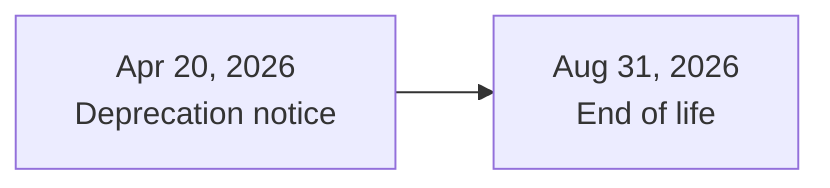
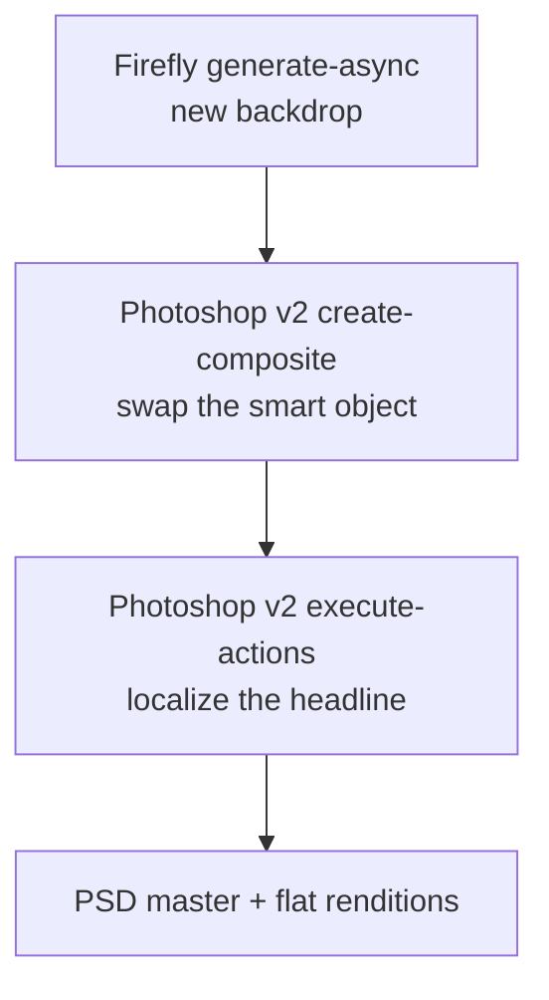

# Part 7 of 8: Photoshop API v1 reached end of life on August 31

*Series: Firefly Services for developers. Checked against Adobe's documentation on September 23, 2026.*

## TL;DR

- Adobe posted the Photoshop API v1 deprecation notice on April 20, 2026. End of life was **August 31, 2026**.
- v2 lives at `photoshop-api.adobe.io/v2/...` and uses new request shapes.
- Manifest, smart object replacement and text editing all moved.



## Where the calls went

| v1 (`image.adobe.io/pie/psdService/...`) | v2 (`photoshop-api.adobe.io/v2/...`) |
|---|---|
| `documentManifest` | `/v2/generate-manifest` |
| `smartObject` (place or replace) | `/v2/create-composite` |
| `text` | `/v2/execute-actions` (ActionJSON or UXP) |
| `renditionCreate` | `/v2/create-composite` |
| `/sensei/cutout` | `/v2/remove-background` |

Adobe's v2 catalog notes that Depth Blur (Neural Filters) is not yet supported in v2.

## Payload shape changes

| v1 | v2 |
|---|---|
| `inputs[0].href` | `image.source.url` |
| `outputs[].href` | `outputs[].destination.url` |
| `storage` | `storageType` |
| `type` | `mediaType` |
| `quality` (1 to 7) | `quality` (string such as `"high"`, `"maximum"`, `"photoshop_max"`) |

Quality defaults differ. `create-composite` defaults to `photoshop_max`; for `execute-actions` no default is guaranteed, so set `quality` explicitly when migrating payloads that omitted it.

## Manifest

```bash
curl -X POST https://photoshop-api.adobe.io/v2/generate-manifest \
  -H "Authorization: Bearer $token" -H "x-api-key: $apiKey" \
  -H "Content-Type: application/json" \
  -d '{
    "image": {"source": {"url": "<SIGNED_GET_URL>"}},
    "includeLayerThumbnails": true,
    "outputs": [{"destination": {"url": "<MANIFEST_OUTPUT_URL>"}, "mediaType": "application/json"}]
  }'
```

What changed in the response, per Adobe's migration guides:

- Layer type strings are now snake_case (`adjustmentLayer` became `adjustment_layer`). Any code that switches on `type` must be updated.
- Artboards are a first-class `artboard` type. In v1 they looked like plain groups.
- The boolean `locked` became a `protection` array of flags.
- Embedded smart objects expose a download URL (`extracted.url`), so you can retrieve their content without opening Photoshop.

## Replacing a smart object

In v2, place and replace are both handled by `/v2/create-composite` using `edits.layers`. For replace you must include `operation.type: "edit"`; there is no implicit replace.

```json
POST https://photoshop-api.adobe.io/v2/create-composite
{
  "image": {"source": {"url": "<SIGNED_INPUT_PSD_GET_URL>"}},
  "edits": {
    "layers": [{
      "type": "smart_object_layer",
      "name": "<EXISTING_SMART_OBJECT_LAYER_NAME>",
      "operation": {"type": "edit"},
      "smartObject": {
        "isLinked": false,
        "smartObjectFile": {"source": {"url": "<SIGNED_REPLACEMENT_FILE_GET_URL>"}}
      }
    }]
  },
  "outputs": [{"destination": {"url": "<SIGNED_OUTPUT_URL>"}, "mediaType": "image/vnd.adobe.photoshop"}]
}
```

Layer names are the ones in your PSD; use the manifest to find them. Setting `isLinked` to false (or omitting it) embeds the file; linked smart objects depend on the external file staying available. Also note: when you resize an output PSD, linked smart objects that you did not edit in the same request are rasterized to pixel layers.

## Text edits

The dedicated v1 `/text` endpoint was replaced. In v2 you edit text layers through `/v2/execute-actions`, passing ActionJSON or a UXP script that selects the text layer and sets its properties. Adobe's Text Layer Operations migration page has the payload details; I haven't reproduced them here because I did not verify a complete v2 payload.

## A v2 template pipeline



## Migration checklist

- [ ] Every `image.adobe.io/pie/psdService` call inventoried
- [ ] Request bodies remapped (`image.source.url`, `destination.url`, `mediaType`)
- [ ] Code that switches on manifest layer `type` updated to snake_case
- [ ] Smart object replaces include `operation.type: "edit"`
- [ ] `quality` set explicitly where you relied on v1 defaults
- [ ] Anything using Depth Blur has a plan

## Could not verify

- Whether individual v1 endpoints currently return errors or still respond after the end-of-life date.
- The v2 job status polling format.
- A complete v2 `execute-actions` text payload.

## LinkedIn kit

**Post**

Photoshop API v1 reached end of life on August 31. If your pipeline calls /pie/psdService, this one's for you.

Adobe posted the deprecation notice on April 20, 2026. End of life was August 31.

Here's where the three calls a template pipeline usually needs went.

Get manifest is now /v2/generate-manifest. Layer types are snake_case, artboards have their own type, and embedded smart objects expose a download URL.

Replace smart object now goes through /v2/create-composite, and you have to specify an edit operation. There's no implicit replace anymore.

Edit text used to be its own endpoint. In v2 you use /v2/execute-actions with ActionJSON or a UXP script.

Payloads changed too: image.source.url going in, outputs[].destination.url coming out.

Which v1 call is hardest to migrate?

**Alternate hooks**
- Three weeks past end of life. Is anything of yours still calling /pie/psdService?
- Replace smart object in Photoshop API v2 has no implicit replace. You have to ask for an edit.

**First comment:** Deprecation notice: https://developer.adobe.com/firefly-services/docs/photoshop/getting-started/deprecation-announcement/ Text layer migration: https://developer.adobe.com/firefly-services/docs/photoshop/guides/photoshop-v2/v1-to-v2/convenience-apis/text-layer-operations

## Sources

- Deprecation announcement: https://developer.adobe.com/firefly-services/docs/photoshop/getting-started/deprecation-announcement/
- Photoshop API reference: https://developer.adobe.com/firefly-services/docs/photoshop/api/
- Manifest migration: https://developer.adobe.com/firefly-services/docs/photoshop/guides/photoshop-v2/v1-to-v2/manifest-migration
- Manifest response format: https://developer.adobe.com/firefly-services/docs/photoshop/guides/photoshop-v2/v1-to-v2/manifest-response-migration
- Smart object replace migration: https://developer.adobe.com/firefly-services/docs/photoshop/guides/photoshop-v2-beta/v1-to-v2/convenience-apis/smart-object-replace
- Smart object operations migration: https://developer.adobe.com/firefly-services/docs/photoshop/guides/photoshop-v2-beta/v1-to-v2/layer-operations-smart-objects
- Text layer migration: https://developer.adobe.com/firefly-services/docs/photoshop/guides/photoshop-v2/v1-to-v2/convenience-apis/text-layer-operations
- Output types migration: https://developer.adobe.com/firefly-services/docs/photoshop/guides/photoshop-v2/v1-to-v2/output-types-migration
- Format conversion migration: https://developer.adobe.com/firefly-services/docs/photoshop/guides/photoshop-v2-beta/v1-to-v2/format-conversion-migration
- V2 API behavior catalog: https://developer.adobe.com/firefly-services/docs/photoshop/guides/photoshop-v2-beta/v1-to-v2/v2-api-catalog
- What's new in v2: https://developer.adobe.com/firefly-services/docs/photoshop/guides/photoshop-v2-beta/v1-to-v2/v2-whats-new
