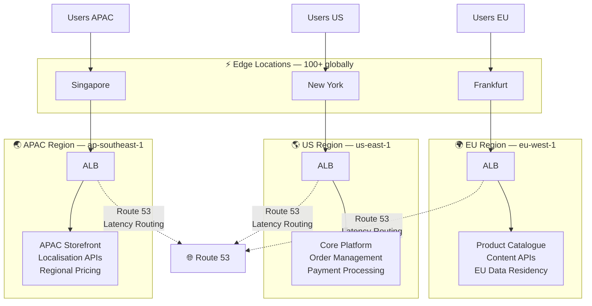
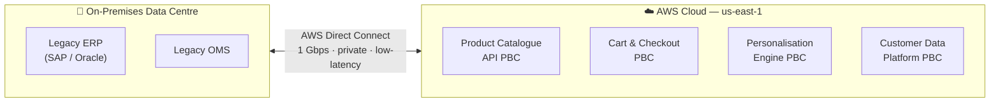

# Why Composable Commerce Starts With AWS Global Infrastructure

*By a Senior AWS Solutions Architect | #ComposableCommerce #MACH #AWS #CloudArchitecture*

---

I've been on the ground with retailers making the leap from monolithic platforms to composable architectures for the better part of a decade. And without fail, the conversation always starts in the same place: "where do we actually run all these microservices?"

The answer is more strategic than people expect.

## The Monolith's Original Sin

The history of Amazon itself is the best argument for composable commerce. In 2002, Amazon.com was a monolith — a single codebase where teams stepped on each other's changes, deployments were terrifying events, and scaling one feature meant scaling everything. Jeff Bezos famously mandated the API-first approach and the two-pizza team rule: every capability must be exposed through an API, and every team must be small enough to be fed with two pizzas.

That mandate became the foundation of AWS. And today it underpins what we call MACH architecture — **M**icroservices, **A**PI-first, **C**loud-native, **H**eadless — the engineering philosophy behind composable commerce.

The insight that took Amazon from monolith to marketplace applies directly to every retailer building a composable platform today. And the AWS global infrastructure is where that transformation happens.

## Composable Commerce Is a Geography Problem

Here's a tension most architects don't address early enough: **composable platforms are globally distributed by nature, but commerce is locally experienced.**

A shopper in Hamburg buying a product from your US-based brand expects the same sub-second page load as a shopper in New York. Your checkout PBC (Packaged Business Capability) might be hosted by one vendor, your product catalogue API by another, your personalisation engine by a third. If those services are all calling each other across ocean-wide network hops, you've traded the monolith's rigidity for a distributed system's latency.

AWS solves this with **Regions** and **Availability Zones**.

Each AWS Region is a completely independent set of data centres. Resources — your microservices, your databases, your event buses — stay in that Region unless you explicitly replicate them. For GDPR compliance, that's not a limitation, it's a feature.

## The Availability Zone Contract

Within each Region, AWS has a minimum of two (usually three) Availability Zones. Each AZ is physically separate infrastructure — different power, different cooling, different networking. They communicate via low-latency, high-bandwidth private links.

For composable commerce, this matters enormously. Your PBCs are microservices. Microservices fail. An AZ failure is a known blast radius — isolated, with predictable recovery behaviour. When you deploy your Cart PBC across two AZs with an Application Load Balancer routing between them:

- **One AZ goes down** → ALB detects unhealthy targets, routes 100% to the healthy AZ within seconds
- **Your customers notice nothing** — their cart is intact, checkout continues
- **Auto Scaling replaces the lost capacity** in the surviving AZ

This is active redundancy, and it's the foundation of the "fault isolation" that makes composable architectures genuinely resilient rather than just theoretically modular.

## Edge Locations: Where Your Storefront Actually Lives

Composable commerce decouples the frontend from the backend. Your storefront — whether it's a Next.js application, a mobile app, or a voice interface — renders content assembled from multiple API calls. The fastest way to serve that content is to not make those API calls at all for static or cacheable responses.

AWS has over 100 Edge Locations globally — far more than the 30+ Regions. These are the CloudFront CDN nodes that cache your product images, static assets, and even API responses close to the shopper. For a headless storefront built on a composable stack:

- Product listing pages served from the nearest Edge Location: **8ms**
- Same page served from origin (us-east-1) to a user in Tokyo: **180ms**

That 22x difference in response time is the argument for edge-first architecture in composable commerce. And it's infrastructure — not application code — that delivers it.

## Hybrid Architecture: The Pragmatic Path to Composability

Most retailers I work with don't rebuild from scratch. They modernise incrementally. The legacy OMS is still on-premises. The ERP isn't moving for three years. But the new checkout experience, the personalisation engine, the loyalty PBC — those are cloud-native from day one.

**AWS Direct Connect** provides a dedicated private link between your data centre and AWS — not over the public internet, not through a VPN tunnel, but a physical circuit with consistent bandwidth and predictable latency. This makes the hybrid period of a composable migration genuinely workable:

The PBCs talk to the legacy systems over private, reliable infrastructure. You compose the new experience on top of existing operational systems without a big-bang migration. When the ERP eventually moves to the cloud, you lift the Direct Connect, update the API endpoint, and the composable layer barely notices.

## The Six Advantages, Reframed for Composable Commerce

AWS's six advantages of cloud computing aren't abstract — each one maps directly to composable commerce development:

| AWS Advantage | Composable Commerce Translation |
|---|---|
| **Trade CapEx for OpEx** | Each PBC team pays only for the compute their service uses — no shared infrastructure budget fights |
| **Economies of scale** | AWS pricing passes on the benefit of running infrastructure at Amazon's scale — every PBC is cheaper to run than equivalent on-prem |
| **Stop guessing capacity** | Your Checkout PBC scales independently of your Product Catalogue PBC — no coordinated capacity planning required |
| **Increase speed and agility** | Spin up a new Search PBC environment in minutes, not weeks — test, iterate, deploy independently |
| **Stop spending on data centres** | The infrastructure team becomes a platform team — they provide deployment pipelines and IaC templates, not rack-and-stack |
| **Go global in minutes** | Deploy your composable stack to eu-west-1 for EU expansion by running CloudFormation in a new Region — same code, new geography |

## What This Means for Your Architecture Decisions

When you're designing a composable commerce platform on AWS, the infrastructure decisions made at this level cascade through everything else. Here are the principles I apply on every engagement:

**1. Start with Region selection, not service selection.**
Which Regions will you serve users from? Where does your primary data need to live for compliance? Which Regions do your PBC vendors support? Your vendor topology constrains your deployment topology.

**2. Treat AZs as your minimum redundancy unit, not an afterthought.**
Every stateless PBC should deploy across at least two AZs from day one. The cost difference is minimal. The availability difference is enormous.

**3. Design for the edge from the start.**
Your headless frontend shouldn't be making synchronous API calls to services in a single Region for every page render. Think about what can be edge-cached, what can be pre-generated at build time (ISR with Next.js), and what genuinely requires a real-time API call.

**4. Plan the hybrid period explicitly.**
Most composable migrations take 18–36 months. The architecture needs to support running new PBCs alongside legacy systems over that entire period, not just at the start.

## The Bigger Picture

Composable commerce architectures using MACH principles offer greater business agility compared to traditional monolithic architectures. But agility without resilience is just different fragility. The AWS global infrastructure — Regions, AZs, Edge Locations, and Direct Connect — is the reliability substrate that makes composable architectures production-worthy rather than proof-of-concept.

The history of building modern, modular architectures at Amazon began in 2002 when the early Amazon.com webstore was a monolithic system. The company adopted an API-first design approach and the two-pizza team rule — breaking down software features into smaller, independent units that could be managed by teams small enough to be fed by two pizzas.

We've been running this architecture at Amazon scale for over two decades. The infrastructure is proven. The patterns are documented. The question for retailers is: how fast do you want to adopt them?

---

*Next in this series: How Amazon S3 and Glacier power the content and media backbone of a composable commerce stack — from product asset management to compliance archiving.*

*🔔 Follow for weekly deep dives on composable commerce architecture on AWS.*

*💬 What's the hardest infrastructure decision you've faced in a composable migration? Drop it in the comments.*

---
**#ComposableCommerce #MACHArchitecture #AWS #CloudNative #HeadlessCommerce #SolutionsArchitect #eCommerce #DigitalTransformation #Microservices #APIFirst**
