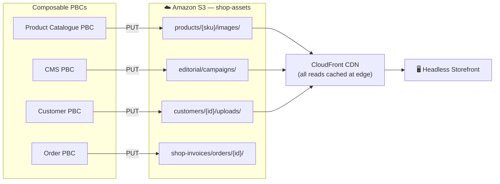
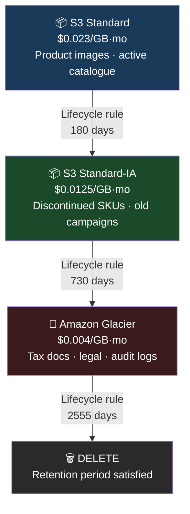
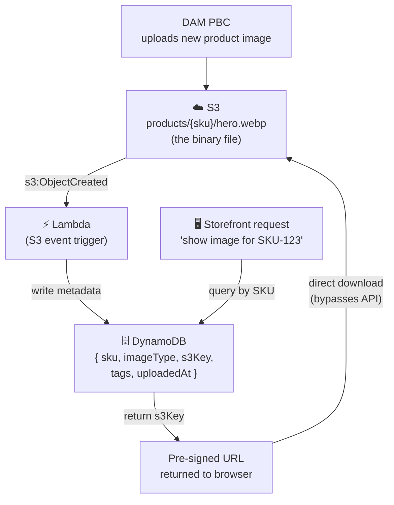

# S3 Is the Silent Infrastructure of Every Composable Commerce Platform

*By a Senior AWS Solutions Architect | #ComposableCommerce #AWS #ObjectStorage #ContentManagement*

---

Every composable commerce platform I've ever architected has S3 somewhere near the centre of it. Not always visibly — sometimes it's three layers behind a CDN, sometimes it's the destination of an ETL pipeline — but it's always there.

And yet S3 is often treated as an afterthought: "we'll put the images somewhere." That thinking costs teams dearly later when they're dealing with a 9-hour Glacier retrieval during a compliance audit, a product page that loads slowly because images aren't properly cached, or a customer invoice that anyone with the URL can read.

Let me show you how S3 and Glacier should actually be designed into a composable commerce architecture.

## Why Object Storage Is the Natural Fit for Composable

Composable commerce is built on the principle that every capability is a discrete, independently deployable service. Your product catalogue PBC, your CMS, your DAM (Digital Asset Management), your order management service — each maintains its own data. But they all need a shared place to exchange large, unstructured assets: product images, video demos, PDF specifications, customer-uploaded photos, compliance documents.

This is exactly what object storage is for.

Object storage manages data as **objects** — a blob of bytes plus metadata, identified by a key, accessed via HTTP. No file system hierarchy. No mounting. No iSCSI. Just a REST API call to a globally resolvable URL. That API model maps perfectly to the API-first principle of MACH architecture: any PBC can read or write objects with a standard HTTP call, regardless of what language it's written in, what cloud it's running on, or what team built it.



One S3 bucket as the shared asset store. Every PBC writes to its own prefix. IAM policies enforce that the Product Catalogue PBC can only write to `products/` — it cannot touch `customers/` or `invoices/`. The bucket is the integration point; the prefix structure is the boundary enforcement.

## Eleven Nines of Durability in Plain English

S3 Standard storage is designed for 99.999999999% durability. That's eleven nines. If you store 10 million product images, you can expect to lose one of them every 10 billion years.

What makes this possible? S3 automatically replicates every object across a minimum of three Availability Zones within the Region. Concurrently lose two full data centres — S3 doesn't miss a beat. This happens transparently, with no configuration required from you.

For a composable commerce platform, this durability is the foundation that lets every PBC trust the asset store. The Cart PBC can store a customer's uploaded gift message image without building its own backup strategy. The DAM can ingest 500,000 product assets from a brand migration without worrying about data loss. The durability is handled at the infrastructure level.

## Storage Classes: Matching Cost to Access Pattern

Not all commerce data has the same access pattern. This is where the composable architecture shines — you can apply granular cost optimisation to each data type independently.



A single lifecycle policy on the bucket handles all of this automatically. No cron jobs. No manual migrations. No operational overhead. Just a YAML configuration that says: "after 180 days, move to IA; after 730 days, move to Glacier; after 2,555 days, delete."

## The Pre-Signed URL Pattern for Headless Commerce

One of the most powerful S3 patterns for composable commerce is the pre-signed URL, and it comes up constantly in headless storefront designs.

The scenario: a customer wants to download their order invoice from your headless storefront. The invoice is in S3. The bucket is private (as it must be — you don't want invoices publicly accessible). You need to give the authenticated customer a temporary, direct download link.

The wrong approach: proxy the download through your Order PBC, serving the file through your API. This means every invoice download consumes your API compute and bandwidth.

The right approach: generate a pre-signed URL.

```javascript
// Order PBC: generate pre-signed URL on authenticated request
const { getSignedUrl } = require("@aws-sdk/s3-request-presigner");
const { S3Client, GetObjectCommand } = require("@aws-sdk/client-s3");

const s3 = new S3Client({ region: "us-east-1" });

async function getInvoiceDownloadUrl(customerId, orderId) {
  const command = new GetObjectCommand({
    Bucket: "shop-invoices",
    Key: `customers/${customerId}/orders/${orderId}/invoice.pdf`,
  });

  // URL valid for 1 hour — customer clicks it, downloads directly from S3
  // Your API handles zero bytes of the download
  const url = await getSignedUrl(s3, command, { expiresIn: 3600 });
  return { downloadUrl: url, expiresInSeconds: 3600 };
}
```

The customer gets a direct download link to S3. The download bypasses your API entirely — S3 serves it. Your API served one small JSON response (the URL). S3 handles the actual file transfer at scale, without touching your compute budget.

This pattern extends to customer-generated content: profile photos, review images, personalisation uploads. The frontend requests a pre-signed PUT URL from your Customer PBC, uploads directly to S3 from the browser, then notifies the PBC when complete. Your backend never handles the binary upload. For large product video files (2–8GB), this is the only approach that makes sense at scale.

## Encryption at Every Layer: PCI and GDPR Compliance by Default

In composable commerce, you're dealing with multiple vendors, multiple teams, and multiple data types. The composable architecture distributes the blast radius of a security incident — but only if you encrypt at rest and in transit everywhere.

S3 makes this straightforward. The decision tree is simple:

| Encryption Option | Choose When |
|---|---|
| **SSE-S3** | Standard commerce assets (product images, editorial content) — no compliance overhead needed |
| **SSE-KMS** | Personally Identifiable Information, payment-adjacent documents — need audit trail of key access |
| **SSE-C** | You must control the keys entirely — your security team owns key lifecycle |
| **Client-side** | End-to-end control required — you encrypt before S3 ever sees the data |

For a composable platform handling PCI-adjacent data, the default is SSE-KMS on all buckets containing customer or order data. AWS KMS logs every key usage to CloudTrail — so you have a provable record of which PBC accessed which customer document at what time. That audit trail is what your compliance team needs during a PCI assessment, and it's built into the infrastructure rather than requiring application-level instrumentation.

In-transit encryption is non-negotiable: always enforce HTTPS on S3 bucket policies. One line in the bucket policy denies any request not using TLS:

```json
{
  "Effect": "Deny",
  "Principal": "*",
  "Action": "s3:*",
  "Resource": ["arn:aws:s3:::shop-assets/*"],
  "Condition": { "Bool": { "aws:SecureTransport": "false" } }
}
```

## Cross-Region Replication: The Business Continuity Requirement

Multi-Region composable deployments need multi-Region assets. When your composable platform deploys to eu-west-1 for European customers, the Product Catalogue PBC in Ireland needs sub-50ms access to product images — not a transatlantic round-trip to us-east-1 for every image.

Cross-Region Replication (CRR) asynchronously mirrors every new object in your source bucket to a destination bucket in another Region. Enable it once, and every image your brand team uploads in New York is automatically available in Dublin within minutes.

Requirements: versioning must be enabled on both buckets, and an IAM role grants S3 permission to perform the replication. That's it. No ETL pipelines, no Lambda functions watching for new uploads, no operational overhead.

For composable commerce disaster recovery: CRR means your product assets survive a full regional outage. If us-east-1 is unavailable, eu-west-1 has a complete, consistent copy. Your regional deployment fails over via Route 53, and the EU storefront serves EU customers from EU assets with zero cross-region latency.

## Glacier: The Compliance Archive Every Commerce Platform Needs

Composable architectures separate concerns cleanly, but one concern that every commerce platform shares is **compliance archiving**. Financial records, order data, customer consent logs, tax documents — these need to be retained for 5–10 years depending on jurisdiction, accessed almost never, and verifiable as unmodified during that period.

Amazon Glacier is purpose-built for exactly this. Storage costs are roughly 80% lower than S3 Standard. Retrieval takes 3–5 hours. Data is automatically encrypted. And **Vault Lock** allows you to write a WORM (Write Once, Read Many) policy that makes stored data immutable — not even AWS can delete it once the lock is applied.

For a composable commerce platform's compliance posture:
- All order records transition to Glacier after 3 years via lifecycle policy
- Vault Lock policy prevents deletion before 7-year retention period
- Annual compliance audit: request retrieval, data is available within 4 hours

The composable architecture means this archiving strategy is configured once — at the infrastructure level — and all PBCs that write order data to S3 benefit automatically. The Cart PBC, the Order PBC, the Payment PBC — they all write to the same prefixes, and the lifecycle policy handles the rest.

## The Architecture Decision Every Team Gets Wrong

Here's the mistake I see repeatedly: teams use S3 directly as a searchable data store, calling ListObjects to find relevant assets. At 10,000 objects this is fine. At 10 million objects, it's unusable.

The right pattern: **S3 for storage, DynamoDB for indexing.**



Searches hit DynamoDB — milliseconds. Downloads hit S3 — bandwidth billed, not compute. Asset metadata lives in a queryable, indexable data store. The actual binary data lives in infinitely scalable, 11-nines-durable object storage. Each system does what it's good at.

---

## The Bottom Line

S3 and Glacier aren't just storage — they're the integration fabric of a composable commerce architecture. They provide the shared asset exchange that API-first PBCs need, the compliance posture that regulated commerce requires, and the cost efficiency that makes global scale affordable.

The retailers I've seen struggle with composable commerce almost always have the same problem: they've built excellent PBC boundaries, excellent API contracts, excellent deployment pipelines — and then every PBC is managing its own file storage in its own EC2 instances, with its own backup strategy, its own CDN configuration, its own access control model.

Centralise on S3. Let each PBC own its prefix. Build the lifecycle policies once. And let eleven nines of infrastructure durability underpin the modularity you've built at the application layer.

---

*Next: How EC2 and EBS provide the compute foundation for stateful PBCs — and when Lambda is the better answer for composable commerce workloads.*

*💬 What's your approach to shared asset storage across PBCs? I'd love to hear how different teams are solving the DAM challenge in composable stacks.*

---
**#S3 #AWS #ComposableCommerce #ObjectStorage #MACH #HeadlessCommerce #CloudNative #DAM #ContentManagement #SolutionsArchitect**
