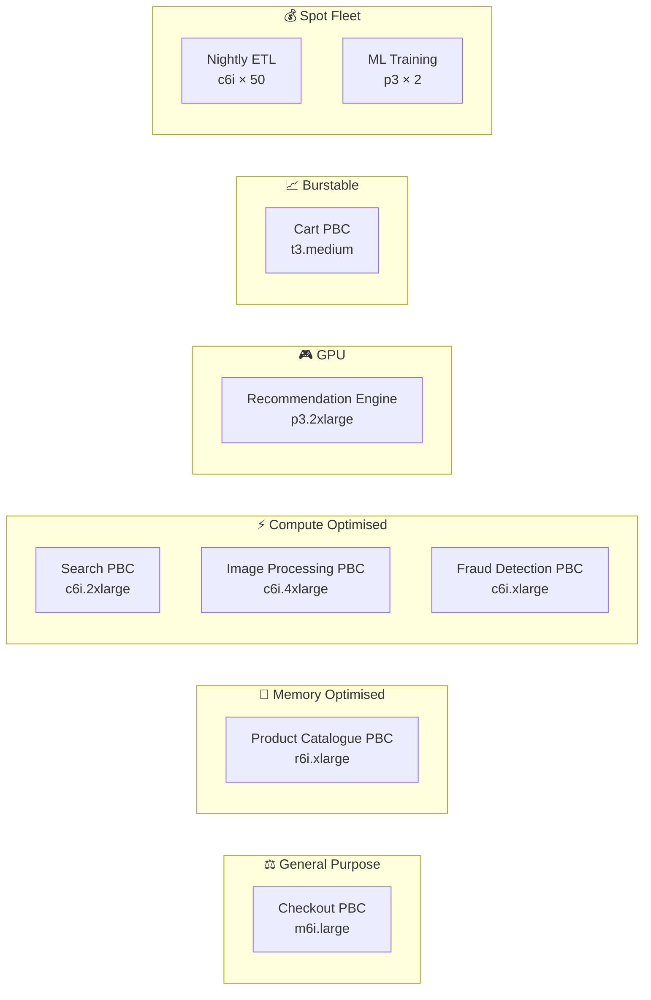
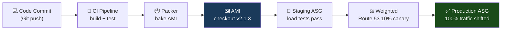
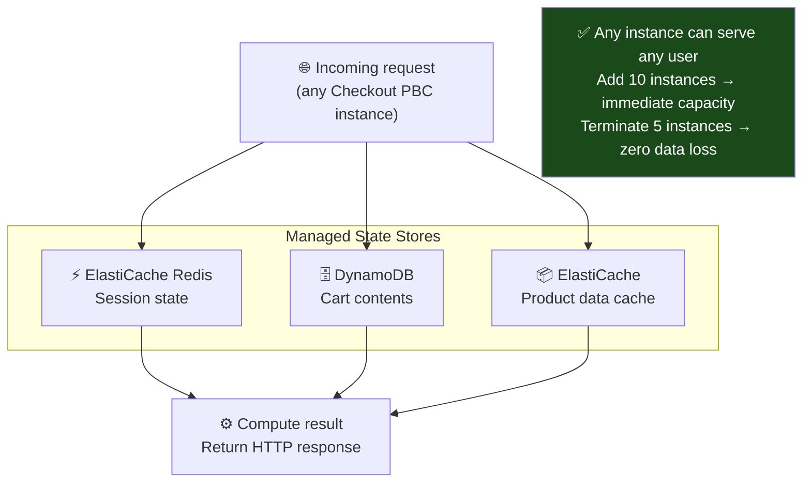

# Sizing EC2 for Composable Commerce: Why Your PBCs Don't All Need the Same Instance

*By a Senior AWS Solutions Architect | #ComposableCommerce #AWS #EC2 #Microservices*

---

One of the most underappreciated benefits of composable commerce is that different services have radically different resource profiles. Your Search PBC is CPU-bound. Your Product Catalogue PBC is memory-bound. Your Image Processing PBC is GPU-optional but CPU-intensive. Your Cart PBC barely uses CPU at all — it's mostly waiting on database round-trips.

In a monolith, you provision for the most demanding component. All of it runs on the same instance, so you size the instance for the Search workload — and your Cart functionality is riding on massively over-provisioned compute that you're paying for whether it's used or not.

In a composable architecture, each PBC runs on the instance family that fits its actual workload. This is one of the financial arguments for composable that rarely gets as much attention as the organisational agility argument. Let me walk through how I approach compute decisions for composable commerce PBCs on AWS.

## The PBC-to-Instance-Family Mapping

Every AWS instance family is optimised for a different compute profile. Mapping your PBCs to the right family is one of the highest-leverage cost optimisation decisions in the whole architecture.



The result: each PBC is right-sized for its actual workload. You're not paying for GPU on your Cart PBC. You're not starving your Search PBC on a burstable instance. Total compute cost is often 40–60% lower than a monolith sized for peak load across the board.

## AMIs as the PBC Deployment Contract

In composable commerce, a **golden AMI** for each PBC is the deployment contract between the platform team and the product team. The AMI contains everything the PBC needs to run: the runtime (Node.js, JVM, Python), the application code, the monitoring agent, the security hardening, the log shipper configuration.

This matters for composable architectures because it makes PBC deployment **atomic**. When a team deploys a new version of the Checkout PBC, they're not patching files on a running server — they're launching a new ASG using a new AMI. The old version runs until the new version is healthy. Health checks pass. Traffic shifts. Old instances terminate. Rollback means pointing the ASG at the previous AMI.



No configuration management at deploy time. No SSH onto running servers. No "works on my machine." The AMI is the artifact that carries the entire PBC runtime environment.

## The Three Pricing Models and When Each Applies

Every composable commerce team has a mix of workload patterns across their PBCs. Mapping the right pricing model to each dramatically reduces total infrastructure cost.

**Reserved Instances for your baseline PBCs.**
Your core platform services — API Gateway, Order Management, Customer Data — run 24/7 at relatively stable load. Commit to 1-year Reserved Instances for the baseline capacity of these PBCs. You'll save 40% compared to On-Demand.

**On-Demand for your variable PBCs.**
Campaign services, seasonal promotions, A/B testing environments, new PBCs under active development — pay On-Demand so you're not locked in to capacity you might not need.

**Spot for your async PBCs.**
Image processing, recommendation model training, ETL pipelines, search index rebuilds — these are all fault-tolerant, restartable, and don't face users directly. Run them on Spot. Pricing is typically 70–90% below On-Demand. When a Spot instance is reclaimed, the job checkpoints and resumes on a replacement instance.

```
COST MODEL FOR A MID-SIZE COMPOSABLE PLATFORM (monthly)

Reserved (1yr, baseline):
  Cart + Checkout + Order (6x m6i.large @ $0.062/hr)     = $271
  Product Catalogue (2x r6i.xlarge @ $0.117/hr)           = $170
  Search (2x c6i.2xlarge @ $0.177/hr)                     = $256

On-Demand (variable):
  Campaign PBCs (2x m6i.large, peak periods)              = $190
  Development environments                                 = $320

Spot (async workloads):
  Image processing fleet (10x c6i.2xlarge @ ~$0.06/hr)   = $432
  ML training (2x p3.2xlarge @ ~$0.90/hr, 4hrs/day)      = $216

Total: ~$1,855/month

Equivalent monolith (sized for peak):
  2x m6i.16xlarge always-on (reserved)                    = $4,370/month

Savings: ~57%
```

This isn't a theoretical saving — it's the actual cost difference I see when teams right-size after a composable migration.

## EBS: The Storage Layer for Stateful PBCs

Most composable commerce PBCs should be **stateless** — they hold no data between requests. State lives in managed services: RDS, DynamoDB, ElastiCache. But some PBCs genuinely need local disk: search indices, ML model files, local caches for warm-up performance.

For these, EBS volume selection matters:

| PBC Type | EBS Volume | Reason |
|---|---|---|
| Search index (OpenSearch) | `gp3` | General SSD, configurable IOPS independently of size |
| Database (self-managed) | `io2` | Provisioned IOPS for consistent latency |
| ML model storage | `gp3` | Models loaded at start, read-only at inference time |
| Log aggregation | `st1` | Sequential throughput HDD — cheap, high bandwidth |

The critical rule for composable PBCs: **never rely on instance store for anything that must survive a deployment.** Instance store is ephemeral — data is lost when the instance stops. In a composable architecture where deployments happen frequently (individual PBCs deploy independently, sometimes multiple times per day), instance store is only appropriate for truly transient data: caches that are warm-up artifacts, temporary files during processing.

For anything persistent, EBS snapshots give you the backup story: automated daily snapshots to S3, cross-Region copy for disaster recovery, instant restore to a new volume in any AZ. Your search index is recoverable from a snapshot in minutes, not hours of re-indexing.

## Security Groups as PBC Network Boundaries

In a monolith, the network boundary is the server. In composable commerce, the network boundary is the PBC. Security Groups give you the instance-level firewall to enforce that boundary.

The pattern I use for every composable deployment:

```
SECURITY GROUP TOPOLOGY FOR COMPOSABLE COMMERCE

External ALB SG:
  Inbound:  443 from 0.0.0.0/0 (internet shoppers)
  Outbound: 8080 to Checkout-PBC-SG

Checkout PBC SG:
  Inbound:  8080 from External-ALB-SG (only from the load balancer)
  Outbound: 3306 to Order-DB-SG, 6379 to Cache-SG, 443 to Payment-Gateway

Order PBC SG:
  Inbound:  8080 from Checkout-PBC-SG, Internal-ALB-SG
  Outbound: 3306 to Order-DB-SG, 5432 to Inventory-DB-SG

Internal ALB SG:
  Inbound:  8080 from any PBC SG (internal service mesh traffic)
  Outbound: 8080 to any PBC SG
```

No PBC can reach another PBC directly — all inter-PBC traffic goes through the internal ALB, which provides load balancing, health checking, and path-based routing between services. The security groups enforce this at the network layer. Even if application-level access control fails, a compromised Cart PBC cannot make direct calls to the Order database — the Security Group rejects the connection before it gets there.

## The Stateless PBC Imperative

This deserves its own section because it's the most important architectural constraint for composable commerce on EC2: **your PBCs must be stateless.**

If a PBC stores session state on the EC2 instance — in memory, in a local file, in a JVM cache — then Auto Scaling becomes dangerous. Add an instance during a traffic spike: new instance has empty state. Remove an instance during scale-in: any user session on that instance is gone. Sticky sessions partially mask the problem but eliminate the elasticity benefit.

The solution is always the same: move state to a managed service.



This is not just a best practice — it's what enables the core value proposition of composable commerce: independent scalability of each PBC.

---

## The Practical Verdict

EC2 and EBS are not glamorous. They don't generate the conference talk buzz of Lambda or Kubernetes. But for stateful PBCs, long-running services, and workloads requiring fine-grained control over the runtime environment, they're the right tool — and using them correctly with the right instance families, AMI strategies, pricing models, and security group topologies is one of the most direct levers on both the cost and resilience of your composable commerce platform.

Right-size each PBC. Treat AMIs as immutable deployment artifacts. Reserve the baseline, spot the async, on-demand the rest. Keep PBCs stateless. And let the security group topology enforce the service boundary that your API contracts define logically.

---

*Next: VPC design for composable commerce — how to build the network topology that gives each PBC the right level of isolation, connectivity, and security.*

*💬 How does your team handle AMI management across multiple PBCs? Golden AMI per service or a shared base with service-specific layers?*

---
**#EC2 #EBS #AWS #ComposableCommerce #MACH #CloudNative #Microservices #DevOps #SolutionsArchitect #CostOptimisation**
