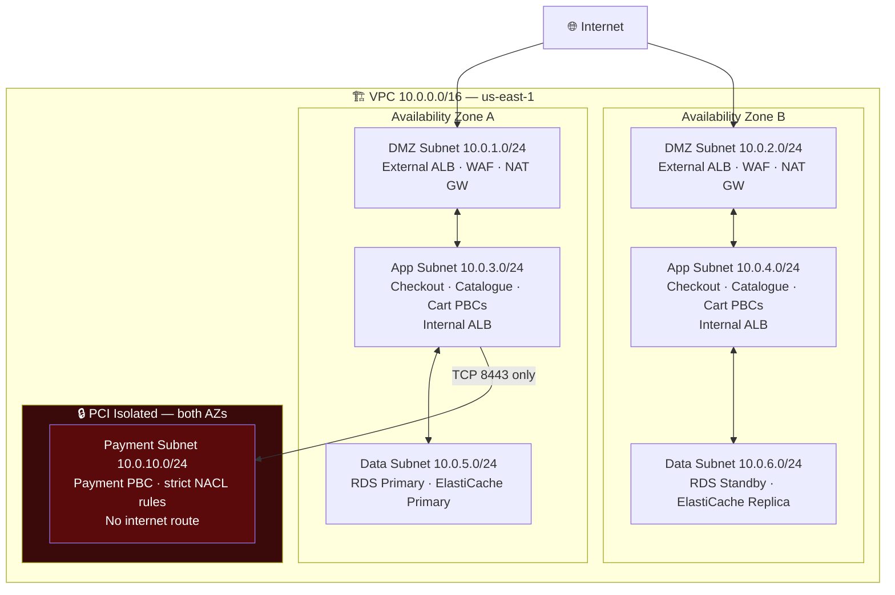
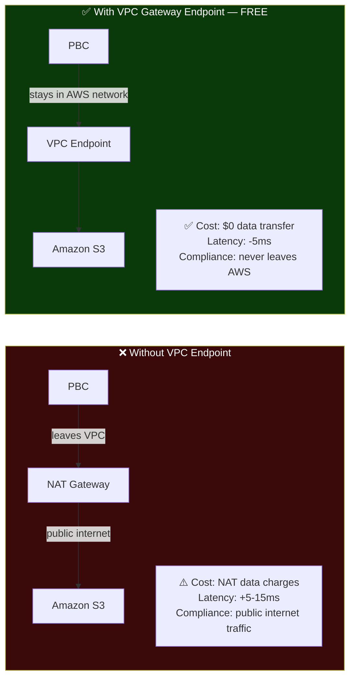
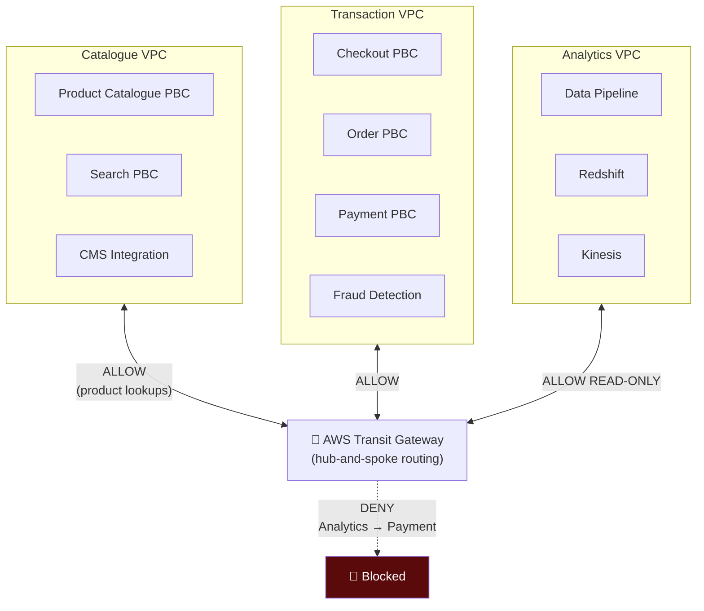
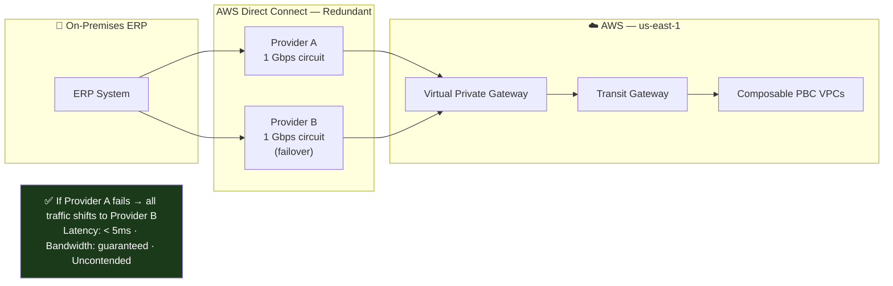

# VPC Design Patterns for Composable Commerce: Isolation Without Friction

*By a Senior AWS Solutions Architect | #ComposableCommerce #VPC #NetworkSecurity #AWS*

---

The network topology of a composable commerce platform is one of the most consequential architectural decisions you'll make — and one of the hardest to change later. Get it right and your PBCs can communicate securely and efficiently. Get it wrong and you'll spend years fighting cross-service connectivity issues, compliance audit findings, and latency problems that never quite surface in testing but show up in production at the worst moments.

Here's how I approach VPC design for composable commerce platforms.

## Why Composable Commerce Has Unique Network Requirements

A monolith has one network boundary: the server. Everything inside the application communicates in-process — zero network overhead, no firewall to navigate, no certificate to validate.

Composable commerce inverts this. Every PBC boundary is a network boundary. The Cart PBC calling the Inventory PBC is a network call — with all the implications that carries: latency, failure modes, authentication, encryption. The network design either amplifies or absorbs these costs.

The two competing tensions in composable network design:

**Isolation** — PBCs should not be able to reach services they have no business calling. A compromised frontend PBC should not be able to directly query the Order database. The Payment PBC should not be reachable from the general internet.

**Connectivity** — PBCs must be able to reach the services they do need. The Checkout PBC must reach the Payment gateway. The Recommendation PBC must reach the product catalogue API. Internal service mesh traffic must flow with minimal latency and overhead.

The VPC design is the infrastructure expression of this balance.

## The Reference VPC Topology

After designing this for multiple large composable platforms, here's the topology I return to most consistently:

Three logical tiers, with an additional isolated subnet for regulated workloads. Each tier is in both AZs for redundancy. The payment subnet is intentionally isolated — not just by security groups but by NACLs and routing rules, providing defence-in-depth for PCI compliance.

## Security Groups vs NACLs: Using Both Layers

This distinction trips up almost every team I work with, so let me be direct about how each layer functions in a composable context.

**Security Groups** are stateful, instance-level firewalls. When a Checkout PBC instance sends a request to the Order PBC, the Security Group on the Order PBC allows the inbound connection. The response traffic is automatically allowed back — you don't need a corresponding outbound rule. Security Groups are your primary PBC-to-PBC access control mechanism.

**Network ACLs** are stateless, subnet-level firewalls. They process rules in order and require explicit rules for both inbound AND outbound traffic. They don't track connections — every packet is evaluated independently. In a composable architecture, NACLs are your second line of defence at the subnet boundary, most valuable for:
- Blocking entire IP ranges (known malicious CIDRs, geo-blocking)
- Isolating the Payment subnet from the App subnet at the network layer
- Providing an independently controlled security layer that survives a Security Group misconfiguration

The composable architecture makes the two-layer approach more valuable than in a monolith. You have more services, more movement of traffic, more potential for misconfiguration. Each layer independently catches errors in the other.

## VPC Endpoints: Keeping PBC Data Off the Public Internet

Your Product Catalogue PBC reads product data from DynamoDB. Your Order PBC writes completed orders to S3 for archiving. Your Payment PBC reads encryption keys from AWS Secrets Manager.

Without VPC Endpoints, all of these calls leave your VPC, traverse the internet (even though they're destined for AWS services), and return. This creates three problems: latency, data transfer costs, and compliance exposure (data on the public internet, even encrypted, fails some compliance frameworks).

**Gateway Endpoints** for S3 and DynamoDB are free. Create them and add a route table entry, and all S3/DynamoDB traffic from your PBCs stays inside the AWS network:

For a composable platform processing millions of API calls per day between PBCs and AWS services, the NAT Gateway data processing savings alone often pay for a significant portion of the infrastructure.

**Interface Endpoints** (PrivateLink) for other services — Secrets Manager, Systems Manager, KMS, EventBridge — cost $0.01/hour per AZ but eliminate the NAT Gateway traffic and provide private connectivity. For a Payment PBC accessing Secrets Manager to retrieve payment processor credentials, PrivateLink is both the secure and cost-efficient choice.

## Peering and the Multi-VPC Composable Strategy

At scale, composable platforms often use **multiple VPCs** — one per team, domain, or compliance boundary. The Product team owns the Catalogue VPC. The Commerce team owns the Transaction VPC. The platform team owns the shared services VPC.

VPC Peering connects pairs of VPCs with private routing, but it's **non-transitive**. If VPC-A peers with VPC-B and VPC-B peers with VPC-C, VPC-A cannot reach VPC-C through VPC-B. In a composable architecture with 8 domain VPCs, you'd need 28 peering connections for full mesh connectivity. That's operationally painful.

**AWS Transit Gateway** solves this: a hub-and-spoke network topology where every VPC connects to the Transit Gateway, and the Transit Gateway routes between them. Route tables on the Transit Gateway enforce which VPCs can reach which — the Payment VPC can only be reached from the Transaction VPC, not from the Catalogue VPC or the Analytics VPC.

This gives you the network-level isolation that PCI DSS and GDPR require between different data domains, while maintaining the service connectivity that composable architecture needs.

## Hybrid Connectivity: The Migration Period

No composable migration happens overnight. For 12–36 months, you're running new PBCs on AWS alongside legacy systems on-premises. The VPN or Direct Connect configuration determines how well that hybrid period works.

For AWS Direct Connect — the dedicated private circuit — the design rule is always: provision two connections from two separate providers, both in active-active configuration. A single Direct Connect circuit to a single provider is a single point of failure that will eventually fail during the wrong moment of your migration.

During the composable migration, your new Checkout PBC on AWS calls the legacy Order Management System on-premises via Direct Connect. After the OMS is migrated to AWS, you update the endpoint in a configuration parameter — the PBC code doesn't change.

---

## The Design Principles That Withstand Scrutiny

After years of designing composable commerce networks, these are the principles I apply regardless of team size or platform complexity:

**1. Subnet per tier, not subnet per service.** You don't need 30 subnets for 30 PBCs. Subnets define network boundaries for NACLs and routing — Security Groups handle service-to-service access control within a subnet tier.

**2. Never put a database in a public subnet.** This sounds obvious but I've seen it in production. Data subnets have no IGW route, full stop.

**3. VPC Endpoints before NAT Gateway for AWS service traffic.** The cost and compliance benefits are immediate.

**4. Payment isolation is network topology, not just application logic.** Security Groups on the Payment PBC are necessary but not sufficient. The NACL rules and route table configuration that prevent non-checkout traffic from ever reaching the payment subnet are the belt that backs up the suspenders.

**5. Plan your CIDR ranges before you deploy anything.** The single most painful conversation in AWS architecture is "we need to peer these two VPCs but their CIDR ranges overlap." Plan a non-overlapping addressing scheme for every VPC you might ever need to connect, including on-premises ranges.

---

*Next: ELB, CloudWatch, and Auto Scaling — the elasticity layer that lets each PBC scale independently without affecting the others.*

*💬 What's your approach to network isolation between PBCs handling different data classifications? Single VPC with subnet isolation, or multiple VPCs with Transit Gateway?*

---
**#VPC #AWS #NetworkSecurity #ComposableCommerce #MACH #CloudNative #PCICompliance #SolutionsArchitect #Microservices #CloudArchitecture**
