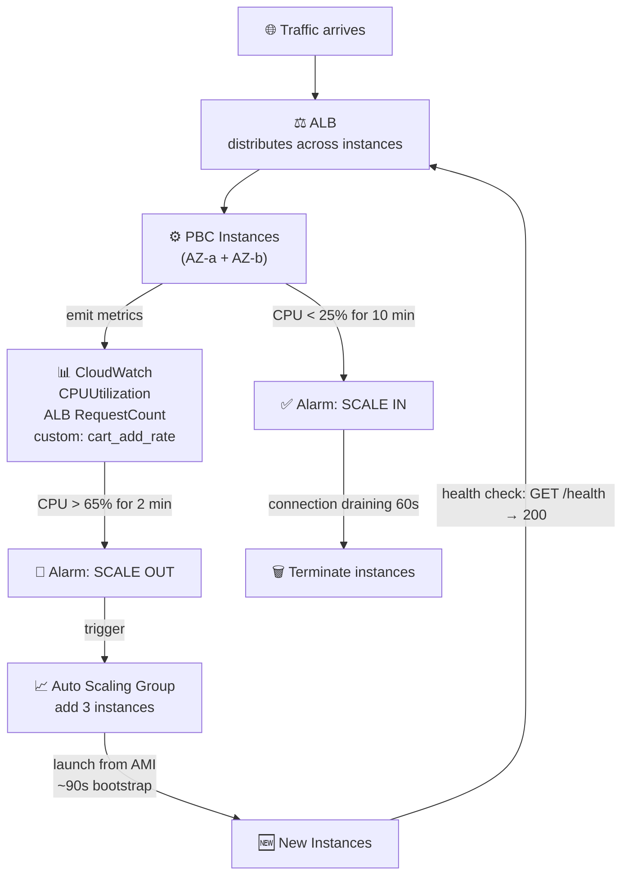
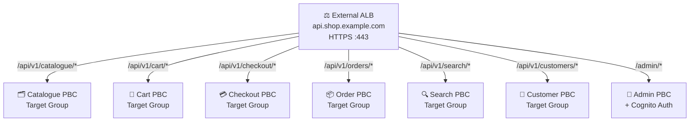
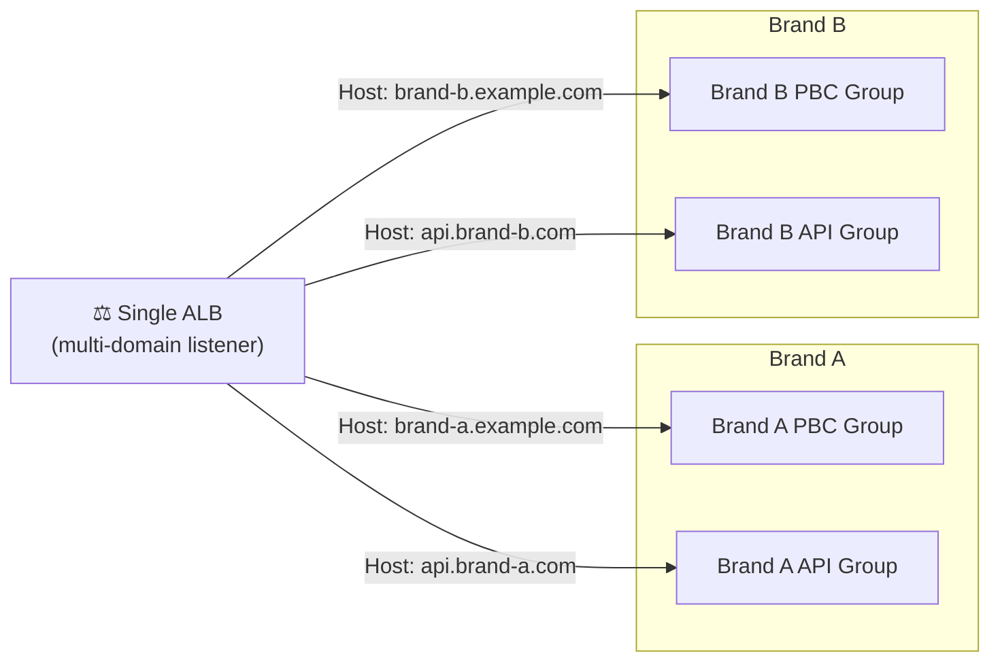
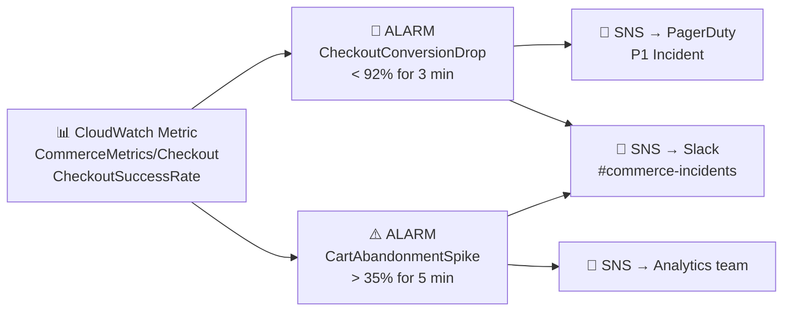

# The Elasticity Engine: ELB, CloudWatch and Auto Scaling for Composable Commerce

*By a Senior AWS Solutions Architect | #ComposableCommerce #AutoScaling #Observability #AWS*

---

The promise of composable commerce is that each PBC scales independently. Your Checkout PBC doesn't have to scale because your Search PBC is under load. Your Product Catalogue PBC can absorb Black Friday traffic without forcing your Fraud Detection PBC to spin up additional capacity it doesn't need.

That promise is only delivered by three services working together: Elastic Load Balancing, CloudWatch, and Auto Scaling. Get this layer right and your composable platform is genuinely elastic. Get it wrong and you've just built a distributed monolith that's harder to operate than the thing you replaced.

## The Elasticity Triad

Each of these services plays a distinct role:

- **Elastic Load Balancing** — distributes traffic across instances, performs health checks, removes unhealthy targets automatically
- **Amazon CloudWatch** — collects metrics from every PBC and every AWS service, evaluates alarm conditions, triggers actions
- **Auto Scaling** — adds or removes EC2 instances (or ECS tasks, Lambda concurrency, etc.) in response to CloudWatch signals

Together, they form a closed-loop control system: observe (CloudWatch), decide (alarm threshold), act (Auto Scaling), verify (ELB health check).



No human in the loop. Happens at 3am on a Sunday as smoothly as it happens during a live campaign.

## ALB for Composable Commerce: Beyond Basic Load Balancing

The Application Load Balancer does more than distribute traffic in a composable architecture — it's the API routing layer that allows a single external endpoint to serve the entire composable stack.

**Path-based routing for PBC dispatch:**



Each target group has its own health check, its own set of instances, its own Auto Scaling group. The ALB is the external face of the entire composable platform — one domain, one TLS certificate, multiple independent services behind it.

**Host-based routing for multi-brand composable:**
If you're running a composable platform for multiple brands (common in retail groups), host-based routing lets you handle all of them from a single ALB:



One ALB. Multiple brands. Each brand's PBCs scale independently.

## CloudWatch Custom Metrics: Observing Business Behaviour, Not Just Infrastructure

The biggest observability mistake in composable commerce is stopping at infrastructure metrics. CPU is a proxy. You need to observe the business behaviour your PBCs are implementing.

For a composable commerce platform, I instrument custom CloudWatch metrics at every significant business event:

```javascript
// Checkout PBC: publish business metrics alongside technical metrics
const cloudwatch = new CloudWatchClient({ region: "us-east-1" });

async function recordCheckoutMetrics(result) {
  await cloudwatch.send(new PutMetricDataCommand({
    Namespace: "CommerceMetrics/Checkout",
    MetricData: [
      {
        MetricName: "CheckoutAttempts",
        Value: 1,
        Unit: "Count",
        Dimensions: [{ Name: "Channel", Value: result.channel }]
      },
      {
        MetricName: "CheckoutSuccessRate",
        Value: result.success ? 100 : 0,
        Unit: "Percent"
      },
      {
        MetricName: "CheckoutDuration",
        Value: result.durationMs,
        Unit: "Milliseconds"
      },
      {
        MetricName: "CartAbandonmentRate",
        Value: result.abandoned ? 100 : 0,
        Unit: "Percent"
      }
    ]
  }));
}
```

Now you have alarms that mean something to the business:



Infrastructure CPU at 80% might be fine — you're just busy. Checkout success rate at 91% at 8pm on a Tuesday is a production incident regardless of what CPU is doing.

## Auto Scaling Strategy: Different PBCs, Different Policies

Not all PBCs should scale the same way. The scaling policy should match the workload profile.

**Target Tracking (simplest, most effective for most PBCs):**
Set a target value for a metric. Auto Scaling adjusts capacity automatically to maintain it.
```
Checkout PBC: Target ALBRequestCountPerTarget = 500 requests/min/instance
Cart PBC: Target CPUUtilization = 60%
Search PBC: Target CPUUtilization = 70%
```

**Step Scaling (for non-linear workloads):**
When traffic spikes aren't smooth — a flash sale hit or a celebrity mention — step scaling responds more aggressively to large deviations:
```
Cart PBC Step Scaling:
  CPU 60-70%: add 1 instance
  CPU 70-80%: add 3 instances
  CPU 80-90%: add 6 instances
  CPU > 90%:  add 10 instances
```

**Scheduled Scaling (for predictable peaks):**
Use historical data. If your composable platform consistently sees 4x traffic every Friday at 6pm:
```
Scheduled Action: FridayEvening
  Recurrence: cron(0 17 ? * FRI *)  # 5pm UTC Friday
  Min: 10 instances, Desired: 16, Max: 40

Scheduled Action: FridayNight
  Recurrence: cron(0 22 ? * FRI *)  # 10pm UTC Friday
  Min: 4 instances, Desired: 6, Max: 40
```

Capacity is there before the traffic arrives. No cold start penalty while the first shoppers of the evening are trying to check out.

## Connection Draining: The Zero-Downtime Composable Deployment Requirement

Composable commerce PBCs deploy frequently — individual teams deploy their service independently, sometimes multiple times per day. Every deployment is a potential disruption to in-flight user sessions.

Connection draining (ALB Deregistration Delay) is the mechanism that makes frequent deployments safe. When a PBC instance is deregistered from the target group (during a deployment), the ALB:

1. Stops routing **new** requests to that instance
2. Waits for **in-flight requests** to complete (configurable, up to 3600 seconds)
3. After the drain period, the instance is fully deregistered and terminates

For a composable Checkout PBC, set the drain period to accommodate your longest expected checkout flow. If checkout takes up to 90 seconds from cart to payment confirmation, set `deregistration_delay.timeout_seconds = 120`. No customer loses their checkout mid-flow due to a deployment.

---

## The Practical Payoff

When these three services are configured correctly for a composable platform, the operational picture changes fundamentally. Teams deploy their PBCs independently without coordinating with other teams. Traffic spikes are absorbed automatically. Failures are isolated and self-healing. Capacity cost tracks actual demand.

This is the operational independence that composable architecture promises — but it only exists at the infrastructure level if the elasticity layer is built correctly.

---

*Next: IAM — how identity and access management enforces the service boundaries your composable architecture defines logically, at the credential level.*

*💬 What metrics do you use to trigger Auto Scaling in your composable platform? Still CPU-based, or have you moved to business-level metrics?*

---
**#ELB #CloudWatch #AutoScaling #AWS #ComposableCommerce #MACH #Observability #SRE #SolutionsArchitect**
