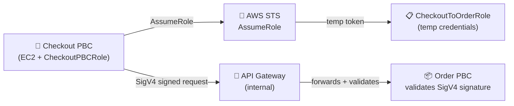
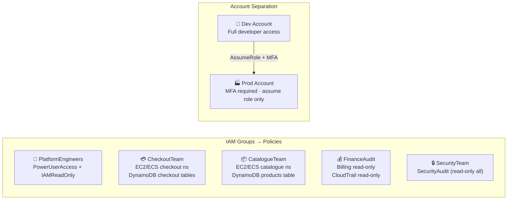

# Zero-Trust Between Your Own Services: IAM for Composable Commerce

*By a Senior AWS Solutions Architect | #ComposableCommerce #IAM #Security #ZeroTrust*

---

Composable commerce creates a security paradox that monolithic architectures never face: the more you decompose, the more service-to-service trust relationships you create. In a monolith, there's one process, one identity, one credential. In a composable platform with 15 PBCs, you have 15 service identities, potentially hundreds of IAM roles, and a complex web of who is allowed to call what.

I've seen composable platforms where every PBC used the same shared IAM user with administrator access "to keep things simple during the build phase." That phase ended three years ago. The shared key is still there. It's rotated approximately never. And every PBC that runs on that key can delete your production database.

Here's how to do it correctly.

## One IAM Role Per PBC: The Non-Negotiable Starting Point

Every PBC gets exactly one IAM role. That role has exactly the permissions that PBC needs to do its job. No more.

```
CheckoutPBCRole:
  Trust Policy: EC2 instances tagged Service=checkout
  Permissions:
    - dynamodb:GetItem, PutItem, UpdateItem on Orders table
    - s3:PutObject on s3://shop-invoices/orders/*
    - sqs:SendMessage to checkout-events queue
    - secretsmanager:GetSecretValue for checkout/payment-gateway-key
    - kms:Decrypt for the checkout encryption key
    DENY everything else (implicit)

CataloguePBCRole:
  Trust Policy: EC2 instances tagged Service=catalogue
  Permissions:
    - dynamodb:GetItem, Query, Scan on Products table
    - s3:GetObject on s3://shop-assets/products/*
    - elasticache:Connect (cluster ARN)
    DENY everything else (implicit)
```

The Checkout PBC cannot read the Products table — it has no permission for that. The Catalogue PBC cannot write to the Orders table. Even if a vulnerability allows an attacker to compromise the Checkout PBC, their blast radius is bounded to checkout's IAM role. They cannot pivot to the Catalogue database, the Customer data, or the Payment secrets.

This is **least-privilege** applied at the PBC level, and it's the IAM analogue of the network isolation we built in the VPC.

## No Credentials in Code, Configuration, or Environment Variables

This rule is absolute in a composable platform. I've reviewed the codebases of five different composable platforms over the past two years. All five had at least one place where access keys were hardcoded or in environment variables. In one case, they were in a public GitHub repository.

The correct pattern: **IAM roles on EC2 instances.** The AWS SDK automatically fetches temporary credentials from the EC2 Instance Metadata Service. Your PBC code never sees a key ID or secret. Credentials rotate automatically every few hours. No rotation scripts. No secrets sprawl.

```python
# Checkout PBC: no credentials anywhere in the code
import boto3

# SDK automatically uses the CheckoutPBCRole attached to this instance
# Credentials fetched from http://169.254.254.169/latest/meta-data/iam/security-credentials/
dynamodb = boto3.resource("dynamodb")
table = dynamodb.Table("Orders")

# This works because the EC2 instance has CheckoutPBCRole attached
# If this code runs anywhere else without that role, it fails cleanly
table.put_item(Item={"order_id": order_id, "status": "confirmed"})
```

For containerised PBCs on ECS, use **ECS Task Roles** — the exact same pattern, applied at the task level rather than the instance level. For Lambda-based PBCs, the Lambda execution role. The pattern is consistent across all compute primitives.

## Cross-PBC Authorization: Roles, Not Keys

When one PBC needs to call another PBC's API, the authentication should use IAM roles, not shared API keys.

The pattern: the calling PBC assumes a specific role that grants it permission to invoke the target PBC's API. The target PBC validates the assumed role identity on every request.

For internal service-to-service calls via API Gateway:


For event-driven communication via SQS, the IAM policy is the authorization control:
```
CheckoutPBCRole: sqs:SendMessage on arn:aws:sqs:...:checkout-events
OrderPBCRole:    sqs:ReceiveMessage, sqs:DeleteMessage on arn:aws:sqs:...:checkout-events

Checkout PBC writes events to the queue (authorised)
Order PBC reads events from the queue (authorised)
Catalogue PBC cannot read checkout events (no permission)
```

## Secrets Management: SSM vs Secrets Manager

In a composable platform, PBCs need access to secrets: database passwords, payment gateway API keys, third-party OAuth tokens, encryption keys. How these are stored and accessed matters.

**AWS Secrets Manager** is the right choice for secrets that rotate (database passwords, API keys with expiry), that need a full audit trail of access, or that multiple PBCs might share. Automatic rotation for RDS database passwords — Secrets Manager rotates the password on a schedule and updates the secret value. Your PBCs fetch the current secret value at runtime; they never cache it long-term.

**SSM Parameter Store** (SecureString tier) for configuration values that happen to be sensitive but don't rotate: feature flags with sensitive values, environment-specific configuration, non-rotating API endpoints. Lower cost than Secrets Manager for high-volume parameter reads.

```python
# PBC startup: fetch secrets from Secrets Manager, not environment variables
import boto3
import json

def get_payment_gateway_credentials():
    client = boto3.client("secretsmanager")
    secret = client.get_secret_value(
        SecretId="commerce/checkout/payment-gateway"
    )
    return json.loads(secret["SecretString"])
    # {"api_key": "...", "webhook_secret": "..."}
    # Fetched fresh each time — no stale credentials
    # All access logged in CloudTrail
```

## MFA and Human Access Patterns

In a composable platform with multiple teams, human access to AWS needs as much structure as service access.

**Team-based IAM groups:**


**MFA required for:**
- Any console access (policy condition: `aws:MultiFactorAuthPresent = true`)
- Any action that modifies production resources
- Cross-account access to production accounts

**Production account separation:**
The mature composable platform uses separate AWS accounts per environment — development, staging, production. Developers work in the development account freely. Production access requires assuming a role in the production account via IAM Identity Center (SSO), with MFA enforced. This means a compromised developer credential cannot directly affect production.

## The Explicit Deny Guardrail

One IAM pattern I implement on every composable platform is the **explicit deny guardrail** at the account level via Service Control Policies (if using AWS Organizations) or via permission boundaries on PBC roles.

The most dangerous actions in a composable platform — the ones that can cause catastrophic data loss or business disruption — should require a higher bar than just "the role doesn't have permission":

```json
{
  "Effect": "Deny",
  "Action": [
    "dynamodb:DeleteTable",
    "rds:DeleteDBInstance",
    "s3:DeleteBucket",
    "ec2:TerminateInstances"
  ],
  "Resource": "*",
  "Condition": {
    "StringNotEquals": {
      "aws:ResourceTag/Environment": "development"
    },
    "BoolIfExists": {
      "aws:MultiFactorAuthPresent": "false"
    }
  }
}
```

This policy: explicitly denies deletion of production resources (tagged Environment=production) from any session without active MFA. Even if a PBC role somehow had these permissions (it shouldn't), and even if an attacker compromised that role, the explicit deny prevents destruction without an MFA-authenticated session.

---

## The Identity Model Reflects Your Architecture

Here's the observation I leave teams with: your IAM configuration is a specification of your composable architecture's intended behaviour. Every `Allow` is a statement of "this service is supposed to do this." Every `Deny` is a statement of "this boundary must hold." The blast radius of any failure — a bug, a breach, a misconfiguration — is bounded by the IAM model.

Monolithic architectures don't have this. You either have access to the system or you don't. Composable architectures on AWS, with well-designed IAM roles and policies, have fine-grained blast radius control built into the infrastructure. That's a security property you can't easily add to a monolith.

---

*Next: Database selection for composable commerce — how to choose between RDS, DynamoDB, and Redshift for different PBC data requirements.*

*💬 How does your team handle IAM role proliferation in a large composable platform? Do you use a central IAM module in Terraform/CDK, or do teams own their roles independently?*

---
**#IAM #AWS #ComposableCommerce #ZeroTrust #CloudSecurity #MACH #SolutionsArchitect #Microservices #SecurityArchitecture**
