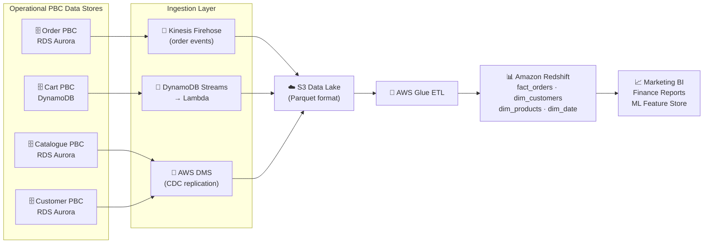

# One Platform, Three Databases: RDS, DynamoDB and Redshift in Composable Commerce

*By a Senior AWS Solutions Architect | #ComposableCommerce #Databases #AWS #DataArchitecture*

---

One of the most counterintuitive aspects of composable commerce for engineers coming from monolithic backgrounds is that **different PBCs use different databases.** In a monolith, you have one database. The whole application talks to it. Schema changes are painful. You optimise it with indexes and hope.

In a composable architecture, each PBC owns its data store. And "data store" doesn't mean one RDS instance that all PBCs share with different schema — it means each PBC chooses the database technology that fits its specific data access patterns. This is the "polyglot persistence" pattern, and it's one of the areas where composable commerce most clearly outperforms its monolithic predecessor in operational flexibility.

Here's how I map the right database to each PBC type.

## The Decision Framework

Before I show the specific services, the framework for choosing is straightforward:

**Does the PBC need relational joins, complex queries, or ACID transactions?** → RDS/Aurora

**Does the PBC need key-value or document access with millisecond latency at any scale?** → DynamoDB

**Does the PBC aggregate historical data for analytics, reports, or BI?** → Redshift

The failure mode to avoid: using RDS for everything because it's familiar, and discovering that your Cart PBC can't handle 50,000 concurrent users because it's hitting a relational database for every cart operation.

## RDS and Aurora: For PBCs with Complex Data Relationships

The Order Management PBC is the canonical use case for RDS in composable commerce. Orders have complex relationships: an order has line items, line items reference products, products belong to categories, orders link to customers who have addresses and payment methods. Answering business questions like "what's the total revenue from customers in Germany who bought from the electronics category in Q3?" requires SQL joins across multiple tables.

Aurora MySQL is my default for composable commerce order management:

```sql
-- Order PBC: complex query that would be painful without SQL
SELECT
    c.country,
    cat.name AS category,
    SUM(oi.unit_price * oi.quantity) AS revenue,
    COUNT(DISTINCT o.order_id) AS order_count,
    AVG(o.total_amount) AS avg_order_value
FROM orders o
JOIN order_items oi ON o.order_id = oi.order_id
JOIN products p ON oi.sku_id = p.sku_id
JOIN categories cat ON p.category_id = cat.category_id
JOIN customers c ON o.customer_id = c.customer_id
WHERE o.created_at BETWEEN '2024-07-01' AND '2024-09-30'
  AND c.country = 'DE'
  AND o.status = 'completed'
GROUP BY c.country, cat.name
ORDER BY revenue DESC;
```

This is not a DynamoDB query. The relational model, the joins, the aggregations — these are SQL's strength. Aurora gives you MySQL/PostgreSQL compatibility with up to 5x the performance, up to 15 read replicas (vs 5 for standard RDS), and auto-scaling storage up to 128TB.

**Multi-AZ is non-negotiable for Order PBC.** Orders are the commercial heart of the platform. The Multi-AZ standby is synchronously replicated — failover is automatic, DNS-switched, and takes about 60 seconds. Your Order PBC's connection string doesn't change. Your customers' orders don't disappear.

**The read/write split pattern for product-adjacent PBCs:**
Product detail reads (product name, price, description) are far more frequent than product writes (brand team updates once a week). Put Aurora Read Replicas behind the Product Catalogue PBC's read path. Direct writes and inventory updates to the primary. The read replicas absorb 90% of the traffic load.

## DynamoDB: For PBCs with Simple, High-Volume Access Patterns

The Cart PBC doesn't need joins. It doesn't need SQL. It needs exactly one operation per user interaction: "get the cart for session X" or "add item Y to cart X" or "clear cart X." The access pattern is simple, but the volume is enormous — every user browsing the site is potentially interacting with the cart.

This is DynamoDB territory.

```javascript
// Cart PBC: DynamoDB operations
const dynamoDb = new DynamoDBClient({ region: "us-east-1" });

// Add item to cart — single DynamoDB UpdateItem call
async function addToCart(sessionId, sku, quantity, price) {
  await dynamoDb.send(new UpdateItemCommand({
    TableName: "ShoppingCarts",
    Key: { session_id: { S: sessionId } },
    UpdateExpression: "SET cart_items.#sku = :item, updated_at = :now",
    ExpressionAttributeNames: { "#sku": sku },
    ExpressionAttributeValues: {
      ":item": { M: { sku: { S: sku }, qty: { N: quantity.toString() }, price: { N: price.toString() } } },
      ":now": { S: new Date().toISOString() }
    },
    // TTL: cart expires after 24 hours of inactivity
    // Handled by a separate UpdateExpression on expires_at attribute
  }));
}
```

**DynamoDB's operational advantage for composable:** It's fully serverless. No instances to manage, no capacity to pre-provision in on-demand mode, no connection limits to worry about. During a Black Friday spike, your Cart PBC's DynamoDB table absorbs 500,000 concurrent cart operations without any configuration change. Scale-down is equally automatic.

**DAX (DynamoDB Accelerator)** for the Product Catalogue PBC: product reads are read-heavy and cacheable. DAX adds an in-memory cluster in front of DynamoDB that serves reads in microseconds for hot items. During a flash sale, the top 1,000 products being viewed get served from DAX memory — the DynamoDB table barely registers the traffic.

## Redshift: Not a PBC Database, But the Cross-PBC Analytics Layer

Redshift sits outside the individual PBC architecture — it's the convergence point for data from all PBCs, normalised into a unified view for analytics, reporting, and machine learning.



Each PBC owns its operational data. Redshift provides a unified view of the entire business. The question "which customer segments are abandoning cart during the payment step on mobile?" requires data from Cart PBC, Checkout PBC, Customer PBC, and the web analytics layer. Only Redshift can answer that question efficiently.

## The Data Ownership Contract

One of the harder problems in composable commerce data architecture is defining ownership clearly. The rule I apply:

**The PBC that writes data owns it.** Other PBCs get access through the owning PBC's API, not through direct database access.

This means:
- The Checkout PBC reads product prices via the Catalogue PBC's API — not by querying the catalogue database
- The Recommendation Engine reads order history via the Order PBC's API — not by querying the order database
- Analytics gets data via the export/event stream pathway — not by joining across operational databases

This preserves the PBC's ability to change its internal data model without breaking other PBCs. If the Catalogue team migrates from Aurora to DynamoDB, the Checkout PBC doesn't notice — it still calls the same API endpoint.

---

*Next: SQS, SNS, and SWF — the asynchronous messaging layer that enables genuine loose coupling between composable commerce PBCs.*

*💬 How do you handle cross-PBC data consistency in your composable platform? Saga pattern? Event sourcing? I'd love to compare approaches.*

---
**#Databases #RDS #DynamoDB #Redshift #AWS #ComposableCommerce #MACH #DataArchitecture #SolutionsArchitect**
