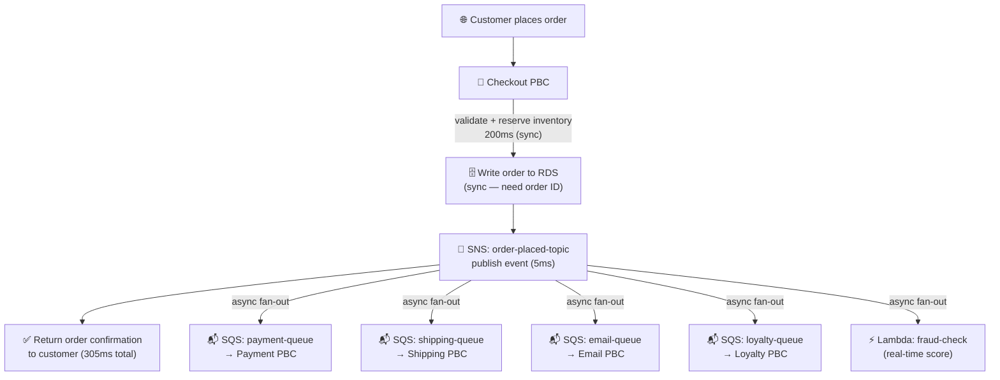
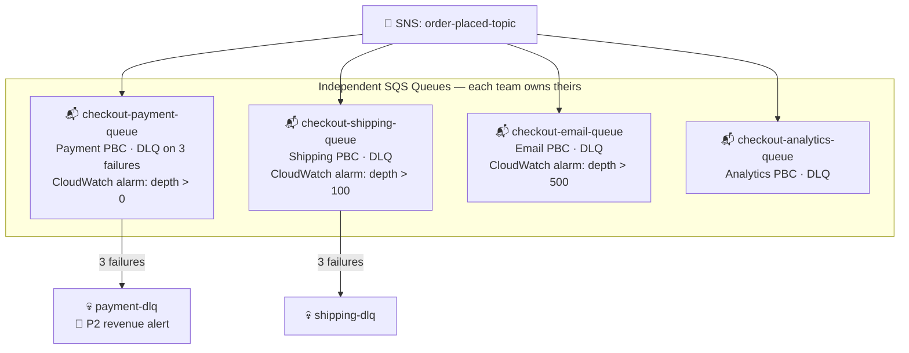
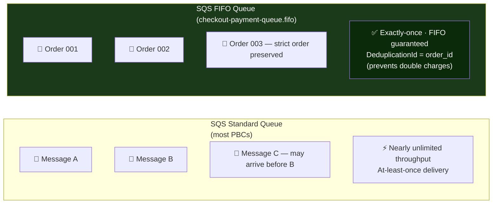

# SQS, SNS and the Event-Driven Backbone of Composable Commerce

*By a Senior AWS Solutions Architect | #ComposableCommerce #EventDriven #SQS #SNS #AWS*

---

If IAM defines who can talk to whom in a composable platform, SQS and SNS define **how** they talk. And the how matters enormously.

Synchronous API calls between PBCs create tight operational coupling. If the Email PBC is having a bad day and responding slowly, do you want that to slow down your Checkout PBC? If the Analytics PBC has a deployment in progress and is returning 503s, do you want orders to fail?

Of course not. And yet this is exactly what happens when composable platforms default to synchronous REST calls for every inter-PBC interaction.

The event-driven architecture — SQS for work queues, SNS for pub/sub fanout — is what makes composable commerce operationally independent as well as architecturally independent. Here's how to apply it.

## The Order Placement Moment: The Canonical Fan-Out

Every composable commerce architect should design the "order placed" event flow early and carefully. It's the highest-value, highest-risk moment in the customer journey, and it's the best illustration of why event-driven architecture matters.

When a customer places an order, at least six things need to happen:
1. Reserve inventory (must happen quickly)
2. Charge the payment method (must happen reliably)
3. Create a shipping label (can happen asynchronously)
4. Send order confirmation email (can happen asynchronously)
5. Update customer loyalty points (can happen asynchronously)
6. Record analytics event (can definitely happen asynchronously)

The synchronous approach: Checkout PBC calls all six services sequentially. Total response time: 500+200+150+100+80+50 = 1,080ms. If any service is slow or down, the checkout fails. The customer waits over a second just to get a confirmation page.

The event-driven approach:



Customer experience: confirmation page in 305ms.
Payment charged: within 3 seconds (in the background).
Email received: within 30 seconds.
Loyalty points: within a minute.

And crucially: if the Email PBC has an outage, orders still process. The messages queue in SQS until Email recovers. If the Analytics PBC is deploying, no orders are affected — analytics events queue and drain when the deployment completes.

## SQS Architecture: Queue Per PBC Concern

Don't share queues across unrelated concerns. Each downstream concern gets its own SQS queue:



Why separate queues matter for composable:
- **Independent scaling.** Each downstream PBC scales its consumer pool based on its queue depth, independent of the others.
- **Independent retry.** If the Shipping PBC has a bug that causes it to fail processing shipping messages, its queue backs up and triggers a DLQ alert. The Payment queue continues processing normally.
- **Independent monitoring.** CloudWatch alarm per queue: "if ApproximateNumberOfMessages > 1000, alert the owning team." The Shipping team owns their queue alarm. The Email team owns theirs.

## The Visibility Timeout: The Contract for Reliable Processing

One of the most important SQS configuration decisions is the visibility timeout. When a worker picks up a message, SQS hides it from other workers for the visibility timeout period. If the worker processes and deletes the message before the timeout — clean completion. If the worker crashes — message reappears after the timeout, another worker picks it up.

For composable commerce, set the visibility timeout to **2x your expected processing time** for each queue:

```
payment-queue: visibility timeout = 120s
  (Payment processing takes 15-30s, set to 120s for safety margin)

shipping-queue: visibility timeout = 60s
  (Shipping API calls take 5-10s)

email-queue: visibility timeout = 30s
  (Email dispatch takes 2-5s)
```

Too short: messages reappear while still being processed → duplicate work, potential double-charges on payment queue.
Too long: if a worker crashes, messages are hidden for unnecessarily long before recovery.

For the Payment PBC specifically — use FIFO queues to guarantee exactly-once processing. A customer should not be charged twice because a payment message was redelivered:



## Dead Letter Queues: Observability Into Failure

Every SQS queue in your composable platform should have a Dead Letter Queue (DLQ). After N failed processing attempts (configurable, typically 3-5), messages move to the DLQ. This prevents one malformed message from blocking the queue forever.

The DLQ is also your debugging interface:

```
CloudWatch Alarm: PaymentDLQDepth
  Metric: ApproximateNumberOfMessages on checkout-payment-dlq
  Threshold: > 0
  Action: PagerDuty P2 + Slack #payments-team

When an alert fires, the engineer inspects the DLQ:
  - What does the failed message look like?
  - Which specific field is causing the processing failure?
  - Is it one malformed message, or a systemic issue?
  - Fix the bug, replay the DLQ messages, verify the queue drains
```

For the Payment PBC DLQ specifically, every message that ends up there represents a customer whose payment wasn't processed. A DLQ alert is a revenue alert.

## Long Polling: The Efficiency Detail That Matters at Scale

SQS consumers poll the queue for messages. Short polling — the default — returns immediately even if the queue is empty. At scale with many consumer instances polling a usually-empty queue, you're paying for millions of empty API calls.

Long polling waits up to 20 seconds for a message before returning empty. For a composable platform's event-driven layer with many low-volume queues (loyalty-queue, review-processing-queue, etc.), enabling long polling reduces SQS API calls by 80-90%:

```javascript
// Consumer worker: long polling configuration
const response = await sqs.receiveMessage({
  QueueUrl: queueUrl,
  MaxNumberOfMessages: 10,
  WaitTimeSeconds: 20,  // Long polling: wait up to 20 seconds
  VisibilityTimeout: 60
});
```

Simple change. Meaningful cost reduction on a large composable platform.

## SNS for PBC Decoupled Subscriptions

The beauty of SNS for composable commerce is that it decouples the publisher from the subscribers at the infrastructure level. When the Checkout PBC publishes an `OrderPlaced` event to the SNS topic, it doesn't know or care who's subscribed. The Loyalty PBC can subscribe tomorrow without any code change in the Checkout PBC.

This is the infrastructure expression of the open/closed principle: the Checkout PBC is closed for modification but open for extension. New downstream PBCs subscribe to existing events — the upstream PBC doesn't need to know about them.

When a new Returns PBC is added to the platform six months later:
1. Create a new SQS queue: `checkout-returns-queue`
2. Subscribe the queue to the `order-placed-topic` SNS topic
3. Returns PBC starts consuming events

Zero changes to the Checkout PBC. Zero changes to the Payment PBC. Zero changes to the SNS topic. Pure additive composition.

---

*Next: Route 53 — how DNS becomes a traffic management layer in multi-region composable deployments.*

*💬 Are you using SNS+SQS fan-out, or have you moved to EventBridge for your composable event bus? I'd love to hear what drove the decision.*

---
**#SQS #SNS #AWS #ComposableCommerce #EventDriven #MACH #SolutionsArchitect #Microservices #AsyncArchitecture**
