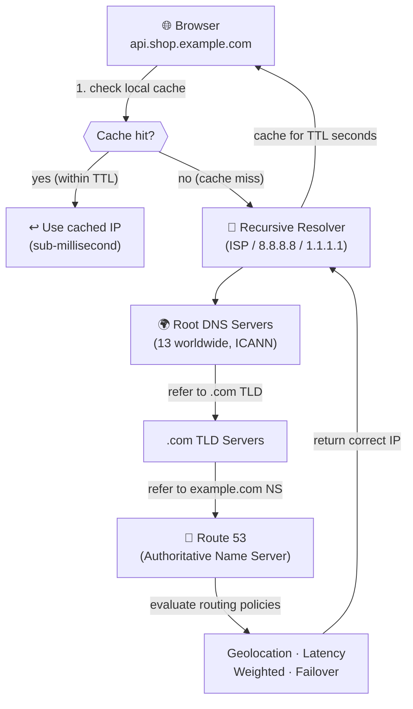
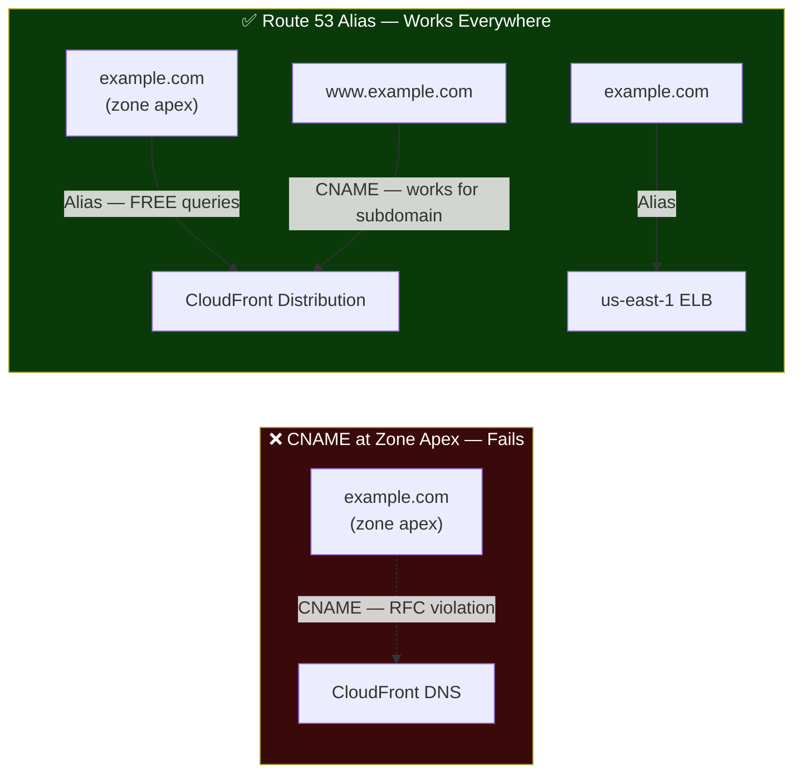
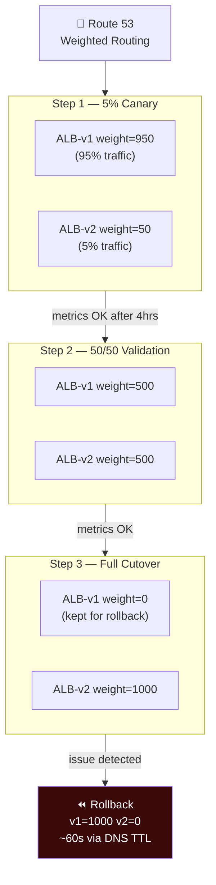
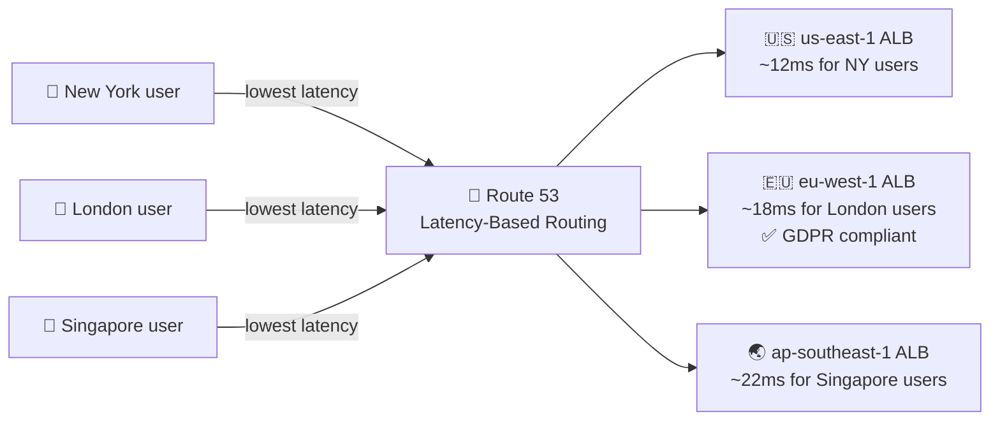
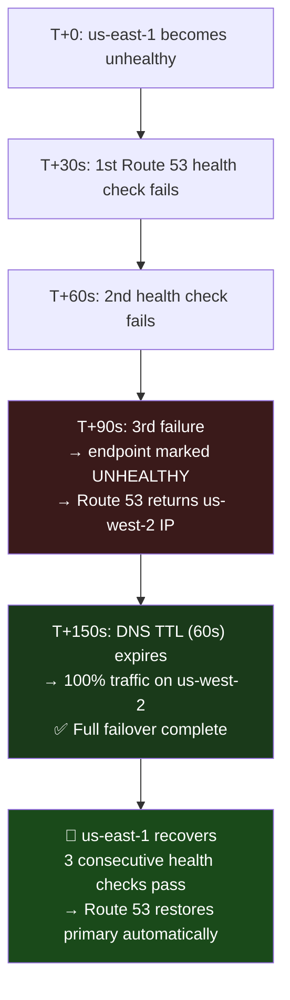
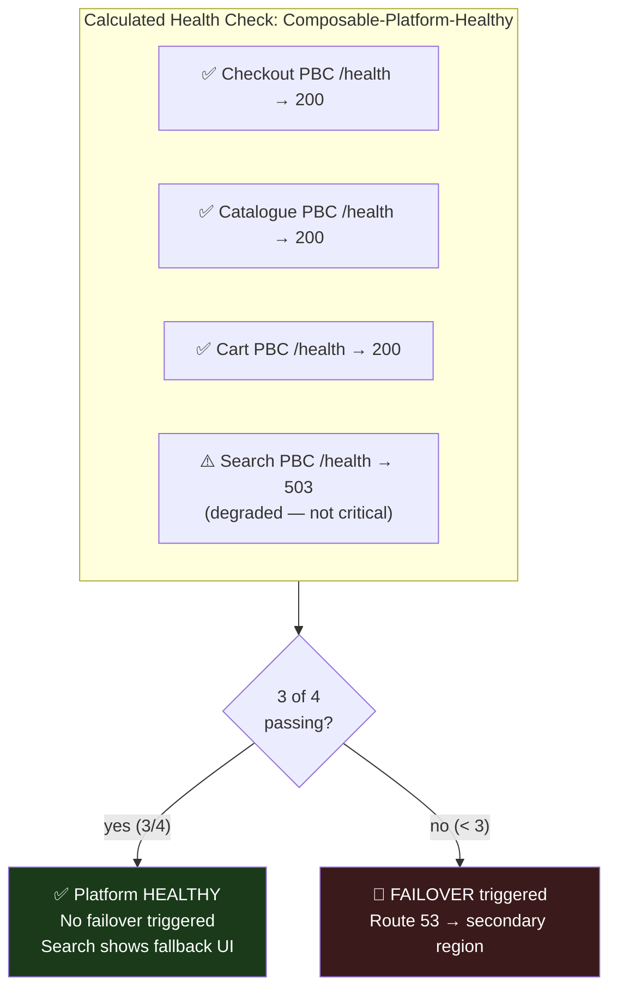
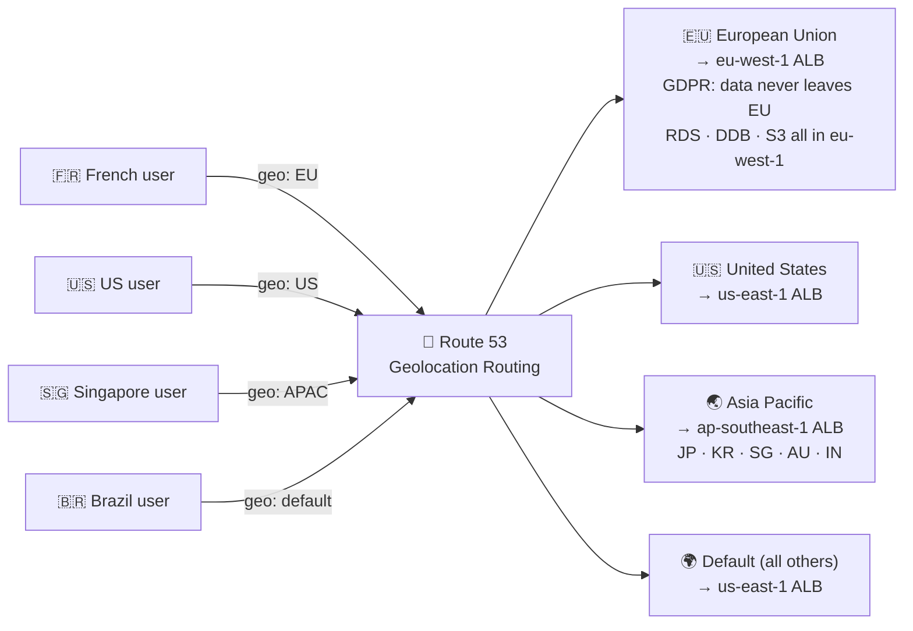
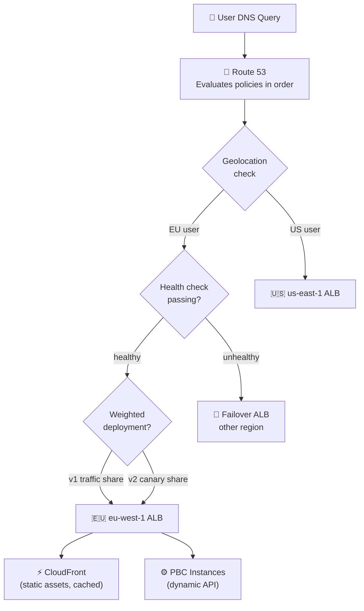

# Route 53 as the Global Traffic Director for Your Composable Commerce Platform

*By a Senior AWS Solutions Architect | #ComposableCommerce #Route53 #DNS #GlobalArchitecture*

---

I want to start with a scenario that happens more often than it should.

A retailer launches a composable commerce platform. They've done everything right — independent PBCs, headless storefront, CloudFront at the edge, Multi-AZ databases. Then they configure DNS by pointing their apex domain to a CloudFront distribution using a CNAME record. It doesn't work. Three hours of debugging later, the answer is one of the most basic DNS concepts: **a CNAME record cannot be used at the zone apex.** An Alias record is the fix, available only in Route 53.

This is a small example of a larger truth: DNS is the first thing a user's browser interacts with, the last thing architects think about, and in a multi-region composable platform, it's one of the most consequential design decisions in the whole system.

## What Route 53 Actually Is

Most engineers think of Route 53 as "where you manage DNS records." That's like describing an ALB as "a thing that forwards HTTP requests." Technically accurate, deeply incomplete.

Route 53 is a **global traffic management system** that happens to implement DNS. It lets you express sophisticated routing policies — route by geography, by measured network latency, by health check status, by weighted percentage — and delivers those policies from 100+ points of presence worldwide with sub-10ms DNS resolution.

For a composable commerce platform serving users across multiple continents with multiple regional deployments, Route 53 is the policy layer that decides which deployment serves which user, and what happens automatically when a deployment fails.

## DNS Resolution: The Chain Your PBCs Start With

Every API call your headless storefront makes starts with a DNS resolution. Understanding the chain matters for configuring TTLs correctly and debugging latency.



**TTL is the dial between caching efficiency and operational agility.** Short TTL = faster DNS changes propagate, more DNS queries (cost). Long TTL = slower changes, but resolvers cache longer (performance).

| Record | Recommended TTL | Rationale |
|---|---|---|
| Static CloudFront CDN | 86400s (1 day) | Never changes — maximise cache hits |
| Regional API endpoints | 300s (5 min) | Rarely changes, performance-sensitive |
| Failover records | 60s (1 min) | Fast failover requires short TTL |
| Health-checked records | 30s | Match to health check interval |
| Active deployment | 60s | Lower before any weighted routing change |

The operational discipline: always lower TTL 24–48 hours before a planned DNS change. Wait one full previous-TTL cycle for the change to propagate everywhere, then make your change. Rollback takes effect within the new shorter TTL.

## The Alias Record: Zone Apex Problem Solved

CNAME records (which map one name to another name) cannot exist at the zone apex — the root of your domain. `example.com` cannot be a CNAME. `www.example.com` can.

This matters because your composable storefront sits behind a CloudFront distribution or an ALB — both have DNS names, not static IPs. You need `example.com` to point there. Route 53 Alias records are the solution:



**The bonus:** Alias queries to AWS resources are **free**. A busy composable storefront generates millions of DNS queries per day. Alias records to CloudFront and ELBs carry no Route 53 query charge. CNAME queries do.

## Five Routing Policies, Five Commerce Requirements

### 1. Simple Routing
One record, one answer. Use for admin tools and internal services that don't need global distribution. Not appropriate for customer-facing composable APIs.

### 2. Weighted Routing: Safe Progressive Deployments

Split traffic between two endpoints by percentage. In composable commerce this enables deploying a new storefront version to 10% of users before full rollout.



### 3. Latency-Based Routing: Nearest Region for Every Shopper

Routes users to whichever AWS Region Route 53 measures as having the lowest latency for their location.



For a headless storefront making 8–12 PBC API calls per page render, routing to the nearest Region saves 150–170ms per call for non-local users. A product page that took 900ms for a Singapore user hitting us-east-1 takes 400ms from ap-southeast-1. That's the difference between a bounce and a session.

### 4. Failover Routing: Automatic Disaster Recovery

Active-passive DR: primary handles all traffic when healthy; secondary takes over when health checks fail.

**Health check design matters.** Don't test "is TCP 443 open?" — test meaningful business readiness:

```javascript
// GET /api/health/ready — evaluated by Route 53 every 30 seconds
app.get('/api/health/ready', async (req, res) => {
  const checks = await Promise.allSettled([
    checkDatabaseConnection(),
    checkCacheConnection(),
    checkCriticalPBCDependencies(),
    checkSecretsManagerAccess(),
  ]);

  const failed = checks.filter(c => c.status === 'rejected');

  if (failed.length === 0) {
    return res.status(200).json({ status: 'healthy', region: process.env.AWS_REGION });
  }
  // 503 triggers Route 53 to mark endpoint unhealthy → failover
  res.status(503).json({ status: 'unhealthy', failures: failed.map(f => f.reason.message) });
});
```

Route 53 checks every 30 seconds. After 3 consecutive failures (90 seconds), failover triggers automatically:



**Calculated health checks** let you avoid failover for non-critical PBC degradation:



### 5. Geolocation Routing: GDPR as Infrastructure

Geolocation routing is not optional for composable platforms serving EU customers — it's a compliance control. EU customer data must stay in EU infrastructure. Route 53 enforces this before any request reaches your PBCs.



A French user's entire journey — browse, cart, checkout, order — occurs within eu-west-1. Data never transits to a US server. The Route 53 geolocation record is a GDPR compliance control implemented at the infrastructure layer, independent of application code.

## The Full Picture: Route 53 Tying the Multi-Region Platform Together



## Three Operational Rules I Apply to Every Engagement

**Rule 1: DNS configuration is infrastructure code, not console work.**
Every Route 53 record, health check, and routing policy belongs in CloudFormation or Terraform, committed to version control. A DNS misconfiguration that takes down a global e-commerce platform because someone edited a record in the console at 11pm is an avoidable outage.

**Rule 2: Use CloudWatch Alarm health checks for application-level routing decisions.**
Infrastructure health checks (TCP connect, HTTP 200) don't catch application degradation — a service that returns 200 but is processing requests 10x slower than normal, a checkout flow with a payment provider partial outage. CloudWatch Alarm health checks tie Route 53 routing to your actual business metrics.

**Rule 3: Health check from multiple regions.**
Route 53 health checks from a single location can be fooled by regional internet routing issues. Configure health checks from at least 3 Route 53 health check locations. This prevents a transient routing issue from a single location triggering an unnecessary failover.

---

*Next: ElastiCache — the in-memory layer that prevents your 15-service composable platform from hammering databases on every page render.*

*💬 What's your TTL strategy for critical DNS records? I've seen teams caught by long TTLs during incidents more often than almost any other single configuration decision.*

---
**#Route53 #DNS #AWS #ComposableCommerce #GlobalArchitecture #MACH #GDPR #DisasterRecovery #SolutionsArchitect #CloudNative**
