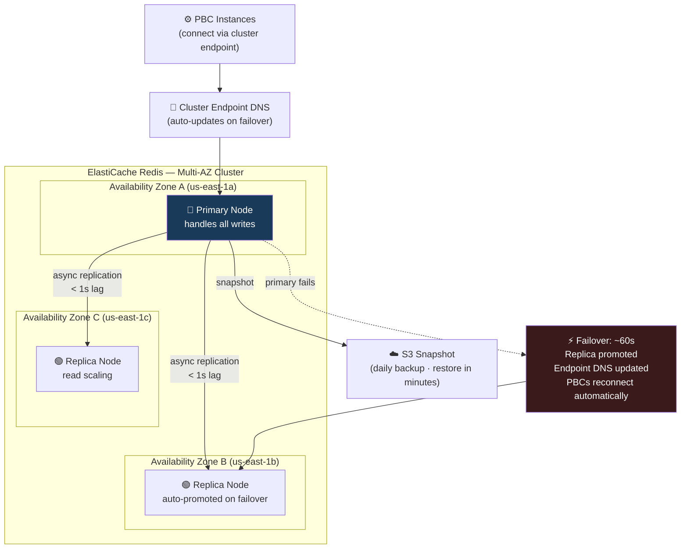

# ElastiCache: Making 15 API Calls Feel Like One to the Shopper

*By a Senior AWS Solutions Architect | #ComposableCommerce #ElastiCache #Performance #Redis*

---

Here's the uncomfortable truth about composable commerce performance: a headless storefront rendering a product detail page might make 8–15 API calls to different PBCs. Product data from the Catalogue PBC. Pricing from the Pricing PBC. Inventory status from the Inventory PBC. Recommendations from the ML PBC. Reviews from the Review PBC. Personalisation signals from the Customer Data Platform.

Done naively, that's 8–15 database queries per page render. At 50,000 concurrent users, that's potentially 750,000 database queries per second across your backend PBCs. Most database clusters will either refuse that load or respond too slowly to be usable.

ElastiCache is how you make that problem manageable — and how you turn the multi-PBC architecture from a potential performance liability into a genuine competitive advantage.

## Cache-Aside: The Universal Pattern for Composable PBCs

Every PBC that serves read-heavy, cacheable data should implement the cache-aside (lazy loading) pattern. The logic is simple and worth stating explicitly:

```javascript
// Product Catalogue PBC — cache-aside with versioned keys
const CACHE_VERSION = "v3"; // Increment on schema change to bust cache

async function getProduct(sku) {
  const cacheKey = `${CACHE_VERSION}:product:${sku}`;

  // Step 1: check cache first
  const cached = await redis.get(cacheKey);
  if (cached) {
    metrics.increment('cache.hit', { pbc: 'catalogue', type: 'product' });
    return JSON.parse(cached); // Sub-millisecond, no database involved
  }

  metrics.increment('cache.miss', { pbc: 'catalogue', type: 'product' });

  // Step 2: cache miss — go to database
  const product = await db.query(
    `SELECT p.*, c.name as category_name, b.name as brand_name
     FROM products p
     JOIN categories c ON p.category_id = c.id
     JOIN brands b ON p.brand_id = b.id
     WHERE p.sku = ? AND p.active = 1`,
    [sku]
  );

  if (!product) return null;

  // Step 3: populate cache with appropriate TTL
  await redis.setex(cacheKey, 300, JSON.stringify(product)); // 5 minute TTL

  return product;
}
```

With this pattern, the first request for a product goes to the database. Every subsequent request over the next 5 minutes is served from Redis in under 1ms. For a popular SKU during a Black Friday sale — viewed 50,000 times per minute — the database serves 1 request. Redis serves 49,999.

**Versioned cache keys** (`v3:product:sku`) are the clean solution to cache invalidation. When the product schema changes (adding a new field, restructuring the response), increment the version prefix and all caches are naturally invalidated as their old keys go unqueried and expire. No explicit purge operation needed.

## TTL as a Business Decision, Not a Technical One

Every PBC has data with different staleness tolerance. The TTL configuration should be driven by the business impact of stale data, not a uniform "we cache everything for 5 minutes."

| Data | PBC | TTL | Staleness Impact |
|---|---|---|---|
| Product name/description | Catalogue | 600s (10 min) | Brand team updates once a week — very low |
| Product price | Pricing | 30s | Dynamic pricing, promotion eligibility — high |
| Inventory count (display) | Inventory | 10s | Customers see "3 left" — tolerance for brief lag |
| Inventory (checkout confirm) | Inventory | **0 — always live** | Must be accurate at point of sale |
| Recommendation list | ML PBC | 300s (5 min) | Personalisation can lag slightly |
| Customer loyalty points | Loyalty | 60s | Points earned, customer checks balance |
| Category/navigation tree | Catalogue | 3600s (1 hour) | Changes only with editorial releases |
| Session data | Auth | 1800s (30 min) | User's active session — sliding TTL |

The critical design decision: **inventory at checkout is always a live database call.** Cache the display number (show "3 left in stock"), but when a customer actually clicks "Place Order," always verify inventory synchronously against the database. Overselling because you trusted a 10-second-old cache is a customer service problem, a logistics problem, and a brand problem simultaneously.

## Memcached vs. Redis: Choose Redis for Composable Commerce

The default answer for composable commerce is Redis. Here's why:

**Memcached** is a simple, multithreaded key-value store. It's fast for simple get/set operations, horizontally scalable, but has no persistence, no replication, and no data structures beyond strings. If the Memcached cluster loses a node, all cached data on that node is gone — your application sees a thundering herd of cache misses hitting the database simultaneously.

**Redis** is a data structure server. For composable commerce it provides:

1. **Persistence** — Redis can snapshot its data to disk (RDB) and/or write every operation to an append-only log (AOF). After a restart or failover, the cache isn't cold.

2. **Replication + Multi-AZ failover** — Primary in AZ-a, replica in AZ-b. If the primary fails, the replica promotes automatically in under 60 seconds. Sessions, inventory counters, and leaderboards survive an AZ failure.

3. **Sorted sets** — ordered data structures maintained automatically. Product leaderboards, top-selling items, customer spend rankings.

4. **Atomic operations** — `INCR`, `DECR`, `HINCRBY` are atomic. No two Redis operations on the same key can interleave. Critical for inventory counters and rate limiting.

5. **Pub/Sub** — PBCs can publish events to Redis channels and other PBCs subscribe. Lightweight event bus for low-latency use cases.

The only case where Memcached is preferable: simple, horizontally scalable caching where you need to add many cache nodes dynamically and ElastiCache Auto Discovery is important. Even then, Redis Cluster mode now provides comparable horizontal scaling.

## Redis Data Structures in Practice for Composable Commerce

### Strings: The Universal Cache Entry
```javascript
// Cache any serialisable object as a JSON string
await redis.setex(`product:${sku}`, 300, JSON.stringify(productData));
const data = JSON.parse(await redis.get(`product:${sku}`));
```

### Hashes: Session Storage Across PBCs

Sessions stored as Redis hashes let any PBC read or update specific session fields without serialising/deserialising the entire session object:

```javascript
// Auth PBC writes session on login
await redis.hset(`session:${sessionId}`, {
  customer_id: customerId,
  email: customer.email,
  cart_id: cartId,
  currency: 'EUR',
  locale: 'de-DE',
  ab_variant_checkout: 'B',
  loyalty_tier: 'gold'
});
await redis.expire(`session:${sessionId}`, 3600);

// Checkout PBC reads only what it needs — no full deserialisation
const [customerId, currency, loyaltyTier] = await redis.hmget(
  `session:${sessionId}`,
  'customer_id', 'currency', 'loyalty_tier'
);

// Recommendation PBC updates preference signal without reading whole session
await redis.hset(`session:${sessionId}`, 'last_category_viewed', categoryId);
await redis.expire(`session:${sessionId}`, 3600); // Reset TTL on activity
```

### Atomic Counters: Flash Sale Inventory

Redis's atomic operations prevent the race conditions that lose you money in flash sales:

```javascript
// Inventory PBC: atomic decrement for flash sale
async function reserveInventory(sku, quantity) {
  // DECRBY is atomic — no two calls interleave
  const remaining = await redis.decrby(`flash-inventory:${sku}`, quantity);

  if (remaining < 0) {
    // Oversold — restore and reject
    await redis.incrby(`flash-inventory:${sku}`, quantity);
    throw new InsufficientInventoryError(`SKU ${sku} is sold out`);
  }

  // Confirmed reservation — write to DB asynchronously
  await sqs.sendMessage({
    QueueUrl: inventoryUpdateQueue,
    MessageBody: JSON.stringify({ sku, delta: -quantity, reservationId: uuid() })
  });

  return remaining; // e.g., "47 remaining after your reservation"
}
```

This pattern handles 10,000 concurrent checkout attempts for the same limited-inventory item. Redis's single-threaded command processing means `DECRBY` operations execute serially, one at a time, in microseconds. No locking required. No lost updates. No overselling.

### Sorted Sets: Real-Time Commerce Rankings

```javascript
// Loyalty PBC: update leaderboard on every purchase
async function recordPurchaseForLeaderboard(customerId, orderAmount, campaignId) {
  const key = `leaderboard:campaign:${campaignId}`;

  // ZINCRBY atomically adds score to member's existing score
  const newTotal = await redis.zincrby(key, orderAmount, customerId);
  await redis.expireat(key, campaignEndTimestamp);

  return newTotal;
}

// Storefront widget: get top 10 with spend amounts
async function getLeaderboard(campaignId, n = 10) {
  const key = `leaderboard:campaign:${campaignId}`;

  // ZREVRANGE with WITHSCORES: highest scores first
  const entries = await redis.zrevrange(key, 0, n - 1, 'WITHSCORES');
  // Returns: [customerId1, score1, customerId2, score2, ...]

  // Get customer display names in bulk (one Redis call)
  const customerIds = entries.filter((_, i) => i % 2 === 0);
  const displayNames = await redis.mget(customerIds.map(id => `customer:${id}:display`));

  return customerIds.map((id, i) => ({
    rank: i + 1,
    displayName: displayNames[i] || 'Anonymous',
    totalSpend: parseFloat(entries[i * 2 + 1])
  }));
}
```

Redis sorted sets maintain the ranking automatically on every insert. A leaderboard query returning the top 10 from a set of 500,000 participants completes in O(log N) time — under 1ms regardless of participant count. This is simply not achievable with SQL at this latency.

### Rate Limiting: Protecting PBC APIs

```javascript
// Applied as middleware on any PBC API — prevents abuse and controls costs
async function rateLimitMiddleware(req, res, next) {
  const customerId = req.session.customerId || req.ip;
  const endpoint = req.path.split('/')[2]; // e.g., 'search', 'recommendations'
  const key = `ratelimit:${endpoint}:${customerId}`;
  const limit = 60; // 60 requests per minute
  const window = 60;

  const current = await redis.incr(key);
  if (current === 1) await redis.expire(key, window); // Set TTL on first request

  if (current > limit) {
    res.set('Retry-After', await redis.ttl(key));
    return res.status(429).json({
      error: 'Rate limit exceeded',
      retryAfter: await redis.ttl(key)
    });
  }

  res.set('X-RateLimit-Remaining', limit - current);
  next();
}
```

One Redis `INCR` with TTL. Applied across all instances of the PBC (they share the Redis cluster). A customer making 200 search requests per minute is rate limited consistently regardless of which PBC instance serves each request.

## Cache Warming: Solving the Cold Start Problem

Every composable PBC deployment starts with a cold cache. The first wave of requests after a deployment all hit the database — temporarily spiking database CPU and response times.

Three approaches I use depending on the PBC's criticality:

**1. Pre-warm on deployment (for high-traffic PBCs):**
```bash
# Deployment pipeline step after new PBC instances pass health checks
# but before they receive production traffic
aws ecs run-task --task-definition cache-warmer \
  --overrides '{"containerOverrides":[{"name":"warmer","environment":[
    {"name":"TARGET_ENV","value":"production"},
    {"name":"WARM_TOP_N_PRODUCTS","value":"10000"}
  ]}]}'
# Warmer fetches top 10,000 products and populates Redis
# New PBC instances join traffic with warm cache
```

**2. Canary traffic warming:**
Route 5% of production traffic to new instances before shifting full traffic (weighted routing in ALB). The small traffic percentage warms the cache against real usage patterns. At full traffic shift, cache hit rates are already above 80%.

**3. Rolling deployments with overlap:**
During a rolling deployment, old instances (with warm cache) continue serving traffic while new instances are added. New instances see traffic immediately but share the Redis cluster — their cache is populated by serving real requests. The cold start impact is gradual rather than sudden.

## Multi-AZ Configuration: Sessions Must Survive an AZ Failure

For a composable platform where sessions, carts, and inventory counters all live in Redis, a Redis cluster failure is a revenue event. Multi-AZ with automatic failover is not optional.



The application connects to the **cluster endpoint** (not individual node endpoints). When failover occurs, the cluster endpoint DNS record updates to point to the promoted replica. Your PBCs reconnect automatically after the brief failover period.

---

## The Practical Outcome

A composable commerce platform without a properly designed caching layer is an expensive distributed system that's slower than the monolith it replaced. A composable platform with ElastiCache properly integrated — cache-aside on every read-heavy PBC, Redis data structures for sessions and counters and leaderboards, Multi-AZ for resilience — is a platform that genuinely delivers on the performance promise of the MACH architecture.

The goal is that the 15 API calls your storefront makes per page render feel, to the user, like one fast response. ElastiCache is what makes that possible.

---

*Next: CloudFront, Kinesis, CloudFormation and the additional services that complete the composable commerce infrastructure picture.*

*💬 What's your Redis TTL strategy for product pricing data on a platform with dynamic pricing? I'd love to hear how teams are balancing freshness against database load.*

---
**#ElastiCache #Redis #AWS #ComposableCommerce #Performance #Caching #MACH #SolutionsArchitect #BackendEngineering**
