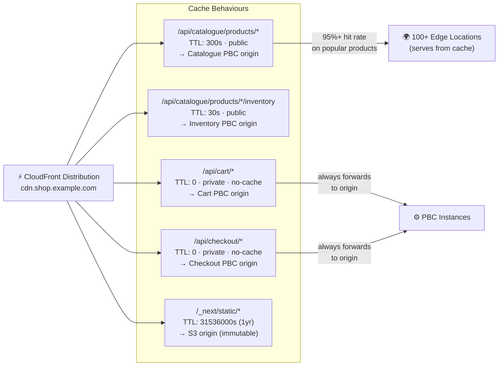
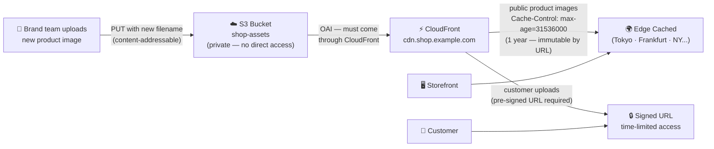
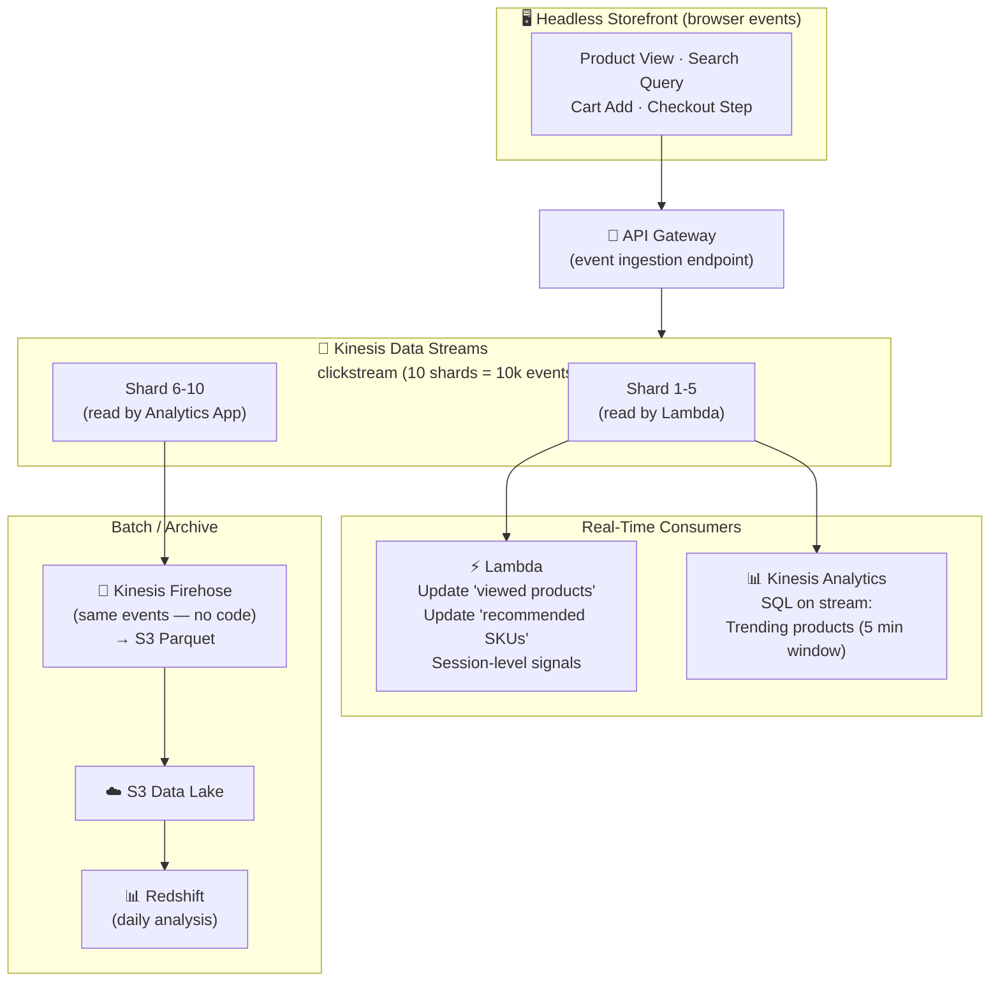

# The Infrastructure Glue: CloudFront, Kinesis and CloudFormation for Composable Commerce

*By a Senior AWS Solutions Architect | #ComposableCommerce #CloudFront #IaC #AWS*

---

Composable commerce platforms involve more moving parts than most software systems — multiple teams, multiple services, multiple deployment pipelines, multiple data flows. The services covered in this article are the ones that hold the composable platform together: CloudFront at the edge, Kinesis in the event stream, and CloudFormation as the deployment contract.

## CloudFront: The Edge Layer of Your Composable Storefront

In a MACH architecture, the frontend is headless — completely decoupled from the backends. Your Next.js or Nuxt storefront fetches data from multiple PBC APIs to render each page. The performance challenge is that each API call adds latency. CloudFront solves this at two levels.

**Level 1: Static asset caching.** Every Next.js build produces static chunks: JavaScript bundles, CSS, images, fonts. These don't change between requests. CloudFront caches them at 100+ Edge Locations globally. A user in Tokyo loading your storefront gets the JavaScript bundle from the Tokyo edge node in 8ms — not from your us-east-1 origin in 180ms. The page appears to start loading instantly.

**Level 2: API response caching.** For composable storefronts that render product data at request time, CloudFront can cache API responses at the edge:



This CloudFront configuration means that during a flash sale, 95% of product browsing traffic is absorbed at the edge. Your backend PBCs handle only the 5% that are cache misses, cart updates, and checkout flows. The composable backend is protected from the scale of the storefront by the edge layer.

**CloudFront and S3 for product media:**


When a product image is updated, the brand team uploads a new image with a new filename (content-addressable). Old URLs cache forever. New URLs are uncached until their first request. Zero cache invalidation cost, zero cache coherence problem.

## Kinesis: The Event Stream That Connects Your PBCs

Event-driven architecture with SQS+SNS handles the operational event flow (order placed, cart updated, payment processed). But there's a second type of data flow in composable commerce: the **behavioural event stream** — every click, view, search, scroll, cart interaction — that feeds your analytics, personalisation, and recommendation engines.

This is Kinesis territory.



**Kinesis Streams** for real-time PBC signals: a user views a product → Lambda reads the event from the stream → Lambda calls the Personalisation PBC API to update "recently viewed" → next page render includes personalised recommendations. Latency from browser event to personalised recommendation: under 2 seconds.

**Kinesis Firehose** for the analytics pipeline: the same events are delivered to S3 in Parquet format via Firehose — no code required. From S3, AWS Glue creates a data catalogue and Athena enables SQL queries. "Show me the 20 products that users add to cart but remove before checkout, segmented by customer lifetime value" — answered by querying the Kinesis Firehose S3 data with Athena in under 60 seconds.

## CloudFormation: The Composable Deployment Contract

Composable commerce means multiple teams, multiple services, multiple deployment cadences. Without Infrastructure as Code, this becomes chaos: different environments have different configurations, manual changes accumulate, nobody knows what's actually running in production.

CloudFormation is the contract that makes the composable platform reproducible and auditable.

**The platform team publishes reusable CloudFormation modules:**

```yaml
# modules/pbc-service.yaml — standardised PBC deployment template
# PBC teams instantiate this template with their specific parameters

Parameters:
  ServiceName: { Type: String }
  ContainerImage: { Type: String }
  DesiredCount: { Type: Number, Default: 2 }
  CPUUnits: { Type: Number, Default: 512 }
  MemoryMB: { Type: Number, Default: 1024 }
  HealthCheckPath: { Type: String, Default: "/health" }

Resources:
  ECSService:
    Type: AWS::ECS::Service
    Properties:
      ServiceName: !Ref ServiceName
      TaskDefinition: !Ref TaskDefinition
      DesiredCount: !Ref DesiredCount
      LoadBalancers:
        - ContainerName: !Ref ServiceName
          ContainerPort: 8080
          TargetGroupArn: !Ref TargetGroup

  AutoScalingTarget:
    Type: AWS::ApplicationAutoScaling::ScalableTarget
    Properties:
      MinCapacity: !Ref DesiredCount
      MaxCapacity: !Ref MaxCount

  CloudWatchAlarm:
    Type: AWS::CloudWatch::Alarm
    Properties:
      AlarmName: !Sub "${ServiceName}-HighCPU"
      MetricName: CPUUtilization
      Threshold: 70
      AlarmActions: [!Ref ScalingPolicy]
```

Each PBC team instantiates this module with their specific parameters. The platform team controls the module — security configuration, monitoring setup, networking configuration are consistent across all PBCs. The PBC team controls their specific parameters — service name, container image, scaling configuration.

**Environment promotion via stack parameters:**
```bash
# Deploy Checkout PBC to staging
aws cloudformation deploy \
  --stack-name checkout-pbc-staging \
  --template-file checkout-pbc.yaml \
  --parameter-overrides \
      Environment=staging \
      DesiredCount=2 \
      ContainerImage=123456789.dkr.ecr.us-east-1.amazonaws.com/checkout:v2.1.3

# Same template, different parameters — to production
aws cloudformation deploy \
  --stack-name checkout-pbc-production \
  --template-file checkout-pbc.yaml \
  --parameter-overrides \
      Environment=production \
      DesiredCount=6 \
      ContainerImage=123456789.dkr.ecr.us-east-1.amazonaws.com/checkout:v2.1.3
```

The same CloudFormation template deploys to staging and production. The only differences are the parameter values. Configuration drift between environments is eliminated because there's only one template source.

**CloudFormation Drift Detection:**
When someone makes a manual change to a production resource (it happens), CloudFormation drift detection identifies the difference between the deployed template and the actual configuration. Monthly drift detection on all stacks is a discipline that prevents configuration entropy in composable platforms.

## Trusted Advisor and AWS Config: Governance at Platform Scale

With 15+ PBCs, each potentially creating security groups, S3 buckets, RDS instances, and IAM roles, governance becomes a real operational concern. AWS Config and Trusted Advisor automate the audit process.

**AWS Config rules that I apply to every composable platform:**
- `s3-bucket-server-side-encryption-enabled` — every PBC's S3 bucket must have SSE
- `rds-instance-public-access-check` — no RDS database publicly accessible
- `ec2-instances-in-vpc` — all EC2 instances must be in a VPC (no EC2-Classic remnants)
- `iam-root-access-key-check` — root account must not have active access keys
- `restricted-ssh` — no security group allows SSH from 0.0.0.0/0

When a PBC team inadvertently creates an S3 bucket without encryption, Config flags it within minutes. SNS notification goes to the team's Slack channel. They fix it or acknowledge the exception with a documented reason.

---

*Next: The security architecture that makes your composable platform PCI-compliant and production-worthy.*

---
**#CloudFront #Kinesis #CloudFormation #AWS #ComposableCommerce #MACH #IaC #SolutionsArchitect**
