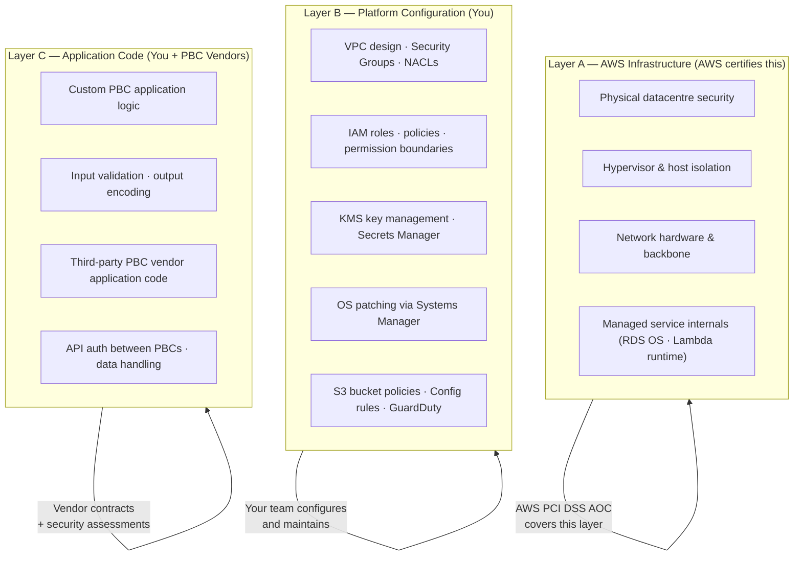
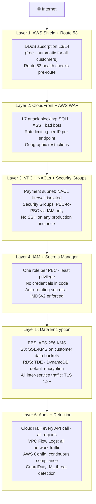
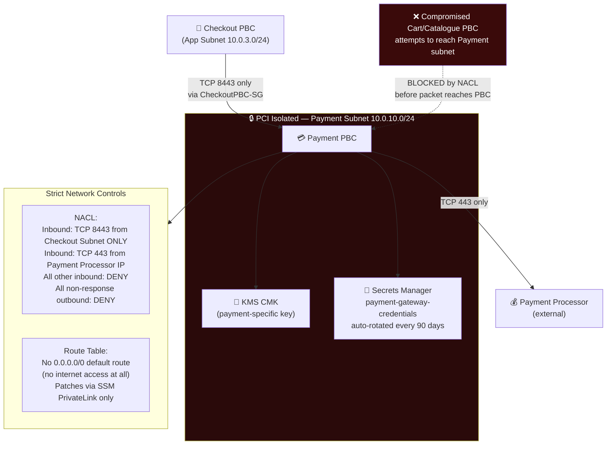

# Securing 15 Services at Once: The Security Architecture of Composable Commerce

*By a Senior AWS Solutions Architect | #ComposableCommerce #Security #AWS #PCIDss #ZeroTrust*

---

Composable commerce creates a security surface area that most teams underestimate when they start the migration.

A monolith has one application to secure. One set of dependencies to patch. One deployment pipeline to harden. One network boundary to defend. One set of credentials to rotate.

A composable platform with 15 PBCs has 15 applications, 15 dependency trees, 15 deployment pipelines, 15 sets of API endpoints, and 15 potential entry points for an attacker — all integrated through APIs that cross network boundaries constantly. Mishandle any one of them and the blast radius can reach the others.

This isn't an argument against composable commerce. It's an argument for building security as **infrastructure** rather than as application code — so that the security posture scales horizontally with the architecture, rather than having to be reimplemented in each PBC.

## The Shared Responsibility Model: Precise Boundaries Matter

For composable commerce on AWS, the shared responsibility model has three layers (not two), because many composable platforms use third-party SaaS PBCs alongside custom-built ones.



AWS's PCI DSS Attestation of Compliance covers Layer A. When your QSA reviews your PCI assessment, Layers B and C require your own evidence. The AWS documentation makes this clear; the mistake is assuming Layer A certification implies Layers B and C.

## Defence in Depth: Five Independent Layers

A composable platform's security posture is only as good as its weakest layer. The goal is that breaching one layer doesn't breach the platform. Each layer must independently limit the blast radius.



A compromised Cart PBC cannot reach the Payment database (Layer 3 blocks it). Even if it somehow did, it has no IAM permission to query the payment database (Layer 4). Even if it somehow had permission, payment data is encrypted with a KMS key the Cart PBC role cannot decrypt (Layer 5). Every attempt is logged in CloudTrail and GuardDuty would flag the anomalous access pattern (Layer 6).

## AWS WAF Rules for Composable Commerce

WAF sits at CloudFront and ALB, evaluating every request before it reaches your PBCs. For composable commerce, I configure three categories of rules:

**AWS Managed Rules (always on — no configuration required):**
```
AWSManagedRulesCommonRuleSet:
  Blocks OWASP Top 10 attack patterns
  SQL injection, XSS, path traversal, command injection
  Critical for any PBC that accepts user input

AWSManagedRulesSQLiRuleSet:
  Additional SQL injection patterns
  Important for any PBC with a relational database backend

AWSManagedRulesKnownBadInputsRuleSet:
  Blocks requests with Java deserialization exploits
  Log4j exploit patterns
  Spring framework attacks
```

**Custom Rate Limiting Rules (tuned per PBC endpoint):**
```
Rule: CheckoutRateLimit
  IF path matches /api/checkout/*
  AND request rate from IP > 20 per 5 minutes
  THEN Block
  (Human checkout flows never exceed this; bots testing cards do)

Rule: SearchRateLimit
  IF path matches /api/search/*
  AND request rate from IP > 100 per minute
  THEN Block with 429
  (Legitimate search users; prevents catalogue scraping)

Rule: LoginBruteForce
  IF path matches /api/auth/login
  AND request rate from IP > 10 per 5 minutes
  THEN Block for 15 minutes
  (Credential stuffing protection)
```

**Geographic restrictions (if your business requires them):**
```
Rule: GeoBlock
  IF source country NOT IN [your operating countries]
  THEN Block
  Use case: if you only sell in EU + US + AU,
  block all other geographies to reduce attack surface
```

WAF logging to S3 via Kinesis Firehose enables analysis of blocked requests. Regularly reviewing WAF logs reveals attack patterns and allows tuning rules to avoid false positives (legitimate customers blocked) and false negatives (attacks passing through).

## The Payment PBC: PCI Isolation Pattern

If your composable platform processes card data directly (rather than tokenising via Stripe/Braintree and removing yourself from PCI scope), the Payment PBC requires the highest level of network isolation.

**Network topology for PCI-isolated Payment PBC:**


Even if an attacker compromises every other PBC in the platform, the Payment subnet is unreachable. The NACL blocks all traffic except from the Checkout subnet on the specific port. The Security Group provides a second independent layer of the same control. The KMS key ensures payment data at rest is readable only by the Payment PBC. This is PCI defence-in-depth.

**The better approach: tokenisation.** If you integrate with Stripe, Braintree, or Adyen, card data never touches your infrastructure. The PBC sends card data directly to the processor via their SDK (executing in the user's browser), receives a token, and stores the token. Your PCI scope drops dramatically — you're handling tokens, not card numbers. The processor handles PCI compliance for card data; you handle compliance for everything else.

## EC2 Instance Hardening: IMDSv2 and No SSH

Two EC2 security controls that should be non-negotiable in any composable platform:

**IMDSv2 Enforcement:**
The Instance Metadata Service (IMDS) provides temporary credentials for IAM roles to EC2 instances. IMDSv1 is vulnerable to Server-Side Request Forgery (SSRF) attacks: if a web application has an SSRF vulnerability, an attacker can use it to call the IMDS endpoint and steal the instance's IAM role credentials.

IMDSv2 requires a session token for all IMDS requests — a token that must be obtained via a PUT request (which SSRF cannot initiate). Enforcing IMDSv2 eliminates this attack vector:

```json
// In every Launch Template — non-negotiable production requirement
{
  "MetadataOptions": {
    "HttpTokens": "required",     // IMDSv2 only — reject v1 requests
    "HttpPutResponseHopLimit": 1  // Prevent metadata access from containers
  }
}
```

**Enforce via AWS Config rule** (`ec2-imdsv2-check`) to detect any instance not enforcing IMDSv2.

**No SSH in Production:**
Direct SSH access to production instances creates audit complexity (who accessed what, when, what did they do?), requires managing SSH keys, and opens port 22 as an attack surface. The modern alternative is **AWS Systems Manager Session Manager**:

- No port 22 open in any security group
- No SSH keys to manage or rotate
- All sessions logged to CloudWatch Logs and S3 automatically
- Access controlled by IAM (the engineer's role must have ssm:StartSession permission)
- Session content recorded for audit purposes

For a composable platform with 15 PBC teams, eliminating SSH means eliminating 15 sets of SSH key management, 15 open port-22 rules, and 15 potential jump points into your production environment.

## Secrets Management at Platform Scale

A composable platform with 15 PBCs might have 60–100 secrets: database passwords, API keys, OAuth tokens, webhook secrets, encryption passwords. Managing these manually is operationally unsustainable and insecure.

**AWS Secrets Manager** handles the full lifecycle:

```python
# PBC startup: fetch live secret value, never cache indefinitely
import boto3
import json
from functools import lru_cache
import time

_secret_cache = {}
_CACHE_TTL = 300  # Refresh secrets every 5 minutes

def get_secret(secret_name: str) -> dict:
    now = time.time()
    cached = _secret_cache.get(secret_name)

    if cached and (now - cached['fetched_at']) < _CACHE_TTL:
        return cached['value']

    client = boto3.client('secretsmanager')
    response = client.get_secret_value(SecretId=secret_name)
    value = json.loads(response['SecretString'])

    _secret_cache[secret_name] = {'value': value, 'fetched_at': now}
    return value

# Usage: credentials always fresh, rotation happens transparently
db_creds = get_secret('commerce/checkout/rds-credentials')
connection = psycopg2.connect(
    host=db_creds['host'],
    user=db_creds['username'],
    password=db_creds['password'],  # Auto-rotated every 30 days by Secrets Manager
    database=db_creds['dbname']
)
```

When Secrets Manager rotates the RDS password (automated, every 30 days), it updates the database password in RDS and the secret value in Secrets Manager atomically. The next time a PBC fetches the secret (within 5 minutes, given the cache TTL), it gets the new password. Zero downtime. Zero manual rotation. Full audit trail in CloudTrail of every access.

## CloudTrail: The Audit Log Every Composable Platform Needs

In a composable platform where 15 teams make changes across hundreds of AWS resources, CloudTrail is the indispensable record of "who did what to which resource at what time."

Configure CloudTrail for maximum coverage:
- **All regions** (not just your primary region — attackers don't limit themselves to your primary)
- **Management events** (IAM changes, VPC changes, security group modifications)
- **Data events** for sensitive resources (S3 GetObject on invoice buckets, DynamoDB GetItem on payment tables)
- **Log file integrity validation** enabled (detect if logs are tampered with post-incident)
- **Delivery to S3** with Object Lock (WORM policy — logs cannot be deleted or modified)

For incident response after a suspected breach:
```sql
-- Query CloudTrail logs in Athena to investigate
-- "What did this compromised IAM role do in the last 24 hours?"
SELECT
    eventtime,
    eventsource,
    eventname,
    awsregion,
    sourceipaddress,
    json_extract_scalar(requestparameters, '$.bucketName') as s3_bucket,
    json_extract_scalar(requestparameters, '$.key') as s3_key
FROM cloudtrail_logs
WHERE useridentity.arn LIKE '%CheckoutPBCRole%'
  AND eventtime > date_add('hour', -24, now())
  AND eventname NOT IN ('AssumeRole', 'GetCallerIdentity')
ORDER BY eventtime DESC;
```

This query runs in seconds against the S3-stored CloudTrail logs via Athena. In a real incident, knowing exactly what a compromised role accessed in the 24 hours before discovery is the difference between a contained incident report and a full breach notification.

---

## The Security Posture Scales With the Architecture

The key insight for composable commerce security: implement controls at the infrastructure layer, not the application layer. IAM permissions enforced by AWS regardless of application code. Network controls enforced by the hypervisor. Encryption enforced at storage. Audit logging enforced by CloudTrail.

When security lives in infrastructure, it scales with your composable architecture. Add a 16th PBC and it automatically inherits the VPC controls, the CloudTrail audit, the Config compliance rules, and the WAF protections — before a single line of application-layer security code is written.

That's the security dividend of treating AWS as a platform, not just a cloud provider.

---

*Next: Compliance — what AWS certifications cover, what they don't, and how to build the compliance posture your enterprise composable commerce platform requires.*

*💬 What's the hardest security boundary to maintain in your composable platform — the network layer, the IAM layer, or the application layer? In my experience the answer is usually IAM.*

---
**#Security #AWS #ComposableCommerce #PCIDss #WAF #ZeroTrust #CloudSecurity #MACH #SolutionsArchitect #IAM**
