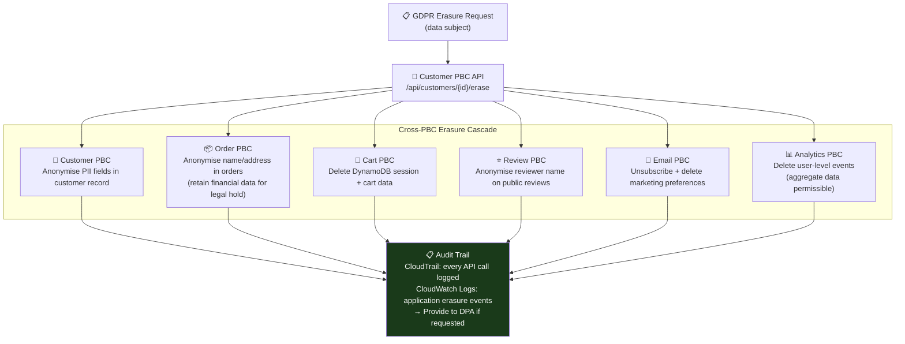

# AWS Compliance for Composable Commerce: What You Inherit and What You Still Own

*By a Senior AWS Solutions Architect | #ComposableCommerce #Compliance #GDPR #PCIDss #AWS*

---

One of the most consequential misconceptions I encounter when working with enterprises adopting composable commerce is the belief that running on AWS somehow transfers compliance responsibility to AWS. "We're on AWS, so we're PCI compliant." "AWS is GDPR compliant, so we're good."

Both statements are partially true and dangerously incomplete.

AWS is certified for PCI DSS, HIPAA, ISO 27001, SOC 2, and dozens of other frameworks. That certification covers AWS's infrastructure — the physical datacentres, the hypervisors, the networking, the managed service control planes. It does not cover your application code, your database schema, your IAM configuration, your data handling practices, or your business processes.

Understanding exactly where the compliance responsibility boundary lies is one of the most important architectural decisions in a composable commerce platform. Let me be specific about it.

## The Inheritance Model for Composable Commerce

Think of AWS compliance as a foundation on which you build your own compliance posture. AWS provides the certified infrastructure; you build certified applications on top.

```
COMPLIANCE RESPONSIBILITY LAYERS

Layer 5: Business Processes (yours alone)
  PCI: how do you train employees? Who has physical access to PAN data?
  GDPR: how do you respond to data subject access requests?
  HIPAA: how do you handle PHI breach notification?

Layer 4: Application Code (yours alone)
  PCI: are your PBCs handling card data securely?
  GDPR: does your Customer PBC implement right-to-erasure correctly?
  SOC 2: do your PBCs have appropriate access controls and audit logging?

Layer 3: Configuration (yours alone)
  IAM roles, security group rules, S3 bucket policies
  Encryption key management
  Logging and monitoring configuration

Layer 2: AWS Managed Services (shared)
  RDS: AWS patches the OS and DB engine. You configure access controls.
  ECS: AWS manages the container runtime. You configure task roles.
  S3: AWS manages the storage infrastructure. You configure encryption and access.

Layer 1: AWS Infrastructure (AWS alone)
  Physical security, hardware, network, hypervisor
  AWS's certifications cover this layer completely
```

When your QSA (Qualified Security Assessor) reviews your PCI compliance, they'll accept the AWS PCI DSS Attestation of Compliance (downloadable from AWS Artifact) for Layer 1. Layers 2–5 require your own evidence.

## AWS Artifact: Your Compliance Document Repository

AWS Artifact is the self-service portal for AWS compliance reports. For a composable commerce platform's compliance programme, the immediately useful reports are:

- **AWS PCI DSS Attestation of Compliance (AOC)** — provides the PCI evidence for AWS infrastructure in scope
- **AWS SOC 2 Type II Report** — security, availability, and confidentiality controls, third-party audited annually
- **AWS ISO 27001 Certificate** — information security management
- **AWS GDPR Data Processing Addendum** — the contractual data processing agreement for GDPR

For a composable platform undergoing its first PCI assessment, the QSA will ask for evidence of infrastructure security controls. The AWS SOC 2 Type II and the PCI AOC together provide this evidence for the AWS-managed layers. Your team's evidence covers the application layers.

## AWS Config for Continuous Composable Compliance

In a composable platform with 15 PBCs, each creating its own AWS resources, configuration drift is inevitable without automated compliance monitoring. AWS Config provides continuous recording of resource configurations and evaluates them against compliance rules.

Rules I deploy on every composable commerce platform at day one:

```
# Non-negotiable security rules
s3-bucket-server-side-encryption-enabled
  → Every PBC's S3 bucket must have SSE enabled
  → Non-compliant: SNS alert to bucket owner's team Slack channel

rds-instance-public-access-check
  → No database in the composable platform may be publicly accessible
  → Non-compliant: P1 alert, auto-remediation via Lambda (disable public access)

iam-root-access-key-check
  → Root account access keys must not exist
  → Non-compliant: P1 alert to security team immediately

ec2-imdsv2-check
  → All EC2 instances must enforce IMDSv2
  → Non-compliant: notify PBC team with 24-hour SLA to remediate

restricted-ssh
  → No security group may allow SSH from 0.0.0.0/0
  → Non-compliant: auto-remediation + PBC team notification
```

The auto-remediation Lambda for public S3 bucket access:
```python
def remediate_public_s3_bucket(event):
    bucket_name = event['detail']['resourceId']
    s3.put_public_access_block(
        Bucket=bucket_name,
        PublicAccessBlockConfiguration={
            'BlockPublicAcls': True,
            'IgnorePublicAcls': True,
            'BlockPublicPolicy': True,
            'RestrictPublicBuckets': True
        }
    )
    # Notify team
    sns.publish(
        TopicArn=security_alerts_topic,
        Message=f"Auto-remediated: public access blocked on bucket {bucket_name}"
    )
```

The Config rule detects the violation. The Lambda remediates it automatically. The security team sees the notification. The PBC team gets a follow-up asking how the configuration was changed outside of CloudFormation.

## GDPR Architecture: Data Residency and Subject Rights in Composable Commerce

GDPR adds specific architectural constraints to composable commerce platforms serving EU customers. The composable architecture's modular design actually makes GDPR implementation more tractable than in a monolith — each PBC owns clear data domains, making it easier to implement subject rights per-domain.

**Data residency:** EU customer data stays in the EU Region. Route 53 Geolocation routing sends EU traffic to eu-west-1. No Cross-Region Replication of customer PII to non-EU Regions. Configuration enforced via S3 bucket policies (deny replication for specific prefixes) and RDS (no cross-region read replicas for customer tables).

**Right to Erasure (Right to be Forgotten):**


The composable architecture makes this tractable because each PBC owns its data and exposes a clear erasure API. In a monolith, "delete all data for customer X" touches 40+ tables in a shared schema — difficult to implement correctly and even harder to verify.

## The IT Governance Responsibility That Never Transfers

One principle that every enterprise CTO needs to understand before adopting composable commerce on AWS: **IT governance is always the customer's responsibility.** Regardless of deployment model — on-premises, cloud, hybrid — you maintain accountability for your IT control environment.

AWS makes governance easier with Config, CloudTrail, Trusted Advisor, and the compliance framework. But the governance decisions — who has access to what, how changes are reviewed and approved, how incidents are managed, how vendor risk is assessed — these remain with your organisation.

For a composable platform with multiple PBC vendors (SaaS commerce components, third-party personalisation, hosted search), each vendor relationship is a vendor risk management question. AWS cannot answer it for you. Your procurement and legal teams need contracts, data processing agreements, and security assessments for every PBC vendor that handles customer data.

---

*Final article in this series: The architecture best practices that separate composable commerce platforms that deliver on their promise from those that just distribute the complexity.*

*💬 What's the hardest compliance challenge you've faced in a composable migration? GDPR data mapping across PBCs? PCI scope reduction? I'd love to compare notes.*

---
**#Compliance #AWS #ComposableCommerce #GDPR #PCIDss #SOC2 #SolutionsArchitect #CloudGovernance**
