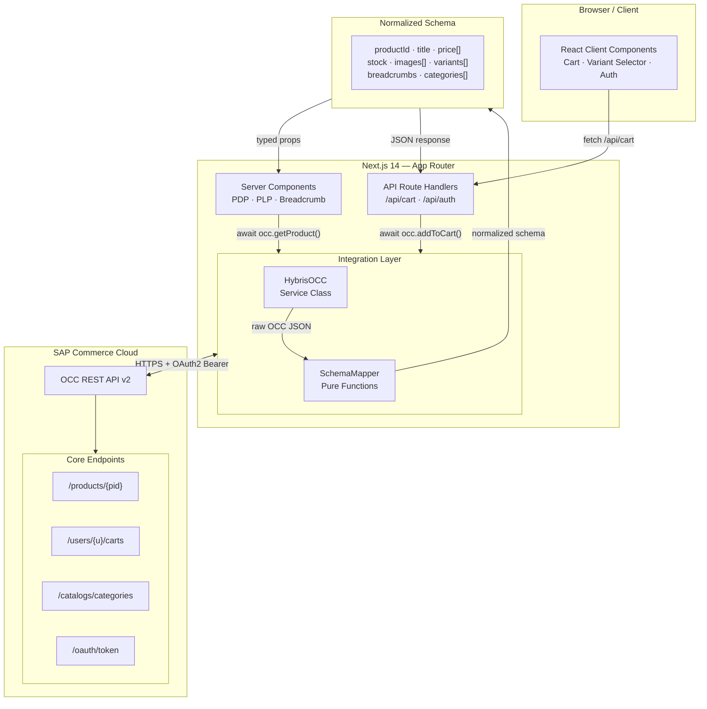
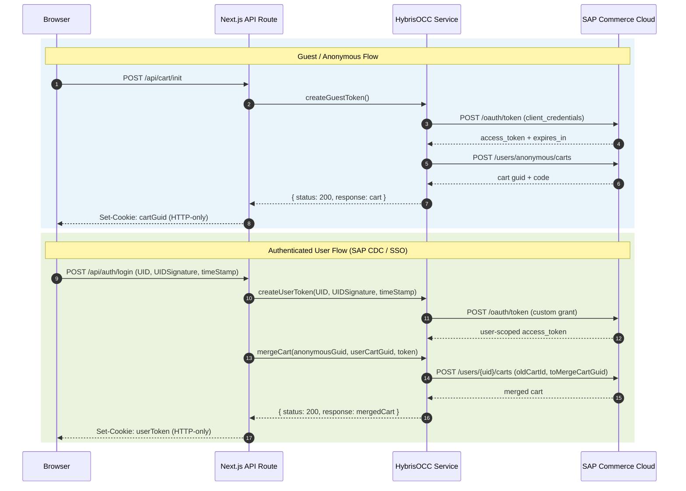
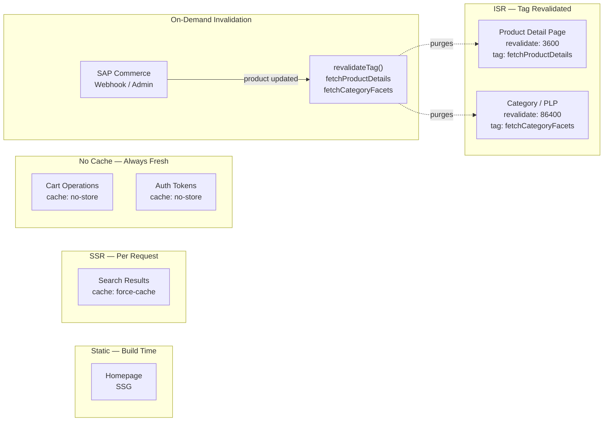

# SAP OCC API + Next.js 14: The Service & Mapper Pattern for Composable Commerce

*How a two-layer integration pattern — a typed service class and a schema mapper — decouples your Next.js storefront from SAP Commerce Cloud's verbose OCC responses.*

---

When our team set out to build a headless storefront on SAP Commerce Cloud, we faced a familiar challenge: the OCC REST API returns rich, deeply nested payloads that are perfect for a commerce backend — but awkward to work with directly in React components.

Product objects come back with `baseOptions`, `variantOptionQualifiers`, `stockLevelStatus` strings, and image URLs that may or may not be absolute. Scattering that knowledge across dozens of components is a maintenance trap. So we didn't.

Instead, we built a two-layer integration pattern — a **service class** (`HybrisOCC`) and a **schema mapper** (`SchemaMapper`) — sitting between Next.js and SAP Commerce. Here's what we learned.

---

## The Core Problem with Raw OCC Responses

If you've worked with SAP OCC, you know responses like this:

```json
{
  "code": "12345_blue_M",
  "baseProduct": "12345",
  "baseOptions": [
    {
      "options": [
        {
          "code": "12345_blue_M",
          "stock": { "stockLevelStatus": "inStock" },
          "variantOptionQualifiers": [
            { "qualifier": "style", "value": "Blue", "image": { "url": "/medias/..." } },
            { "qualifier": "size", "value": "M" }
          ]
        }
      ]
    }
  ],
  "price": { "value": 89.99, "currencyIso": "USD", "formattedValue": "$89.99" },
  "promotionPrice": { "value": 69.99, "currencyIso": "USD", "formattedValue": "$69.99" }
}
```

Now imagine 12 components all reaching into `baseOptions[0].options[n].variantOptionQualifiers[1].value` to get a size. One OCC payload change, and you're hunting through the entire codebase.

The fix: **transform once, consume everywhere.**

---

## The Architecture: Three Layers, One Clean Contract



The frontend never sees raw OCC data. Components receive a predictable, frontend-friendly schema regardless of what SAP changes in their API.

---

## Layer 1: HybrisOCC — The Service Class

The `HybrisOCC` class is a single-responsibility service that owns every OCC API call. It reads config from environment variables, handles OAuth2 token flows, and wraps every fetch in a consistent error envelope.

```javascript
export default class HybrisOCC {
  constructor() {
    this.config = {
      clientId: process.env.HYBRIS_CLIENT_ID,
      clientSecret: process.env.HYBRIS_CLIENT_SECRET,
      apiUrl: process.env.HYBRIS_API_URL,
      baseSite: process.env.HYBRIS_BASE_SITE_IDENTIFIER,
    };
  }

  getProductDetails = async ({ pid }) => {
    try {
      const response = await fetch(
        `${this.config.apiUrl}/restv2/v2/${this.config.baseSite}/products/${pid}?fields=FULL`,
        {
          next: {
            revalidate: configuration.PDPProductCacheTime,
            tags: [fetchTags.fetchProductDetails],
          },
        }
      ).then((res) => res.json());

      const normalized = await makeProductResponse(response);
      return { status: response.errors ? 400 : 200, response: normalized };
    } catch (ex) {
      return { status: 400, response: ex.message || errorMsg.errorInFetch };
    }
  };
}
```

Three things to notice:

1. **Consistent envelope.** Every method returns `{ status, response }`. The calling component never has to guess whether an error throws or returns — it always gets a structured result.

2. **Next.js caching built in.** The `next.revalidate` and `next.tags` options are passed directly in the fetch call, so cache strategy lives with the data fetching code, not scattered in page files.

3. **Server-only.** This class is instantiated in Server Components and API Route handlers — credentials never reach the browser.

---

## Layer 2: SchemaMapper — The Transformation Layer

The mapper is where raw OCC complexity gets absorbed. It's a set of pure async functions that transform OCC payloads into shapes your components actually want.

```javascript
export const makeProductResponse = async (item) => {
  // Normalize variants from nested baseOptions structure
  const variants = buildVariants(item.baseOptions, item.code);

  // Normalize image URLs to absolute
  const images = item.images?.map((img) => ({
    ...img,
    url: img.url?.startsWith('http')
      ? img.url
      : configuration.baseImageURL + img.url,
  })) ?? [];

  // Normalize stock status to app constants
  const stockLevelStatus = normalizeStock(item.stock?.stockLevelStatus);

  // Sale price takes precedence over list price
  const salePrice = item.promotionPrice?.value > 0
    ? item.promotionPrice
    : item.price;

  return {
    productId: item.code,
    title: item.name,
    price: [
      { priceType: 'sale_price', ...salePrice },
      { priceType: 'price', ...item.price },
    ],
    stock: { stockLevelStatus },
    images,
    variants,
    breadcrumbs: await makeBreadcrumbResponse(item.breadcrumbs),
    categories: item.categories ?? [],
  };
};
```

The normalized schema is the contract between your backend integration and your UI. When OCC changes a field, you update one function — not dozens of components.

---

## The Stock Status Problem (and Its Lesson)

In our codebase, we found this ternary in five different places:

```javascript
stockLevelStatus === "inStock"
  ? configuration.inStockStatus
  : stockLevelStatus === "lowStock"
  ? configuration.lowStockStatus
  : configuration.outOfStockStatus
```

This is a symptom of mapping logic escaping the mapper layer. The fix is a single shared utility:

```javascript
// utils/stock.js
export const normalizeStock = (status) =>
  status === 'inStock'  ? configuration.inStockStatus
  : status === 'lowStock' ? configuration.lowStockStatus
  : configuration.outOfStockStatus;
```

Rule of thumb: if you find yourself writing the same OCC field transformation in more than one place, it belongs in the mapper.

---

## Authentication: Two Flows, One Pattern



The merge step is critical — it's what ensures items added before login don't disappear after authentication.

---

## Next.js 14 Integration: Where Components Call OCC

### Server Components get data directly

```javascript
// app/products/[pid]/page.jsx
import HybrisOCC from '@/lib/occ/HybrisOCC';

export default async function ProductPage({ params }) {
  const occ = new HybrisOCC();
  const { status, response: product } = await occ.getProductDetails({
    pid: params.pid,
  });

  if (status !== 200) return <ProductErrorState />;
  return <ProductDetailClient product={product} />;
}
```

No `useEffect`. No loading spinner for the initial data. The page renders with product data already present — great for Core Web Vitals and SEO.

### Client Components use API Routes

Cart operations need to happen client-side (in response to user actions). We use Next.js Route Handlers as a thin server proxy:

```javascript
// app/api/cart/route.js
import HybrisOCC from '@/lib/occ/HybrisOCC';

export async function POST(request) {
  const body = await request.json();
  const occ = new HybrisOCC();
  const result = await occ.AddProductToCart(body);
  return Response.json(result, { status: result.status });
}
```

The client component calls `/api/cart`, which calls `HybrisOCC` server-side. Credentials stay on the server throughout.

---

## Caching Strategy

Next.js 14's granular caching options map cleanly onto commerce data freshness requirements:



On-demand revalidation means a product update in SAP Commerce can trigger `revalidateTag('fetchProductDetails')` via webhook, purging exactly the affected cached responses without a full rebuild.

---

## Lessons from Production

**1. OCC fields can be null. Always be defensive.**
`item.promotionPrice?.value > 0` is safer than `item.promotionPrice.value > 0`. One null reference in a mapper takes down the entire page render.

**2. Image URLs aren't always absolute.**
OCC returns relative image paths like `/medias/product-image.jpg`. You need to prepend your Commerce CDN base URL. Doing this in the mapper means your components always receive a ready-to-use URL.

**3. `Authorization: undefined` is a real header.**
We found code like `Authorization: token ? 'Bearer ' + token : undefined`. Some SAP Commerce instances reject this. Build headers conditionally:

```javascript
const headers = { 'Content-Type': 'application/json' };
if (token) headers['Authorization'] = `Bearer ${token}`;
```

**4. Never hardcode OAuth credentials.**
`client_id: "trusted_client"` in source code will end up in version control history. Environment variables for everything.

**5. Token expiry needs handling.**
OAuth tokens expire. Without a refresh mechanism, users encounter mysterious 401 errors after a session ages out. Implement TTL tracking and re-issue tokens before they expire.

---

## The Pattern in Summary

The service + mapper pattern gives you:

- **Frontend isolation** — components depend on your schema, not OCC's
- **Single update point** — OCC API changes require updating one mapper function
- **Consistent error handling** — the `{ status, response }` envelope is always predictable
- **Testability** — mappers are pure functions; unit tests don't need a Commerce instance running
- **Next.js cache alignment** — caching strategy lives with the fetch calls, where it belongs

Composable commerce is fundamentally about having clear boundaries between concerns. The OCC service class and mapper pattern are what make the boundary between "SAP Commerce data" and "storefront data" explicit, enforceable, and maintainable at scale.

---

*Have you implemented a similar pattern with SAP OCC or another commerce API? I'd love to hear what tradeoffs you ran into in the comments.*

---

**Tags:** #ComposableCommerce #SAPCommerce #NextJS #Headless #Ecommerce #FrontendArchitecture #OCC #ReactJS #WebDevelopment #SoftwareArchitecture #MACHArchitecture #OAuth2
