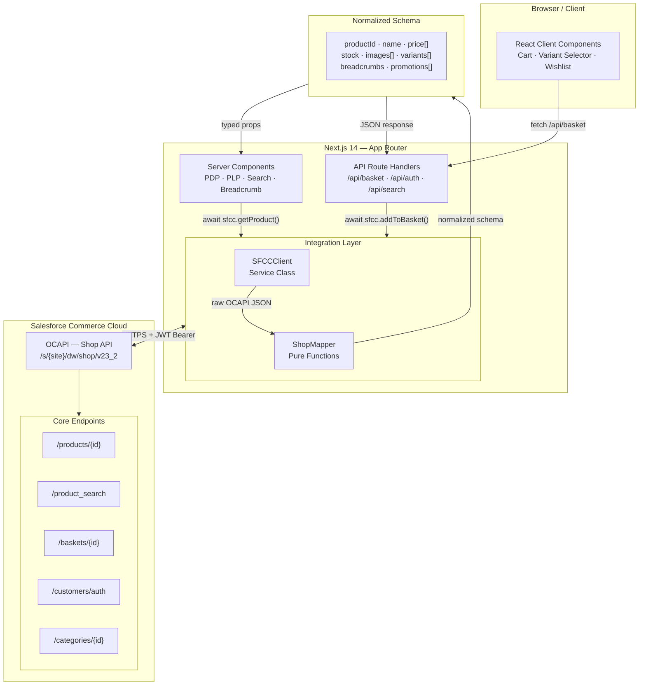
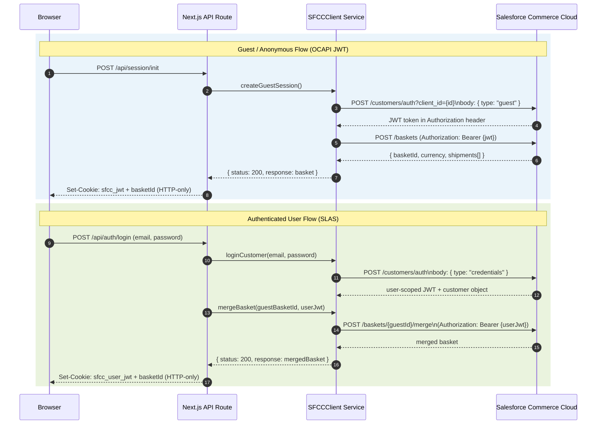
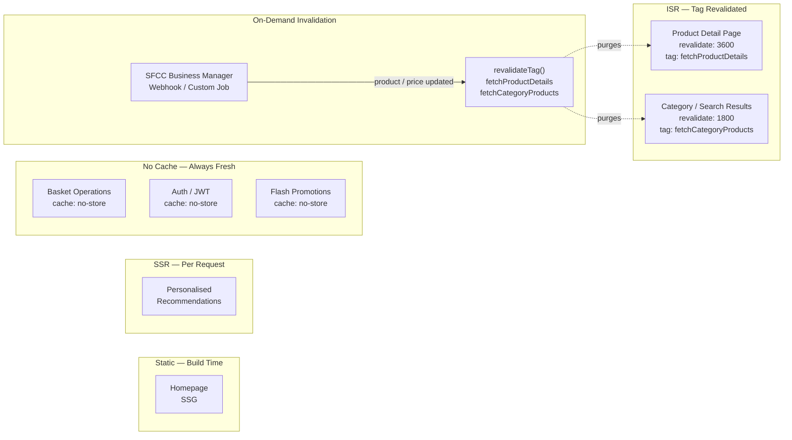

# Salesforce Commerce Cloud + Next.js 14: The Service & Mapper Pattern for Headless OCAPI Integration

*How a two-layer integration pattern — a typed service class and a schema mapper — decouples your Next.js storefront from Salesforce Commerce Cloud's verbose OCAPI responses.*

---

When our team set out to build a headless storefront on Salesforce Commerce Cloud (SFCC), we ran into a familiar problem: the Open Commerce API (OCAPI) returns detailed, deeply nested payloads shaped around the Demandware data model — perfect for the platform, but verbose and awkward to consume directly in React components.

Product objects arrive with `variationAttributes`, `variants`, `imageGroups` keyed by `viewType`, and price books buried inside `productPromotions`. Basket responses nest shipping methods inside `shipments` inside the basket object. Passing that raw shape into a dozen components is a maintenance liability. So we didn't.

Instead, we built a two-layer integration pattern — a **service class** (`SFCCClient`) and a **schema mapper** (`ShopMapper`) — sitting between Next.js and Salesforce Commerce Cloud. Here's what we learned.

---

## The Core Problem with Raw OCAPI Responses

If you've worked with SFCC OCAPI, you know responses like this:

```json
{
  "id": "asics-gel-kayano-30-blue-10",
  "master": { "masterId": "asics-gel-kayano-30", "orderable": true },
  "variationAttributes": [
    {
      "id": "color",
      "name": "Color",
      "values": [
        { "value": "BLUE", "name": "Midnight Blue", "orderable": true,
          "image": { "link": "/on/demandware.static/Sites-asics-Site/-/default/...jpg" } }
      ]
    },
    {
      "id": "size",
      "name": "Size",
      "values": [{ "value": "10", "name": "10", "orderable": true }]
    }
  ],
  "imageGroups": [
    { "viewType": "large", "images": [{ "link": "/on/demandware.static/..." }] },
    { "viewType": "small", "images": [{ "link": "/on/demandware.static/..." }] }
  ],
  "price": 160.00,
  "pricePerTransactionUnit": 160.00,
  "inventory": { "id": "inventory-asics", "ats": 12, "orderable": true, "stockLevel": 12 }
}
```

Now imagine 15 components each reaching into `variationAttributes.find(a => a.id === 'color').values` to render a colour swatch. One OCAPI schema update, and you're chasing it through the entire codebase.

The fix: **transform once, consume everywhere.**

---

## The Architecture: Three Layers, One Clean Contract



The frontend never sees raw OCAPI data. Components receive a predictable, frontend-friendly schema regardless of what Salesforce changes in their platform.

---

## Layer 1: SFCCClient — The Service Class

The `SFCCClient` class is a single-responsibility service that owns every OCAPI call. It reads config from environment variables, manages JWT and SLAS token flows, and wraps every fetch in a consistent error envelope.

```javascript
export default class SFCCClient {
  constructor() {
    this.config = {
      clientId: process.env.SFCC_CLIENT_ID,
      clientSecret: process.env.SFCC_CLIENT_SECRET,
      instanceUrl: process.env.SFCC_INSTANCE_URL,
      siteId: process.env.SFCC_SITE_ID,
      apiVersion: process.env.SFCC_API_VERSION || 'v23_2',
    };
  }

  get baseUrl() {
    return `${this.config.instanceUrl}/s/${this.config.siteId}/dw/shop/${this.config.apiVersion}`;
  }

  getProduct = async ({ productId, expand = 'images,prices,availability,variations' }) => {
    try {
      const response = await fetch(
        `${this.baseUrl}/products/${productId}?expand=${expand}&client_id=${this.config.clientId}`,
        {
          headers: { 'Content-Type': 'application/json' },
          next: {
            revalidate: configuration.PDPProductCacheTime,
            tags: [fetchTags.fetchProductDetails],
          },
        }
      ).then((res) => res.json());

      const normalized = await makeProductResponse(response);
      return { status: response.fault ? 400 : 200, response: normalized };
    } catch (ex) {
      return { status: 400, response: ex.message || errorMsg.errorInFetch };
    }
  };
}
```

Three things to notice:

1. **Consistent envelope.** Every method returns `{ status, response }`. SFCC OCAPI surfaces errors as a `fault` object rather than an HTTP error code in some cases — the envelope pattern absorbs that inconsistency so calling code never has to.

2. **`expand` parameters are explicit.** OCAPI uses an expand query parameter to control payload size. Declaring these at the service layer keeps components from requesting more data than they need.

3. **Server-only.** This class is instantiated in Server Components and API Route handlers only — the `clientId` and `clientSecret` never reach the browser.

---

## Layer 2: ShopMapper — The Transformation Layer

The mapper absorbs SFCC-specific payload complexity. `imageGroups` keyed by `viewType`, flat `price` fields that don't distinguish sale from list, and variation attributes as arrays — all of that gets resolved here so components never deal with it.

```javascript
export const makeProductResponse = async (item) => {
  if (!item.id) return item;

  // Resolve images from viewType-keyed imageGroups
  const largeImages = item.imageGroups?.find(g => g.viewType === 'large')?.images ?? [];
  const images = largeImages.map(img => ({
    url: img.link?.startsWith('http') ? img.link : configuration.baseImageURL + img.link,
    altText: img.alt ?? item.name,
    title: img.title ?? '',
  }));

  // Flatten variationAttributes into keyed maps for easy lookup
  const colorAttr = item.variationAttributes?.find(a => a.id === 'color');
  const sizeAttr  = item.variationAttributes?.find(a => a.id === 'size');

  const colorVariants = (colorAttr?.values ?? []).map(v => ({
    name: 'color',
    value: v.value,
    label: v.name,
    orderable: v.orderable,
    swatchUrl: v.image?.link
      ? configuration.baseImageURL + v.image.link
      : null,
  }));

  const sizeVariants = (sizeAttr?.values ?? []).map(v => ({
    name: 'size',
    value: v.value,
    label: v.name,
    orderable: v.orderable,
  }));

  // Normalize price — SFCC may return price or priceMax for ranges
  const price = normalizePrice(item);

  // Normalize inventory
  const stock = normalizeStock(item.inventory);

  return {
    productId: item.id,
    masterId: item.master?.masterId ?? item.id,
    name: item.name,
    description: item.shortDescription ?? '',
    longDescription: item.longDescription ?? '',
    brand: item.brand ?? '',
    price,
    stock,
    images,
    variants: [...colorVariants, ...sizeVariants],
    promotions: item.productPromotions ?? [],
    categories: item.categories ?? [],
    breadcrumbs: await makeBreadcrumbResponse(item.primaryCategoryId),
  };
};
```

The normalized schema is the contract between your backend integration and your UI. When Salesforce updates their OCAPI schema — or you migrate from OCAPI to the newer SCAPI — only the mapper changes, not the components consuming it.

---

## The Price Normalization Problem (and Its Lesson)

OCAPI's price representation is inconsistent across product types. Simple products have a flat `price` field. Master products expose `price` as the lowest variant price and `priceMax` as the highest. Promotional prices sit inside `productPromotions`. We found price-extraction logic scattered across six components before extracting it into one place:

```javascript
// utils/price.js
export const normalizePrice = (item) => {
  const listPrice = item.price ?? 0;
  const maxPrice  = item.priceMax ?? listPrice;

  const promoPrice = item.productPromotions
    ?.find(p => p.promotionalPrice != null)
    ?.promotionalPrice ?? null;

  return {
    list:  { value: listPrice,  currency: item.currency ?? 'USD' },
    max:   { value: maxPrice,   currency: item.currency ?? 'USD' },
    sale:  promoPrice != null
      ? { value: promoPrice, currency: item.currency ?? 'USD' }
      : null,
    isRange: maxPrice > listPrice,
    isOnSale: promoPrice != null && promoPrice < listPrice,
  };
};
```

Rule of thumb: if a field requires conditional logic to interpret, that logic belongs in the mapper — not in the render function.

---

## Authentication: JWT Shop API and SLAS

SFCC OCAPI authentication has two distinct flows depending on the context.



The guest session JWT is returned in the `Authorization` response header — not the body — which catches developers off guard. Extract it explicitly:

```javascript
createGuestSession = async () => {
  const res = await fetch(`${this.baseUrl}/customers/auth?client_id=${this.config.clientId}`, {
    method: 'POST',
    headers: { 'Content-Type': 'application/json' },
    body: JSON.stringify({ type: 'guest' }),
    cache: 'no-store',
  });

  // JWT is in the Authorization header, not the response body
  const jwt = res.headers.get('Authorization');
  const customer = await res.json();

  return {
    status: customer.fault ? 400 : 200,
    response: { jwt, customer },
  };
};
```

---

## Next.js 14 Integration: Where Components Call OCAPI

### Server Components fetch product data directly

```javascript
// app/products/[productId]/page.jsx
import SFCCClient from '@/lib/sfcc/SFCCClient';

export default async function ProductPage({ params }) {
  const sfcc = new SFCCClient();
  const { status, response: product } = await sfcc.getProduct({
    productId: params.productId,
  });

  if (status !== 200) return <ProductErrorState />;
  return <ProductDetailClient product={product} />;
}
```

No `useEffect`. No client-side loading state for the primary product data. The page arrives fully rendered — important for a performance brand like Asics where Core Web Vitals directly affect organic search rankings.

### Client Components use API Routes for basket operations

```javascript
// app/api/basket/entries/route.js
import SFCCClient from '@/lib/sfcc/SFCCClient';
import { cookies } from 'next/headers';

export async function POST(request) {
  const { productId, quantity, variantId } = await request.json();
  const cookieStore = cookies();
  const basketId = cookieStore.get('basketId')?.value;
  const jwt      = cookieStore.get('sfcc_jwt')?.value;

  const sfcc = new SFCCClient();
  const result = await sfcc.addProductToBasket({
    basketId, jwt, productId, quantity, variantId,
  });

  return Response.json(result, { status: result.status });
}
```

The client component POSTs to `/api/basket/entries`. The route handler reads tokens from HTTP-only cookies, calls `SFCCClient` server-side, and returns the result. Credentials and JWTs never leave the server.

---

## Caching Strategy

SFCC OCAPI data maps onto Next.js 14 caching modes the same way SAP OCC does — the key is being explicit about freshness requirements at the fetch call site:



One SFCC-specific consideration: promotional prices in OCAPI are returned inline with the product response. If you cache a product with `isOnSale: true` and the promotion ends, you need a webhook-triggered `revalidateTag` to ensure the cached response is purged. Stale promotional pricing on a cached PDP is a customer trust issue, not just a data accuracy issue.

---

## Lessons from Production

**1. The JWT is in the response header, not the body.**
SFCC OCAPI returns the session JWT in the `Authorization` response header on `POST /customers/auth`. If you only parse `res.json()`, you'll miss it. Always extract it with `res.headers.get('Authorization')` before parsing the body.

**2. OCAPI `fault` objects don't always map to HTTP error codes.**
Some SFCC error conditions return HTTP 200 with a `fault` object in the body — for example, when a product is not found in a specific locale. Always check for `response.fault` in addition to `response.status` before treating a response as successful.

**3. `imageGroups` is an array, not a map.**
OCAPI returns image groups as an array of objects with a `viewType` string field. It is tempting to reach into `imageGroups[0]` assuming large images come first — they don't always. Always use `.find(g => g.viewType === 'large')` explicitly. Doing this in the mapper means the component just receives `images[]` and never knows the original structure.

**4. Variant availability comes from the master product, not the variant.**
Individual variant products returned from `/products/{variantId}` don't always include full `variationAttributes` with availability per variant. Fetch the master product with `expand=variations,availability` and derive variant availability from the master response. Discovering this after building variant selection logic in the component layer costs days.

**5. Basket merging requires the guest JWT, not the user JWT.**
The `POST /baskets/{guestBasketId}/merge` endpoint must be called with the **guest** JWT in the Authorization header, while passing the registered customer token in the request body. Reversing these silently creates a new empty basket instead of merging. Store both tokens through the login flow and pass them explicitly.

---

## The Pattern in Summary

The service + mapper pattern gives you:

- **Frontend isolation** — components depend on your normalized schema, not OCAPI's Demandware-shaped payloads
- **Single update point** — OCAPI schema changes or a migration to SCAPI requires updating one mapper, not every component
- **Consistent error handling** — the `{ status, response }` envelope normalizes SFCC's mixed HTTP-code-plus-fault-object error surface
- **Testability** — mappers are pure functions; unit tests don't require a Salesforce sandbox
- **Next.js cache alignment** — caching decisions live at the fetch call site, making freshness requirements visible and auditable

Headless commerce on Salesforce Commerce Cloud gives you a powerful, proven backend. The service + mapper pattern is what makes it feel like a clean API rather than a legacy data model — and it's what lets your frontend team move at their own pace while the backend team manages promotions, pricing rules, and catalog changes on their own release schedule.

---

*Have you integrated SFCC OCAPI or migrated to SCAPI in a headless setup? I'd love to hear how you handled the authentication token handoff and variant availability in the comments.*

---

**Tags:** #ComposableCommerce #SalesforceCommerceCloud #OCAPI #SCAPI #NextJS #Headless #Ecommerce #FrontendArchitecture #ReactJS #WebDevelopment #MACHArchitecture #JWT #SLAS #Performance
